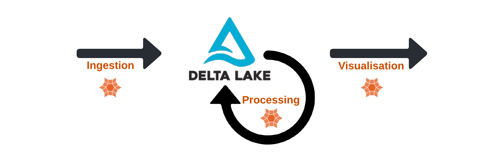

# Mosaic by Databricks Labs


An extension to the [Apache Spark](https://spark.apache.org/) framework that allows easy and fast processing of very large geospatial datasets.

[](https://badge.fury.io/py/databricks-mosaic)

[](https://codecov.io/gh/databrickslabs/mosaic)
[](https://github.com/databrickslabs/mosaic/actions?query=workflow%3A%22build+main%22)
[](https://github.com/databrickslabs/mosaic/actions/workflows/docs.yml)
[](https://lgtm.com/projects/g/databrickslabs/mosaic/context:python)
[](https://github.com/psf/black)
[]([https://codecov.io/github/databrickslabs/mosaic](https://github.com/databrickslabs/mosaic))


## Why Mosaic?

Mosaic was created to simplify the implementation of scalable geospatial data pipelines by bounding together common Open Source geospatial libraries via Apache Spark, with a set of [examples and best practices](#examples) for common geospatial use cases.


## What does it provide?
Mosaic provides geospatial tools for
* Data ingestion (WKT, WKB, GeoJSON)
* Data processing
    * Geometry and geography `ST_` operations via [JTS](https://github.com/locationtech/jts)
    * Indexing (with default [H3](https://github.com/uber/h3) or BNG)
    * Chipping of polygons and lines over an indexing grid [co-developed with Ordnance Survey and Microsoft](https://databricks.com/blog/2021/10/11/efficient-point-in-polygon-joins-via-pyspark-and-bng-geospatial-indexing.html)
* Data visualization ([Kepler](https://github.com/keplergl/kepler.gl))



The supported languages are Scala, Python, R, and SQL.

## How does it work?

The Mosaic library is written in Scala (JVM) to guarantee maximum performance with Spark and when possible, it uses code generation to give an extra performance boost.

__The other supported languages (Python, R and SQL) are thin wrappers around the Scala (JVM) code.__


Image1: Mosaic logical design.

## Getting started

### Mosaic 0.4.x Series [Latest]

We recommend using Databricks Runtime versions 13.3 LTS with Photon enabled. 

:warning: **Mosaic 0.4.x series only supports DBR 13**. If running on a different DBR with throw an exception:

> DEPRECATION ERROR: Mosaic v0.4.x series only supports Databricks Runtime 13. You can specify `%pip install 'databricks-mosaic<0.4,>=0.3'` for DBR < 13.

:warning: **Mosaic 0.4.x series issues the following ERROR on a standard, non-Photon cluster [[ADB](https://learn.microsoft.com/en-us/azure/databricks/runtime/) | [AWS](https://docs.databricks.com/runtime/index.html) | [GCP](https://docs.gcp.databricks.com/runtime/index.html)]:**

> DEPRECATION ERROR: Please use a Databricks Photon-enabled Runtime for performance benefits or Runtime ML for spatial AI benefits; Mosaic 0.4.x series restricts executing this cluster.

__Language Bindings__

As of Mosaic 0.4.0 (subject to change in follow-on releases)...

* [Assigned Clusters](https://docs.databricks.com/en/compute/configure.html#access-modes): Mosaic Python, SQL, R, and Scala APIs.
* [Shared Access Clusters](https://docs.databricks.com/en/compute/configure.html#access-modes): Mosaic Scala API (JVM) with Admin [allowlisting](https://docs.databricks.com/en/data-governance/unity-catalog/manage-privileges/allowlist.html); _Python bindings to Mosaic Scala APIs are blocked by Py4J Security on Shared Access Clusters._ 
  * Mosaic SQL expressions cannot yet be registered with [Unity Catalog](https://www.databricks.com/product/unity-catalog) due to API changes affecting DBRs >= 13, more [here](https://docs.databricks.com/en/udf/index.html).

__Additional Notes:__ 

As of Mosaic 0.4.0 (subject to change in follow-on releases)...

1. [Unity Catalog](https://www.databricks.com/product/unity-catalog): Enforces process isolation which is difficult to accomplish with custom JVM libraries; as such only built-in (aka platform provided) JVM APIs can be invoked from other supported languages in Shared Access Clusters. 
2. [Volumes](https://docs.databricks.com/en/connect/unity-catalog/volumes.html): Along the same principle of isolation, clusters (both assigned and shared access) can read Volumes via relevant built-in readers and writers or via custom python calls which do not involve any custom JVM code.

### Mosaic 0.3.x Series

We recommend using Databricks Runtime versions 12.2 LTS with Photon enabled. 

:warning: **Mosaic 0.3.x series does not support DBR 13**.

As of the 0.3.11 release, Mosaic issues the following WARNING when initialized on a cluster that is neither Photon Runtime nor Databricks Runtime ML [[ADB](https://learn.microsoft.com/en-us/azure/databricks/runtime/) | [AWS](https://docs.databricks.com/runtime/index.html) | [GCP](https://docs.gcp.databricks.com/runtime/index.html)]:

> DEPRECATION WARNING: Please use a Databricks Photon-enabled Runtime for performance benefits or Runtime ML for spatial AI benefits; Mosaic will stop working on this cluster after v0.3.x.
              
If you are receiving this warning in v0.3.11+, you will want to begin to plan for a supported runtime. The reason we are making this change is that we are streamlining Mosaic internals to be more aligned with future product APIs which are powered by Photon. Along this direction of change, Mosaic has standardized to JTS as its default and supported Vector Geometry Provider.

### Documentation

Check out the [documentation pages](https://databrickslabs.github.io/mosaic/).

### Python

Install [databricks-mosaic](https://pypi.org/project/databricks-mosaic/)
as a [cluster library](https://docs.databricks.com/libraries/cluster-libraries.html), or run from a Databricks notebook

```shell
%pip install databricks-mosaic
```

Then enable Mosaic (and namespace it in python) with

```python
import mosaic as mos
mos.enable_mosaic(spark, dbutils)
```

### Scala
Get the jar from the [releases](https://github.com/databrickslabs/mosaic/releases) page and install it as a [cluster library](https://docs.databricks.com/libraries/cluster-libraries.html).

Then enable it with

```scala
import com.databricks.labs.mosaic.functions.MosaicContext
import com.databricks.labs.mosaic.H3
import com.databricks.labs.mosaic.JTS

val mosaicContext = MosaicContext.build(H3, JTS)
import mosaicContext.functions._
```

### R
Get the Scala JAR and the R from the [releases](https://github.com/databrickslabs/mosaic/releases) page. Install the JAR as a [cluster library](https://docs.databricks.com/libraries/cluster-libraries.html), and copy the `sparkrMosaic.tar.gz` to DBFS (This example uses `/FileStore` location, but you can put it anywhere on DBFS).

```R
library(SparkR)

install.packages('/FileStore/sparkrMosaic.tar.gz', repos=NULL)
```

Enable the R bindings
```R
library(sparkrMosaic)
enableMosaic()
```

### SQL
Configure the [Automatic SQL Registration](https://databrickslabs.github.io/mosaic/usage/automatic-sql-registration.html) _or_ follow the Scala installation process and register the Mosaic SQL functions in your SparkSession from a Scala notebook cell:

```scala
%scala
import com.databricks.labs.mosaic.functions.MosaicContext
import com.databricks.labs.mosaic.H3
import com.databricks.labs.mosaic.JTS

val mosaicContext = MosaicContext.build(H3, JTS)
mosaicContext.register(spark)
```
__Note: Mosaic 0.4.x SQL bindings for DBR 13 can register with Assigned clusters (as Hive UDFs), but not Shared Access due to API changes, more [here](https://docs.databricks.com/en/udf/index.html).__

## Examples

Here are some example notebooks, check the language links for latest [[Python](/notebooks/examples/python/) | [Scala](/notebooks/examples/scala/) | [SQL](/notebooks/examples/sql/) | [R](/notebooks/examples/R/)]: 

| Example | Description | Links                                                                                                                                                                                                                                        |
| --- | --- |----------------------------------------------------------------------------------------------------------------------------------------------------------------------------------------------------------------------------------------------|
| __Quick Start__ | Example of performing spatial point-in-polygon joins on the NYC Taxi dataset | [python](/notebooks/examples/python/Quickstart/QuickstartNotebook.ipynb), [scala](notebooks/examples/scala/QuickstartNotebook.ipynb), [R](notebooks/examples/R/QuickstartNotebook.r), [SQL](notebooks/examples/sql/QuickstartNotebook.ipynb) | 
| Shapefiles | Examples of reading multiple shapefiles | [python](notebooks/examples/python/Shapefiles/)                                                                                                                                                                                              |
| Spatial KNN | Runnable notebook-based example using Mosaic [SpatialKNN](https://databrickslabs.github.io/mosaic/models/spatial-knn.html) model | [python](notebooks/examples/python/SpatialKNN)                                                                                                                                                                                               |
| NetCDF |  Read multiple NetCDFs, process through various data engineering steps before analyzing and rendering | [python](notebooks/examples/python/NetCDF/)                                                                                                                                                                                                  |
| STS Transfers | Detecting Ship-to-Ship transfers at scale by leveraging Mosaic to process AIS data. | [python](notebooks/examples/python/Ship2ShipTransfers), [blog](https://medium.com/@timo.roest/ship-to-ship-transfer-detection-b370dd9d43e8)                                                                                                  |
| EO Gridded STAC | End-to-end Earth Observation series showing downloading Sentinel-2 STAC assets for Alaska from [MSFT Planetary Computer](https://planetarycomputer.microsoft.com/), tiling them to H3 global grid, band stacking, NDVI, merging (mosaicing), clipping, and applying a [Segment Anything Model](https://huggingface.co/facebook/sam-vit-huge)  | [python](notebooks/examples/python/EarthObservation/EOGriddedSTAC)                                                                                                                                                                           |

You can import those examples in Databricks workspace using [these instructions](https://docs.databricks.com/en/notebooks/index.html).

## Ecosystem
Mosaic is intended to augment the existing system and unlock the potential by integrating [Spark](https://spark.apache.org/), [Delta Lake](https://delta.io/) and 3rd party frameworks into the Lakehouse architecture.


Image2: Mosaic ecosystem - Lakehouse integration.

### Project Support
Please note that all projects in the `databrickslabs` github space are provided for your exploration only, and are not formally supported by Databricks with Service Level Agreements (SLAs). They are provided AS-IS and we do not make any guarantees of any kind. Please do not submit a support ticket relating to any issues arising from the use of these projects.

Any issues discovered through the use of this project should be filed as GitHub Issues on the Repo. They will be reviewed as time permits, but there are no formal SLAs for support.
