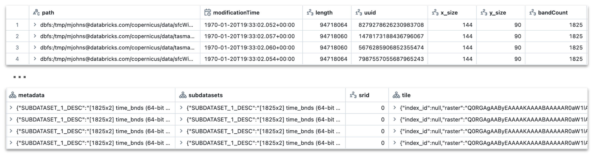

=====================
Raster Format Readers
=====================

Intro
#####
Mosaic provides spark readers for raster files supported by GDAL OGR drivers.
Only the drivers that are built by default are supported.
Here are some common useful file formats:

    * `GTiff <https://gdal.org/drivers/raster/gtiff.html>`__ (GeoTiff) using .tif file extension
    * `COG <https://gdal.org/drivers/raster/cog.html>`__ (Cloud Optimized GeoTiff) using .tif file extension
    * `HDF4 <https://gdal.org/drivers/raster/hdf4.html>`__ using .hdf file extension
    * `HDF5 <https://gdal.org/drivers/raster/hdf5.html>`__ using .h5 file extension
    * `NetCDF <https://gdal.org/drivers/raster/netcdf.html>`__ using .nc file extension
    * `JP2ECW <https://gdal.org/drivers/raster/jp2ecw.html>`__ using .jp2 file extension
    * `JP2KAK <https://gdal.org/drivers/raster/jp2kak.html>`__ using .jp2 file extension
    * `JP2OpenJPEG <https://gdal.org/drivers/raster/jp2openjpeg.html>`__ using .jp2 file extension
    * `PDF <https://gdal.org/drivers/raster/pdf.html>`__ using .pdf file extension
    * `PNG <https://gdal.org/drivers/raster/png.html>`__ using .png file extension
    * `VRT <https://gdal.org/drivers/raster/vrt.html>`__ using .vrt file extension
    * `XPM <https://gdal.org/drivers/raster/xpm.html>`__ using .xpm file extension
    * `GRIB <https://gdal.org/drivers/raster/grib.html>`__ using .grb file extension
    * `Zarr <https://gdal.org/drivers/raster/zarr.html>`__ using .zarr file extension

For more information please refer to gdal `raster driver <https://gdal.org/drivers/raster/index.html>`__ documentation.

Mosaic provides two flavors of the readers:

    * :code:`spark.read.format("gdal")` for reading 1 file per spark task
    * :code:`mos.read().format("raster_to_grid")` reader that automatically converts raster to grid.

spark.read.format("gdal")
*************************
A base Spark SQL data source for reading GDAL raster data sources.
It reads metadata of the raster and exposes the direct paths for the raster files.
The output of the reader is a DataFrame with the following columns (provided in order):

    * :code:`path` - path read (StringType)
    * :code:`modificationTime` - last modification of the raster (TimestampType)
    * :code:`length` -  size of the raster, e.g. memory size (LongType)
    * :code:`uuid` -  unique identifier for the raster (LongType)
    * :code:`x_Size` - width of the raster in pixels (IntegerType)
    * :code:`y_size` - height of the raster in pixels (IntegerType)
    * :code:`bandCount` - number of bands in the raster (IntegerType)
    * :code:`metadata` - raster metadata (MapType(StringType, StringType))
    * :code:`subdatasets` - raster subdatasets (MapType(StringType, StringType))
    * :code:`srid` - raster spatial reference system identifier (IntegerType)
    * :code:`tile` - loaded raster tile (StructType - RasterTileType)

.. function:: format("gdal")

    Loads a GDAL raster file and returns the result as a DataFrame.
    It uses the standard spark reader patthern of :code:`spark.read.format(*).option(*).load(*)`.

    :param path: path to the raster file, e.g. on dbfs
    :type path: Column(StringType)
    :rtype: DataFrame

    :example:

.. tabs::
    .. code-tab:: py

        df = spark.read.format("gdal")\
            .option("driverName", "GTiff")\
            .load("dbfs:/path/to/raster.tif")
        df.show()
        +---------------------------------------------------------------------------------------------------------------+------+------+----------+---------------------+--------------------+-----+----------------------+
        |                                                                                                           tile| ySize| xSize| bandCount|             metadata|         subdatasets| srid|              proj4Str|
        +---------------------------------------------------------------------------------------------------------------+------+------+----------+---------------------+--------------------+-----+----------------------+
        | {index_id: 593308294097928191, raster: [00 01 10 ... 00], parentPath: "dbfs:/path_to_file", driver: "GTiff" } |  100 |  100 |        1 | {AREA_OR_POINT=Po...|                null| 4326|  +proj=longlat +da...|
        +---------------------------------------------------------------------------------------------------------------+------+------+----------+---------------------+--------------------+-----+----------------------+

    .. code-tab:: scala

        val df = spark.read.format("gdal")
            .option("driverName", "GTiff")
            .load("dbfs:/path/to/raster.tif")
        df.show()
        +---------------------------------------------------------------------------------------------------------------+------+------+----------+---------------------+--------------------+-----+----------------------+
        |                                                                                                           tile| ySize| xSize| bandCount|             metadata|         subdatasets| srid|              proj4Str|
        +---------------------------------------------------------------------------------------------------------------+------+------+----------+---------------------+--------------------+-----+----------------------+
        | {index_id: 593308294097928191, raster: [00 01 10 ... 00], parentPath: "dbfs:/path_to_file", driver: "GTiff" } |  100 |  100 |        1 | {AREA_OR_POINT=Po...|                null| 4326|  +proj=longlat +da...|
        +---------------------------------------------------------------------------------------------------------------+------+------+----------+---------------------+--------------------+-----+----------------------+

.. note::
    Keyword options not identified in function signature are converted to a :code:`Map<String,String>`.
    These must be supplied as a :code:`String`.
    Also, you can supply function signature values as :code:`String`.

.. warning::
    Issue 350: https://github.com/databrickslabs/mosaic/issues/350
    The raster reader 'driverName' option has to match the names provided in the above list.
    For example, if you want to read a GeoTiff file, you have to use the following option:
    .option("driverName", "GTiff") instead of .option("driverName", "tif").

mos.read().format("raster_to_grid")
***********************************
Reads a GDAL raster file and converts it to a grid.
It uses a pattern similar to standard :code:`spark.read.format(*).option(*).load(*)` pattern.
The only difference is that it uses :code:`mos.read()` instead of :code:`spark.read()`.
The raster pixels are converted to grid cells using specified combiner operation (default is mean).
If the raster pixels are larger than the grid cells, the cell values can be calculated using interpolation.
The interpolation method used is Inverse Distance Weighting (IDW) where the distance function is a k_ring
distance of the grid.
The reader supports the following options:

    * :code:`combiner` (default "mean") - combiner operation to use when converting raster to grid (StringType), options:
      "average", "avg", "count", "max", "mean", "median", and "min"
    * :code:`deltaFileMB` (default 8) - If :code:`finalTableFqn` provided, this specifies the max size of the delta table
      files generated; smaller value drives more parallelism (IntegerType)
    * :code:`deltaFileRecords` (default 1000) - If > 0 and :code:`finalTableFqn` provided, limit number of files
      per delta file to help with parallelism (IntegerType)
    * :code:`driverName` (default "") - when the extension of the file is not enough, specify the driver (e.g. .zips) (StringType)
    * :code:`extensions` (default "*") - raster file extensions, e.g. "tiff" and "nc", optionally separated by ";" (StringType),
      e.g. "grib;grb" or "*" or ".tif" or  "tif" (what the file ends with will be tested), case insensitive; useful like
      a glob filter to ignore other files in the directory, e.g. sidecar files
    * :code:`finalTableFqn` (default "") - If this is provided, tables will be generated instead of just dataframes;
      this is going to be much more performant and is recommended (StringType)
    * :code:`finalTableFuse` (default "") - If :code:`finalTableFqn` provided, this specifies alternate location for
      the final stage table (StringType)
    * :code:`keepInterimTables` (default false) - If :code:`finalTableFqn` provided, this specifies whether to delete
      interim DeltaLake tables generated (BooleanType)
    * :code:`kRingInterpolate` (default 0) - if the raster pixels are larger than the grid cells, use k_ring
      interpolation with n = kRingInterpolate (IntegerType)
    * :code:`limitTessellate` (default 0) - limits the number of rows during / after tessellate; useful for sampling or testing (IntegerType)
    * :code:`nPartitions` (default <spark.conf.get("spark.sql.shuffle.partitions")>) - you can specify the
      starting number of partitions, will grow (x10 up to 10K) for retile and/or tessellate (IntegerType)
    * :code:`resolution` (default 0) - resolution of the output grid (IntegerType)
    * :code:`retile` (default false) - recommended to re-tile to smaller tiles, not used for geo-scientific files (BooleanType)
    * :code:`sizeInMB` (default 0) - subdivide on initial read if value > 0 provided (IntegerType)
    * :code:`skipProject` (default false) - mostly for troubleshooting, only good up to tessellate phase, most likely (BooleanType)
      will fail in combiner phase, e.g. can be used with :code:`stopAtTessellate` to help with initial processing of
      challenging datasets
    * :code:`srid` (default 0) - can attempt to set the SRID on the dataset, e.g. if it isn't already set (IntegerType);
      if a dataset has no SRID, then WGS84 / SRID=4326 will be assumed
    * :code:`stepTessellate` (default false) - optionally, iterate tessellation from 0..resolution; not allowed with either
      geo-scientific or vsizip files (BooleanType)
    * :code:`stopAtTessellate` (default false) - optionally, return after tessellate phase, prior to the combiner phase (BooleanType)
    * :code:`subdatasetName` (default "") - if the raster has subdatasets, select a specific subdataset by name (StringType)
    * :code:`tileSize` (default 512) - size of the re-tiled tiles, tiles are always squares of tileSize x tileSize (IntegerType)
    * :code:`uriDeepCheck` (default false) - specify whether more extensive testing of known URI parts is needed (StringType)
    * :code:`vsizip` (default false) - if the rasters are zipped files, set this to true (BooleanType)
    * :code:`verboseLevel` (default 0) - get increasing level of information (0..2) during processing, shows up in
      driver stdout (IntegerType)

.. function:: format("raster_to_grid")

    Loads a GDAL tile file and returns the result as a DataFrame.
    It uses the standard spark reader pattern of :code:`mos.read().format(*).option(*).load(*)`.

    :param path: path to the raster file, e.g. on dbfs
    :type path: Column(StringType)
    :rtype: DataFrame

    :example:

.. tabs::
    .. code-tab:: py

        df = mos.read().format("raster_to_grid")\
            .option("extensions", "tif")\
            .option("resolution", "8")\
            .option("combiner", "mean")\
            .option("retile", "true")\
            .option("tileSize", "1024")\
            .option("kRingInterpolate", "2")\
            .load("dbfs:/path/to/raster.tif")
        df.show()
        +--------+--------+------------------+
        |band_id |cell_id |cell_value        |
        +--------+--------+------------------+
        |       1|       1|0.1400000000000000|
        |       1|       2|0.1400000000000000|
        |       1|       3|0.2464000000000000|
        |       1|       4|0.2464000000000000|
        +--------+--------+------------------+

    .. code-tab:: scala

        val df = MosaicContext.read.format("raster_to_grid")
            .option("extensions", "tif")
            .option("resolution", "8")
            .option("combiner", "mean")
            .option("retile", "true")
            .option("tileSize", "1024")
            .option("kRingInterpolate", "2")
            .load("dbfs:/path/to/raster.tif")
        df.show()
        +--------+--------+------------------+
        |band_id |cell_id |cell_value        |
        +--------+--------+------------------+
        |       1|       1|0.1400000000000000|
        |       1|       2|0.1400000000000000|
        |       1|       3|0.2464000000000000|
        |       1|       4|0.2464000000000000|
        +--------+--------+------------------+

.. note::

    **Phases ("raster_to_grid")**

    | (1) Initial load with "gdal" reader, passes select arguments and specifies based on internal logic whether using
    |     either read strategy "as_path" or "subdivide_on_read" (based on :code:`sizeInMB`); for non-table handling,
    |     repartitions after load using :code:`nPartitions`.
    | (2) Resolve the :code:`subdatasetName` if provided.
    | (3) Set the :code:`srid` if provided.
    | (4) Increase :code:`nPartitions` for non-table handling, used for retile (different than subdivide) and tessellate ops.
    | (5) Retile if :code:`retile` is true using provided :code:`tileSize`; not allowed for zips and geo-scientific files.
    | (6) Tessellate to the specified resolution; with :code:`stepTessellate` is iterated (0..:code:`resolution`) for better performance.
    | (7) Combiner Aggregation for :code:`combiner`, if not returning after tessellate phase.
    | (8) Explode combiner measures to row-per-band; 0 is used if no bands.
    | (9) Resample using :code:`kRingInterpolate` number of K-Rings if directed.
      
    General
      To improve performance, for 0.4.3+ rasters are stored in the fuse-mount checkpoint directory with "raster_to_grid",
      based on config :code:`spark.databricks.labs.mosaic.raster.checkpoint`. Also, "raster_to_grid" sets the following
      AQE configuration to false: :code:`spark.sql.adaptive.coalescePartitions.enabled`. There is some interim caching
      for non-table handling (using the metadata only) and should be cleaned up, but for safety you can run
      :code:`spark.catalog.clearCache()` in python to un-cache everything (including anything you may have explicitly
      cached previously). The dataframe returned from this function will be cached, so you can explicitly call
      :code:`df.unpersist()` on it.

      Reader key-values may be provided either individually with :code:`option` (:code:`StringType` as shown in the example)
      or provided as a single map :code:`options` (:code:`Map<String,String>`). Then they will be coerced to the actual type
      expected, e.g. using :code:`toBoolean` or :code:`toInt` during handling.

    Geo-Scientific Files (N-D Labeled)
      - :code:`sizeInMB` is ignored and read strategy "as_path" is used.
      - :code:`retile` and :code:`tileSize` are ignored; also, :code:`stepTessellate` is forced to false.
      - Drivers (and corresponding file extensions) that are defaulted to geo-scientific handling:
        :code:`HDF4` ("hdf4"), :code:`HDF5` ("hdf5"), :code:`GRIB` ("grb"), :code:`netCDF` ("nc"),
        and :code:`Zarr` ("zarr"); see Zarr and NetCDF notes further down.
      - Consider use of `xarray <https://pypi.org/project/xarray/>`_ / `rioxarray <https://pypi.org/project/rioxarray/>`_
        libs to work with Geo-Scientific; can combine with various data engineering and can use UDF patterns, adapting from
        examples shown in :doc:`rasterio-gdal-udfs` as well as various notebook examples in the project repo.

    Other Non-Zipped Files
      - Allows :code:`retile` (and :code:`tileSize`) can be used with :code:`sizeInMB`, or neither.

    Zipped Files
      - Zipped files should end in ".zip".
      - Zipped (.zip) variations use "as_path" read strategy regardless of whether :code:`sizeInMB` is provided
        (which would otherwise cue "subdivide_on_read").
      - Ignores :code:`retile` and :code:`tileSize`; also, :code:`stepTessellate` is forced to false.

    NetCDF Files
      - Additional for this geo-scientific format.
      - Mostly tested with :code:`subdatasetName` provided which seems to reduce the NetCDF to 1 band which GDAL likes.
      - Does not allow :code:`sizeInMB`, :code:`retile`, :code:`tileSize`, or :code:`stepTessellate`.
      - Not really tested zipped, don't recommend providing this format zipped.
      - If not using subdataset, due to potentially challenges with multiple bands at once for this format,
        may need to stop at tessellate with :code:`stopAtTessellate` set to "true", then use UDF (e.g. with [rio]xarray).

    Zarr Files
      - Additional for this geo-scientific format.
      - GDAL 3.4.1 (Ubuntu Jammy version) has limited support for Zarr v2 (it is a directory format vs file).
      - Recommend providing zipped with option :code:`vsizip` to help with handling.
      - Recommend option :code:`driverName` "Zarr" to help with handling.
      - Recommend option :code:`subdatasetName` to specify the group name (relative path after unzipped).
      - Does not allow :code:`sizeInMB`, :code:`retile`, :code:`tileSize`, or :code:`stepTessellate`.
      - Recommend option :code:`stopAtTessellate` "true" to not try to use combiner (band-based) logic,
        then use UDF (e.g. with [rio]xarray).

    :code:`sizeInMB`:
      - Optional: default is 0 (for geo-scientific default is 8).
      - Uses file size vs in-memory size which will be different, e.g. due to compression.
      - If size > 0 that size is used for subdividing the initial file (must be below 2GB); we recommend at/below 64MB,
        even 16MB or 8MB, for better parallelism towards tessellation and measure aggregation.
      - If size is set to -1, the file is loaded and returned as a single tile (not recommended).
      - If set to 0, the file is loaded and subdivided into tiles of size no greater than 64MB.

    :code:`finalTableFqn`:
      - Fully qualified name (Fqn) can be up to "catalog.schema.final_table_name" or can be "schema.final_table_name" or
        "final_table_name"; the current catalog and schema will be used if not provided.
      - If provided, delta lake tables will be generated instead of keeping everything in ephemeral dataframes;
        this can be much more performant as it benefits from materialized data per stage as well as liquid clustering of
        the "cellid" column in the tessellate+ stages.
      - Tables are overwritten per execution, so make sure to provide a new / unique table name if you want to preserve
        prior results; also, interim tables will have "_phase" appended to the end of the provided final table name;
        tessellate is performed incrementally, starting at 0 and going up to specified resolution (if > 0) with a separate
        table generated for each iterative step.
      - :code:`deltaFileMB` (default 8) specifies the underlying file sizes to use in the delta lake table; smaller file
        sizes will drive more parallelism which can be really useful in compute heavy operations as found in spatial
        processing.
      - :code:`deltaFileRecords` (default 1000) - If > 0, limit number of files per delta file to help with parallelism.
      - :code:`finalTableFuse` (default "") specifies alternate location for the final stage table; this will only be
        applied if :code:`stopAtTessellate` is true since the combine phases afterwards do not maintain the raster tile data.
      - :code:`keepInterimTables` (default false) specifies whether to delete interim DeltaLake tables generated.
