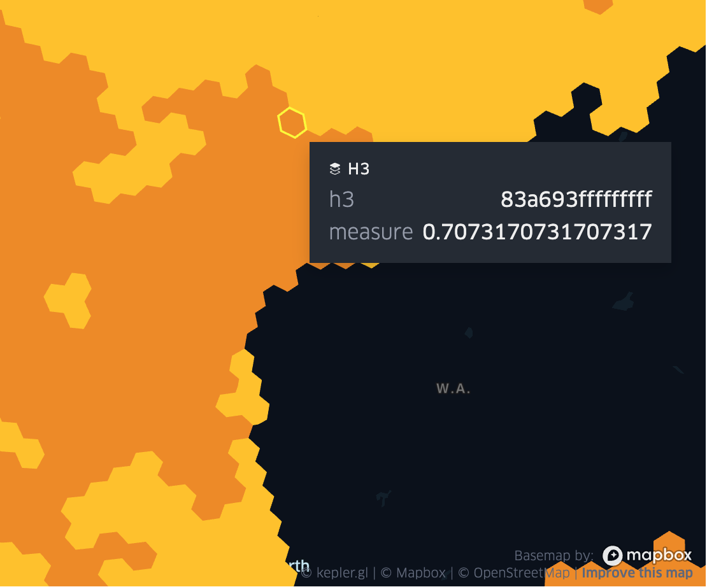

=================
Raster functions
=================

Intro
################
Raster functions are available in mosaic if you have installed the optional dependency `GDAL`.
Please see :doc:`Install and Enable GDAL with Mosaic </usage/install-gdal>` for installation instructions.
Mosaic provides several unique raster functions that are not available in other Spark packages.
Mainly raster to grid functions, which are useful for reprojecting the raster data into a standard grid index system.
This is useful for performing spatial joins between raster data and vector data.
Mosaic also provides a scalable retiling function that can be used to retile raster data in case of bottlenecking due to large files.
All raster functions respect the \"rst\_\" prefix naming convention.
In versions <= 0.3.11 mosaic was operating using either string paths or byte arrays.
In versions > 0.3.11 mosaic is operating using tile objects only. Tile objects are created using rst_fromfile(path_to_raster) function.
If you use spark.read.format("gdal") tiles are automatically generated for you.

.. note:: For mosaic versions > 0.3.11 please do not use setup_gdal call. There is no longer a need for shared objects to be copied around.
    Please use the updated init_script.sh script to install GDAL on your cluster. See :doc:`Install and Enable GDAL with Mosaic </usage/install-gdal>` for more details.

rst_bandmetadata
****************

.. function:: rst_bandmetadata(tile, band)

    Extract the metadata describing the raster band.
    Metadata is return as a map of key value pairs.

    :param tile: A column containing the raster tile. For < 0.3.11 string representing the path to a raster file or byte array.
    :type col: Column (RasterTileType)
    :param band: The band number to extract metadata for.
    :type band: Column (IntegerType)
    :rtype: Column: MapType(StringType, StringType)

    :example:

.. tabs::
   .. code-tab:: py

    df = spark.read.format("gdal").option("extensions", "nc")\
            .load("dbfs:/FileStore/geospatial/mosaic/sample_raster_data/gdal-netcdf-coral")
    df.select(mos.rst_bandmetadata("tile", F.lit(1))).limit(1).display()
    +--------------------------------------------------------------------------------------+
    | rst_bandmetadata(tile, 1)                                                            |
    +--------------------------------------------------------------------------------------+
    | {"_FillValue": "251", "NETCDF_DIM_time": "1294315200", "long_name": "bleaching alert |
    | area 7-day maximum composite", "grid_mapping": "crs", "NETCDF_VARNAME":              |
    | "bleaching_alert_area", "coverage_content_type": "thematicClassification",           |
    | "standard_name": "N/A", "comment": "Bleaching Alert Area (BAA) values are coral      |
    | bleaching heat stress levels: 0 - No Stress; 1 - Bleaching Watch; 2 - Bleaching      |
    | Warning; 3 - Bleaching Alert Level 1; 4 - Bleaching Alert Level 2. Product           |
    | description is provided at https://coralreefwatch.noaa.gov/product/5km/index.php.",  |
    | "valid_min": "0", "units": "stress_level", "valid_max": "4", "scale_factor": "1"}    |
    +--------------------------------------------------------------------------------------+

   .. code-tab:: scala

    val df = spark.read
        .format("gdal").option("extensions", "nc")
        .load("dbfs:/FileStore/geospatial/mosaic/sample_raster_data/binary/netcdf-coral")
    df.select(rst_bandmetadata(col("tile"), lit(1)).limit(1).show(false)
    +--------------------------------------------------------------------------------------+
    | rst_bandmetadata(tile, 1)                                                            |
    +--------------------------------------------------------------------------------------+
    | {"_FillValue": "251", "NETCDF_DIM_time": "1294315200", "long_name": "bleaching alert |
    | area 7-day maximum composite", "grid_mapping": "crs", "NETCDF_VARNAME":              |
    | "bleaching_alert_area", "coverage_content_type": "thematicClassification",           |
    | "standard_name": "N/A", "comment": "Bleaching Alert Area (BAA) values are coral      |
    | bleaching heat stress levels: 0 - No Stress; 1 - Bleaching Watch; 2 - Bleaching      |
    | Warning; 3 - Bleaching Alert Level 1; 4 - Bleaching Alert Level 2. Product           |
    | description is provided at https://coralreefwatch.noaa.gov/product/5km/index.php.",  |
    | "valid_min": "0", "units": "stress_level", "valid_max": "4", "scale_factor": "1"}    |
    +--------------------------------------------------------------------------------------+

   .. code-tab:: sql

    CREATE TABLE IF NOT EXISTS TABLE coral_netcdf
        USING gdal
        OPTIONS (extension "nc", path "dbfs:/FileStore/geospatial/mosaic/sample_raster_data/binary/netcdf-coral")
    SELECT rst_bandmetadata(tile, 1) FROM coral_netcdf LIMIT 1
    +--------------------------------------------------------------------------------------+
    | rst_bandmetadata(tile, 1)                                                            |
    +--------------------------------------------------------------------------------------+
    | {"_FillValue": "251", "NETCDF_DIM_time": "1294315200", "long_name": "bleaching alert |
    | area 7-day maximum composite", "grid_mapping": "crs", "NETCDF_VARNAME":              |
    | "bleaching_alert_area", "coverage_content_type": "thematicClassification",           |
    | "standard_name": "N/A", "comment": "Bleaching Alert Area (BAA) values are coral      |
    | bleaching heat stress levels: 0 - No Stress; 1 - Bleaching Watch; 2 - Bleaching      |
    | Warning; 3 - Bleaching Alert Level 1; 4 - Bleaching Alert Level 2. Product           |
    | description is provided at https://coralreefwatch.noaa.gov/product/5km/index.php.",  |
    | "valid_min": "0", "units": "stress_level", "valid_max": "4", "scale_factor": "1"}    |
    +--------------------------------------------------------------------------------------+

rst_boundingbox
***************

.. function:: rst_boundingbox(raster)

    Returns the bounding box of the raster as a polygon geometry.

    :param tile: A column containing the raster tile. For < 0.3.11 string representing the path to a raster file or byte array.
    :type col: Column (RasterTileType)
    :rtype: Column: StructType(DoubleType, DoubleType, DoubleType, DoubleType)

    :example:

.. tabs::
    .. code-tab:: py

     df = spark.read.format("gdal").option("extensions", "nc")\
                .load("dbfs:/FileStore/geospatial/mosaic/sample_raster_data/gdal-netcdf-coral")
     df.select(mos.rst_boundingbox("tile")).limit(1).display()
     +------------------------------------------------------------------+
     | rst_boundingbox(tile)                                            |
     +------------------------------------------------------------------+
     | [00 00 ... 00] // WKB representation of the polygon bounding box |
     +------------------------------------------------------------------+

    .. code-tab:: scala

     val df = spark.read
          .format("gdal").option("extensions", "nc")
          .load("dbfs:/FileStore/geospatial/mosaic/sample_raster_data/binary/netcdf-coral")
     df.select(rst_boundingbox(col("tile"))).limit(1).show(false)
     +------------------------------------------------------------------+
     | rst_boundingbox(tile)                                            |
     +------------------------------------------------------------------+
     | [00 00 ... 00] // WKB representation of the polygon bounding box |
     +------------------------------------------------------------------+

    .. code-tab:: sql

     CREATE TABLE IF NOT EXISTS TABLE coral_netcdf
         USING gdal
         OPTIONS (extension "nc", path "dbfs:/FileStore/geospatial/mosaic/sample_raster_data/binary/netcdf-coral")
     SELECT rst_boundingbox(tile) FROM coral_netcdf LIMIT 1
     +------------------------------------------------------------------+
     | rst_boundingbox(tile)                                            |
     +------------------------------------------------------------------+
     | [00 00 ... 00] // WKB representation of the polygon bounding box |
     +------------------------------------------------------------------+

rst_clip
********

.. function:: rst_clip(raster, geometry)

    Clips the raster to the geometry.
    The geometry is expected to be in the same coordinate reference system as the raster.
    The geometry is expected to be a polygon or a multipolygon.
    The output raster will have the same extent as the input geometry.
    The output raster will have the same number of bands as the input raster.
    The output raster will have the same pixel type as the input raster.
    The output raster will have the same pixel size as the input raster.
    The output raster will have the same coordinate reference system as the input raster.

    :param tile: A column containing the raster tile.
    :type col: Column (RasterTileType)
    :param geometry: A column containing the geometry to clip the raster to.
    :type col: Column (GeometryType)
    :rtype: Column: RasterTileType

    :example:

.. tabs::
    .. code-tab:: py

     df = spark.read.format("gdal").option("extensions", "nc")\
                .load("dbfs:/FileStore/geospatial/mosaic/sample_raster_data/gdal-netcdf-coral")
     df.select(mos.rst_clip("tile", F.lit("POLYGON((0 0, 0 10, 10 10, 10 0, 0 0))"))).limit(1).display()
     +----------------------------------------------------------------------------------------------------------------+
     | rst_clip(tile, POLYGON ((0 0, 0 10, 10 10, 10 0, 0 0)))                                                        |
     +----------------------------------------------------------------------------------------------------------------+
     | {index_id: 593308294097928191, raster: [00 01 10 ... 00], parentPath: "dbfs:/path_to_file", driver: "NetCDF" } |
     +----------------------------------------------------------------------------------------------------------------+

    .. code-tab:: scala

     val df = spark.read
          .format("gdal").option("extensions", "nc")
          .load("dbfs:/FileStore/geospatial/mosaic/sample_raster_data/binary/netcdf-coral")
     df.select(rst_clip(col("tile"), lit("POLYGON((0 0, 0 10, 10 10, 10 0, 0 0))"))).limit(1).show(false)
     +----------------------------------------------------------------------------------------------------------------+
    | rst_clip(tile, POLYGON ((0 0, 0 10, 10 10, 10 0, 0 0)))                                                         |
    +-----------------------------------------------------------------------------------------------------------------+
    | {index_id: 593308294097928191, raster: [00 01 10 ... 00], parentPath: "dbfs:/path_to_file", driver: "NetCDF" }  |
    +-----------------------------------------------------------------------------------------------------------------+

    .. code-tab:: sql

     CREATE TABLE IF NOT EXISTS TABLE coral_netcdf
         USING gdal
         OPTIONS (extension "nc", path "dbfs:/FileStore/geospatial/mosaic/sample_raster_data/binary/netcdf-coral")
     SELECT rst_clip(tile, "POLYGON((0 0, 0 10, 10 10, 10 0, 0 0))") FROM coral_netcdf LIMIT 1
     +----------------------------------------------------------------------------------------------------------------+
     | rst_clip(tile, POLYGON ((0 0, 0 10, 10 10, 10 0, 0 0)))                                                        |
     +----------------------------------------------------------------------------------------------------------------+
     | {index_id: 593308294097928191, raster: [00 01 10 ... 00], parentPath: "dbfs:/path_to_file", driver: "NetCDF" } |
     +----------------------------------------------------------------------------------------------------------------+

rst_combineavg
**************

.. function:: rst_combineavg(rasters)

    Combines a collection of rasters by averaging the pixel values.
    The rasters must have the same extent, number of bands, and pixel type.
    The rasters must have the same pixel size and coordinate reference system.
    The output raster will have the same extent as the input rasters.
    The output raster will have the same number of bands as the input rasters.
    The output raster will have the same pixel type as the input rasters.
    The output raster will have the same pixel size as the input rasters.
    The output raster will have the same coordinate reference system as the input rasters.

    :param tile: A column containing an array of raster tiles.
    :type col: Column (ArrayType(RasterTileType))
    :rtype: Column: RasterTileType

    :example:

.. tabs::
    .. code-tab:: py

     df = spark.read.format("gdal").option("extensions", "nc")\
                .load("dbfs:/FileStore/geospatial/mosaic/sample_raster_data/gdal-netcdf-coral")\
                .groupBy().agg(F.collect_list("tile").alias("tile"))
     df.select(mos.rst_combineavg("tile")).limit(1).display()
     +----------------------------------------------------------------------------------------------------------------+
     | rst_combineavg(tile)                                                                                           |
     +----------------------------------------------------------------------------------------------------------------+
     | {index_id: 593308294097928191, raster: [00 01 10 ... 00], parentPath: "dbfs:/path_to_file", driver: "NetCDF" } |
     +----------------------------------------------------------------------------------------------------------------+

    .. code-tab:: scala

     val df = spark.read
          .format("gdal").option("extensions", "nc")
          .load("dbfs:/FileStore/geospatial/mosaic/sample_raster_data/binary/netcdf-coral")
          .groupBy().agg(collect_list(col("tile")).as("tile"))
     df.select(rst_combineavg(col("tile"))).limit(1).show(false)
     +----------------------------------------------------------------------------------------------------------------+
     | rst_combineavg(tile)                                                                                           |
     +----------------------------------------------------------------------------------------------------------------+
     | {index_id: 593308294097928191, raster: [00 01 10 ... 00], parentPath: "dbfs:/path_to_file", driver: "NetCDF" } |
     +----------------------------------------------------------------------------------------------------------------+

    .. code-tab:: sql

    CREATE TABLE IF NOT EXISTS TABLE coral_netcdf
         USING gdal
         OPTIONS (extension "nc", path "dbfs:/FileStore/geospatial/mosaic/sample_raster_data/binary/netcdf-coral")
    WITH grouped as (
        SELECT collect_list(tile) as tile FROM coral_netcdf
    )
    SELECT rst_combineavg(tile) FROM grouped LIMIT 1
    +----------------------------------------------------------------------------------------------------------------+
    | rst_combineavg(tile)                                                                                           |
    +----------------------------------------------------------------------------------------------------------------+
    | {index_id: 593308294097928191, raster: [00 01 10 ... 00], parentPath: "dbfs:/path_to_file", driver: "NetCDF" } |
    +----------------------------------------------------------------------------------------------------------------+

rst_combineavgagg
*****************

.. function:: rst_combineavgagg(rasters)

    Combines a group by statement over rasters by averaging the pixel values.
    The rasters must have the same extent, number of bands, and pixel type.
    The rasters must have the same pixel size and coordinate reference system.
    The output raster will have the same extent as the input rasters.
    The output raster will have the same number of bands as the input rasters.
    The output raster will have the same pixel type as the input rasters.
    The output raster will have the same pixel size as the input rasters.
    The output raster will have the same coordinate reference system as the input rasters.

    :param tile: A column containing raster tiles.
    :type col: Column (ArrayType(RasterTileType))
    :rtype: Column: RasterTileType

    :example:

.. tabs::
    .. code-tab:: py

     df = spark.read.format("gdal").option("extensions", "nc")\
                .load("dbfs:/FileStore/geospatial/mosaic/sample_raster_data/gdal-netcdf-coral")\
     df.groupBy().agg(mos.rst_combineavgagg("tile")).limit(1).display()
     +----------------------------------------------------------------------------------------------------------------+
     | rst_combineavgagg(tile)                                                                                        |
     +----------------------------------------------------------------------------------------------------------------+
     | {index_id: 593308294097928191, raster: [00 01 10 ... 00], parentPath: "dbfs:/path_to_file", driver: "NetCDF" } |
     +----------------------------------------------------------------------------------------------------------------+

    .. code-tab:: scala

     val df = spark.read
          .format("gdal").option("extensions", "nc")
          .load("dbfs:/FileStore/geospatial/mosaic/sample_raster_data/binary/netcdf-coral")
     df.groupBy().agg(rst_combineavgagg(col("tile"))).limit(1).show(false)
     +----------------------------------------------------------------------------------------------------------------+
     | rst_combineavgagg(tile)                                                                                        |
     +----------------------------------------------------------------------------------------------------------------+
     | {index_id: 593308294097928191, raster: [00 01 10 ... 00], parentPath: "dbfs:/path_to_file", driver: "NetCDF" } |
     +----------------------------------------------------------------------------------------------------------------+

    .. code-tab:: sql

    CREATE TABLE IF NOT EXISTS TABLE coral_netcdf
         USING gdal
         OPTIONS (extension "nc", path "dbfs:/FileStore/geospatial/mosaic/sample_raster_data/binary/netcdf-coral")
    SELECT rst_combineavgagg(tile)
    FROM coral_netcdf
    GROUP BY 1
    +----------------------------------------------------------------------------------------------------------------+
    | rst_combineavgagg(tile)                                                                                        |
    +----------------------------------------------------------------------------------------------------------------+
    | {index_id: 593308294097928191, raster: [00 01 10 ... 00], parentPath: "dbfs:/path_to_file", driver: "NetCDF" } |
    +----------------------------------------------------------------------------------------------------------------+

rst_frombands
**************

.. function:: rst_frombands(rasters)

    Combines a collection of rasters into a single raster.
    The rasters must have the same extent.
    The rasters must have the same pixel coordinate reference system.
    The output raster will have the same extent as the input rasters.
    The output raster will have the same number of bands as all the input raster bands.
    The output raster will have the same pixel type as the input raster bands.
    The output raster will have the same pixel size as the highest resolution input rasters.
    The output raster will have the same coordinate reference system as the input rasters.

    :param tile: A column containing an array of raster tiles.
    :type col: Column (ArrayType(RasterTileType))
    :rtype: Column: RasterTileType

    :example:

.. tabs::
    .. code-tab:: py

     df = spark.read.format("gdal").option("extensions", "nc")\
                .load("dbfs:/FileStore/geospatial/mosaic/sample_raster_data/gdal-netcdf-coral")\
                .groupBy().agg(F.collect_list("tile").alias("tile"))
     df.select(mos.rst_frombands("tile")).limit(1).display()
     +----------------------------------------------------------------------------------------------------------------+
     | rst_frombands(tile)                                                                                            |
     +----------------------------------------------------------------------------------------------------------------+
     | {index_id: 593308294097928191, raster: [00 01 10 ... 00], parentPath: "dbfs:/path_to_file", driver: "NetCDF" } |
     +----------------------------------------------------------------------------------------------------------------+

    .. code-tab:: scala

     val df = spark.read
          .format("gdal").option("extensions", "nc")
          .load("dbfs:/FileStore/geospatial/mosaic/sample_raster_data/binary/netcdf-coral")
          .groupBy().agg(collect_list(col("tile")).as("tile"))
     df.select(rst_frombands(col("tile"))).limit(1).show(false)
     +----------------------------------------------------------------------------------------------------------------+
     | rst_frombands(tile)                                                                                            |
     +----------------------------------------------------------------------------------------------------------------+
     | {index_id: 593308294097928191, raster: [00 01 10 ... 00], parentPath: "dbfs:/path_to_file", driver: "NetCDF" } |
     +----------------------------------------------------------------------------------------------------------------+

    .. code-tab:: sql

    CREATE TABLE IF NOT EXISTS TABLE coral_netcdf
        USING gdal
        OPTIONS (extension "nc", path "dbfs:/FileStore/geospatial/mosaic/sample_raster_data/binary/netcdf-coral")
    WITH grouped as (
        SELECT collect_list(tile) as tile FROM coral_netcdf
    )
    SELECT rst_frombands(tile) FROM grouped LIMIT 1
    +----------------------------------------------------------------------------------------------------------------+
    | rst_frombands(tile)                                                                                            |
    +----------------------------------------------------------------------------------------------------------------+
    | {index_id: 593308294097928191, raster: [00 01 10 ... 00], parentPath: "dbfs:/path_to_file", driver: "NetCDF" } |
    +----------------------------------------------------------------------------------------------------------------+

rst_fromfile
************

.. function:: rst_fromfile(path, <size_in_MB>)

    Returns a raster tile from a file path.
    The file path must be a string.
    The file path must be a valid path to a raster file.
    The file path must be a path to a file that GDAL can read.
    If the size_in_MB parameter is specified, the raster will be split into tiles of the specified size.
    If the size_in_MB parameter is not specified, the raster will not be split into tiles.
    If the size_in_Mb < 0 the raster wont be split into tiles.

    :param path: A column containing the path to a raster file.
    :type col: Column (StringType)
    :param size_in_MB: Optional parameter to specify the size of the raster tile in MB. Default is not to split the input.
    :type col: Column (IntegerType)
    :rtype: Column: RasterTileType

    :example:

.. tabs::
    .. code-tab:: py

     df = spark.read.format("binaryFile")\
                .load("dbfs:/FileStore/geospatial/mosaic/sample_raster_data/binary/netcdf-coral")
     df.select(mos.rst_fromfile("path")).limit(1).display()
     +----------------------------------------------------------------------------------------------------------------+
     | rst_fromfile(path)                                                                                             |
     +----------------------------------------------------------------------------------------------------------------+
     | {index_id: 593308294097928191, raster: [00 01 10 ... 00], parentPath: "dbfs:/path_to_file", driver: "NetCDF" } |
     +----------------------------------------------------------------------------------------------------------------+

    .. code-tab:: scala

     val df = spark.read
          .format("binaryFile")
          .load("dbfs:/FileStore/geospatial/mosaic/sample_raster_data/binary/netcdf-coral")
     df.select(rst_fromfile(col("path"))).limit(1).show(false)
     +----------------------------------------------------------------------------------------------------------------+
     | rst_fromfile(path)                                                                                             |
     +----------------------------------------------------------------------------------------------------------------+
     | {index_id: 593308294097928191, raster: [00 01 10 ... 00], parentPath: "dbfs:/path_to_file", driver: "NetCDF" } |
     +----------------------------------------------------------------------------------------------------------------+

    .. code-tab:: sql

    CREATE TABLE IF NOT EXISTS TABLE coral_netcdf
         USING binaryFile
         OPTIONS (path "dbfs:/FileStore/geospatial/mosaic/sample_raster_data/binary/netcdf-coral")
    SELECT rst_fromfile(path) FROM coral_netcdf LIMIT 1
    +----------------------------------------------------------------------------------------------------------------+
    | rst_fromfile(path)                                                                                             |
    +----------------------------------------------------------------------------------------------------------------+

rst_georeference
****************

.. function:: rst_georeference(raster)

    Returns GeoTransform of the raster as a GT array of doubles.
    GT(0) x-coordinate of the upper-left corner of the upper-left pixel.
    GT(1) w-e pixel resolution / pixel width.
    GT(2) row rotation (typically zero).
    GT(3) y-coordinate of the upper-left corner of the upper-left pixel.
    GT(4) column rotation (typically zero).
    GT(5) n-s pixel resolution / pixel height (negative value for a north-up image).

    :param tile: A column containing the raster tile. For < 0.3.11 string representing the path to a raster file or byte array.
    :type col: Column (RasterTileType)
    :rtype: Column: MapType(StringType, DoubleType)

    :example:

.. tabs::
   .. code-tab:: py

    df = spark.read.format("binaryFile").option("extensions", "nc")\
        .load("dbfs:/FileStore/geospatial/mosaic/sample_raster_data/binary/netcdf-coral")
    df.select(mos.rst_georeference("path")).limit(1).display()
    +--------------------------------------------------------------------------------------------+
    | rst_georeference(path)                                                                     |
    +--------------------------------------------------------------------------------------------+
    | {"scaleY": -0.049999999152053956, "skewX": 0, "skewY": 0, "upperLeftY": 89.99999847369712, |
    | "upperLeftX": -180.00000610436345, "scaleX": 0.050000001695656514}                         |
    +--------------------------------------------------------------------------------------------+

   .. code-tab:: scala

    val df = spark.read
        .format("binaryFile").option("extensions", "nc")
        .load("dbfs:/FileStore/geospatial/mosaic/sample_raster_data/binary/netcdf-coral")
    df.select(rst_georeference(col("path"))).limit(1).show()
    +--------------------------------------------------------------------------------------------+
    | rst_georeference(path)                                                                     |
    +--------------------------------------------------------------------------------------------+
    | {"scaleY": -0.049999999152053956, "skewX": 0, "skewY": 0, "upperLeftY": 89.99999847369712, |
    | "upperLeftX": -180.00000610436345, "scaleX": 0.050000001695656514}                         |
    +--------------------------------------------------------------------------------------------+

   .. code-tab:: sql

    CREATE TABLE IF NOT EXISTS TABLE coral_netcdf
        USING gdal
        OPTIONS (extensions "nc", path "dbfs:/FileStore/geospatial/mosaic/sample_raster_data/binary/netcdf-coral")
    SELECT rst_georeference(path) FROM coral_netcdf LIMIT 1
    +--------------------------------------------------------------------------------------------+
    | rst_georeference(path)                                                                     |
    +--------------------------------------------------------------------------------------------+
    | {"scaleY": -0.049999999152053956, "skewX": 0, "skewY": 0, "upperLeftY": 89.99999847369712, |
    | "upperLeftX": -180.00000610436345, "scaleX": 0.050000001695656514}                         |
    +--------------------------------------------------------------------------------------------+

rest_getnodata
**************

.. function:: rst_getnodata(raster)

    Returns the nodata value of the raster bands.

    :param tile: A column containing the raster tile. For < 0.3.11 string representing the path to a raster file or byte array.
    :type col: Column (RasterTileType)
    :rtype: Column: ArrayType(DoubleType)

    :example:

.. tabs::
    .. code-tab:: py

     df = spark.read.format("binaryFile").option("extensions", "nc")\
          .load("dbfs:/FileStore/geospatial/mosaic/sample_raster_data/binary/netcdf-coral")
     df.select(mos.rst_getnodata("path")).limit(1).display()
     +---------------------+
     | rst_getnodata(path) |
     +---------------------+
     | [0.0, -9999.0, ...] |
     +---------------------+

    .. code-tab:: scala

     val df = spark.read
          .format("binaryFile").option("extensions", "nc")
          .load("dbfs:/FileStore/geospatial/mosaic/sample_raster_data/binary/netcdf-coral")
     df.select(rst_getnodata(col("path"))).limit(1).show()
     +---------------------+
     | rst_getnodata(path) |
     +---------------------+
     | [0.0, -9999.0, ...] |
     +---------------------+

    .. code-tab:: sql

     CREATE TABLE IF NOT EXISTS TABLE coral_netcdf
          USING gdal
          OPTIONS (extensions "nc", path "dbfs:/FileStore/geospatial/mosaic/sample_raster_data/binary/netcdf-coral")
     SELECT rst_getnodata(path) FROM coral_netcdf LIMIT 1
     +---------------------+
     | rst_getnodata(path) |
     +---------------------+
     | [0.0, -9999.0, ...] |
     +---------------------+

rst_getsubdataset
*****************

.. function:: rst_getsubdataset(raster, name)

    Returns the subdataset of the raster with a given name.
    The subdataset name must be a string. The name is not a full path.
    The name is the last identifier in the subdataset path (FORMAT:PATH:NAME).
    The subdataset name must be a valid subdataset name for the raster.

    :param tile: A column containing the raster tile. For < 0.3.11 string representing the path to a raster file or byte array.
    :type col: Column (RasterTileType)
    :param name: A column containing the name of the subdataset to return.
    :type col: Column (StringType)
    :rtype: Column: RasterTileType

    :example:

.. tabs::
    .. code-tab:: py

     df = spark.read.format("binaryFile").option("extensions", "nc")\
          .load("dbfs:/FileStore/geospatial/mosaic/sample_raster_data/binary/netcdf-coral")
     df.select(mos.rst_getsubdataset("path", "sst")).limit(1).display()
     +----------------------------------------------------------------------------------------------------------------+
     | rst_getsubdataset(path, sst)                                                                                   |
     +----------------------------------------------------------------------------------------------------------------+
     | {index_id: 593308294097928191, raster: [00 01 10 ... 00], parentPath: "dbfs:/path_to_file", driver: "NetCDF" } |
     +----------------------------------------------------------------------------------------------------------------+

    .. code-tab:: scala

     val df = spark.read
          .format("binaryFile").option("extensions", "nc")
          .load("dbfs:/FileStore/geospatial/mosaic/sample_raster_data/binary/netcdf-coral")
     df.select(rst_getsubdataset(col("path"), lit("sst"))).limit(1).show(false)
     +----------------------------------------------------------------------------------------------------------------+
     | rst_getsubdataset(path, sst)                                                                                   |
     +----------------------------------------------------------------------------------------------------------------+
     | {index_id: 593308294097928191, raster: [00 01 10 ... 00], parentPath: "dbfs:/path_to_file", driver: "NetCDF" } |
     +----------------------------------------------------------------------------------------------------------------+

    .. code-tab:: sql

     CREATE TABLE IF NOT EXISTS TABLE coral_netcdf
          USING gdal
          OPTIONS (extensions "nc", path "dbfs:/FileStore/geospatial/mosaic/sample_raster_data/binary/netcdf-coral")
     SELECT rst_getsubdataset(path, "sst") FROM coral_netcdf LIMIT 1
     +----------------------------------------------------------------------------------------------------------------+
     | rst_getsubdataset(path, sst)                                                                                   |
    +----------------------------------------------------------------------------------------------------------------+
    | {index_id: 593308294097928191, raster: [00 01 10 ... 00], parentPath: "dbfs:/path_to_file", driver: "NetCDF" } |
    +----------------------------------------------------------------------------------------------------------------+

rst_height
**********

.. function:: rst_height(raster)

    Returns the height of the raster in pixels.

    :param tile: A column containing the raster tile. For < 0.3.11 string representing the path to a raster file or byte array.
    :type col: Column (RasterTileType)
    :rtype: Column: IntegerType

    :example:

.. tabs::
   .. code-tab:: py

    df = spark.read.format("binaryFile").option("extensions", "nc")\
        .load("dbfs:/FileStore/geospatial/mosaic/sample_raster_data/binary/netcdf-coral")
    df.select(mos.rst_height('path')).show()
    +--------------------+
    | rst_height(path)   |
    +--------------------+
    | 3600               |
    | 3600               |
    +--------------------+

   .. code-tab:: scala

    val df = spark.read
        .format("binaryFile").option("extensions", "nc")
        .load("dbfs:/FileStore/geospatial/mosaic/sample_raster_data/binary/netcdf-coral")
    df.select(rst_height(col("path"))).show()
    +--------------------+
    | rst_height(path)   |
    +--------------------+
    |3600                |
    |3600                |
    +--------------------+

   .. code-tab:: sql

    CREATE TABLE IF NOT EXISTS TABLE coral_netcdf
        USING gdal
        OPTIONS (extensions "nc", path "dbfs:/FileStore/geospatial/mosaic/sample_raster_data/binary/netcdf-coral")
    SELECT rst_height(path) FROM coral_netcdf
    +--------------------+
    | rst_height(path)   |
    +--------------------+
    |3600                |
    |3600                |
    +--------------------+

rst_initnodata
**************

.. function:: rst_initnodata(raster)

    Initializes the nodata value of the raster bands.
    The nodata value will be set to default values for the pixel type of the raster bands.
    The output raster will have the same extent as the input raster.
    The default nodata value for ByteType is 0.
    The default nodata value for UnsignedShortType is UShort.MaxValue (65535).
    The default nodata value for ShortType is Short.MinValue (-32768).
    The default nodata value for UnsignedIntegerType is Int.MaxValue (4.294967294E9).
    The default nodata value for IntegerType is Int.MinValue (-2147483648).
    The default nodata value for FloatType is Float.MinValue (-3.4028234663852886E38).
    The default nodata value for DoubleType is Double.MinValue (-1.7976931348623157E308).

    :param tile: A column containing the raster tile.
    :type col: Column (RasterTileType)
    :rtype: Column: RasterTileType

    :example:

.. tabs::
    .. code-tab:: py

     df = spark.read.format("binaryFile").option("extensions", "nc")\
          .load("dbfs:/FileStore/geospatial/mosaic/sample_raster_data/binary/netcdf-coral")
     df.select(mos.rst_initnodata("path")).limit(1).display()
     +----------------------------------------------------------------------------------------------------------------+
     | rst_initnodata(path)                                                                                        |
     +----------------------------------------------------------------------------------------------------------------+
     | {index_id: 593308294097928191, raster: [00 01 10 ... 00], parentPath: "dbfs:/path_to_file", driver: "NetCDF" } |
     +----------------------------------------------------------------------------------------------------------------+

    .. code-tab:: scala

     val df = spark.read
          .format("binaryFile").option("extensions", "nc")
          .load("dbfs:/FileStore/geospatial/mosaic/sample_raster_data/binary/netcdf-coral")
     df.select(rst_initnodata(col("path"))).limit(1).show(false)
     +----------------------------------------------------------------------------------------------------------------+
     | rst_initnodata(path)                                                                                        |
     +----------------------------------------------------------------------------------------------------------------+
     | {index_id: 593308294097928191, raster: [00 01 10 ... 00], parentPath: "dbfs:/path_to_file", driver: "NetCDF" } |
     +----------------------------------------------------------------------------------------------------------------+

    .. code-tab:: sql

    CREATE TABLE IF NOT EXISTS TABLE coral_netcdf
          USING gdal
          OPTIONS (extensions "nc", path "dbfs:/FileStore/geospatial/mosaic/sample_raster_data/binary/netcdf-coral")
    SELECT rst_initnodata(path) FROM coral_netcdf LIMIT 1
    +----------------------------------------------------------------------------------------------------------------+
    | rst_initnodata(path)                                                                                        |
    +----------------------------------------------------------------------------------------------------------------+
    | {index_id: 593308294097928191, raster: [00 01 10 ... 00], parentPath: "dbfs:/path_to_file", driver: "NetCDF" } |
    +----------------------------------------------------------------------------------------------------------------+

rst_isempty
*************

.. function:: rst_isempty(raster)

    Returns true if the raster is empty.

    :param tile: A column containing the raster tile. For < 0.3.11 string representing the path to a raster file or byte array.
    :type col: Column (RasterTileType)
    :rtype: Column: BooleanType

    :example:

.. tabs::
   .. code-tab:: py

    df = spark.read.format("binaryFile").option("extensions", "nc")\
        .load("dbfs:/FileStore/geospatial/mosaic/sample_raster_data/binary/netcdf-coral")
    df.select(mos.rst_isempty('path')).show()
    +--------------------+
    | rst_height(path)   |
    +--------------------+
    |false               |
    |false               |
    +--------------------+

   .. code-tab:: scala

    val df = spark.read
        .format("binaryFile").option("extensions", "nc")
        .load("dbfs:/FileStore/geospatial/mosaic/sample_raster_data/binary/netcdf-coral")
    df.select(rst_isempty(col("path"))).show()
    +--------------------+
    | rst_height(path)   |
    +--------------------+
    |false               |
    |false               |
    +--------------------+

   .. code-tab:: sql

    CREATE TABLE IF NOT EXISTS TABLE coral_netcdf
        USING gdal
        OPTIONS (extensions "nc", path "dbfs:/FileStore/geospatial/mosaic/sample_raster_data/binary/netcdf-coral")
    SELECT rst_isempty(path) FROM coral_netcdf
    +--------------------+
    | rst_height(path)   |
    +--------------------+
    |false               |
    |false               |
    +--------------------+

rst_memsize
*************

.. function:: rst_memsize(raster)

    Returns size of the raster in bytes.

    :param tile: A column containing the raster tile. For < 0.3.11 string representing the path to a raster file or byte array.
    :type col: Column (RasterTileType)
    :rtype: Column: LongType

    :example:

.. tabs::
   .. code-tab:: py

    df = spark.read.format("binaryFile").option("extensions", "nc")\
        .load("dbfs:/FileStore/geospatial/mosaic/sample_raster_data/binary/netcdf-coral")
    df.select(mos.rst_memsize('path')).show()
    +--------------------+
    | rst_height(path)   |
    +--------------------+
    |730260              |
    |730260              |
    +--------------------+

   .. code-tab:: scala

    val df = spark.read
        .format("binaryFile").option("extensions", "nc")
        .load("dbfs:/FileStore/geospatial/mosaic/sample_raster_data/binary/netcdf-coral")
    df.select(rst_memsize(col("path"))).show()
    +--------------------+
    | rst_height(path)   |
    +--------------------+
    |730260              |
    |730260              |
    +--------------------+

   .. code-tab:: sql

    CREATE TABLE IF NOT EXISTS TABLE coral_netcdf
        USING gdal
        OPTIONS (extensions "nc", path "dbfs:/FileStore/geospatial/mosaic/sample_raster_data/binary/netcdf-coral")
    SELECT rst_memsize(path) FROM coral_netcdf
    +--------------------+
    | rst_height(path)   |
    +--------------------+
    |730260              |
    |730260              |
    +--------------------+

rst_merge
*********

.. function:: rst_merge(rasters)

    Combines a collection of rasters into a single raster.
    The rasters do not need to have the same extent.
    The rasters must have the same coordinate reference system.
    The rasters are combined using gdalwarp.
    The noData value needs to be initialised; if not, the non valid pixels may introduce artifacts in the output raster.
    The rasters are stacked in the order they are provided.
    The output raster will have the extent covering all input rasters.
    The output raster will have the same number of bands as the input rasters.
    The output raster will have the same pixel type as the input rasters.
    The output raster will have the same pixel size as the highest resolution input rasters.
    The output raster will have the same coordinate reference system as the input rasters.

    :param tile: A column containing an array of raster tiles.
    :type col: Column (ArrayType(RasterTileType))
    :rtype: Column: RasterTileType

    :example:

.. tabs::
    .. code-tab:: py

     df = spark.read.format("gdal").option("extensions", "nc")\
                .load("dbfs:/FileStore/geospatial/mosaic/sample_raster_data/gdal-netcdf-coral")\
                .groupBy().agg(F.collect_list("tile").alias("tile"))
     df.select(mos.rst_merge("tile")).limit(1).display()
     +----------------------------------------------------------------------------------------------------------------+
     | rst_merge(tile)                                                                                                |
     +----------------------------------------------------------------------------------------------------------------+
     | {index_id: 593308294097928191, raster: [00 01 10 ... 00], parentPath: "dbfs:/path_to_file", driver: "NetCDF" } |
     +----------------------------------------------------------------------------------------------------------------+

    .. code-tab:: scala

     val df = spark.read
          .format("gdal").option("extensions", "nc")
          .load("dbfs:/FileStore/geospatial/mosaic/sample_raster_data/binary/netcdf-coral")
          .groupBy().agg(collect_list(col("tile")).as("tile"))
     df.select(rst_merge(col("tile"))).limit(1).show(false)
     +----------------------------------------------------------------------------------------------------------------+
     | rst_merge(tile)                                                                                                |
     +----------------------------------------------------------------------------------------------------------------+
     | {index_id: 593308294097928191, raster: [00 01 10 ... 00], parentPath: "dbfs:/path_to_file", driver: "NetCDF" } |
     +----------------------------------------------------------------------------------------------------------------+

    .. code-tab:: sql

    CREATE TABLE IF NOT EXISTS TABLE coral_netcdf
        USING gdal
        OPTIONS (extension "nc", path "dbfs:/FileStore/geospatial/mosaic/sample_raster_data/binary/netcdf-coral")
    WITH grouped as (
        SELECT collect_list(tile) as tile FROM coral_netcdf
    )
    SELECT rst_merge(tile) FROM grouped LIMIT 1
    +----------------------------------------------------------------------------------------------------------------+
    | rst_merge(tile)                                                                                                |
    +----------------------------------------------------------------------------------------------------------------+
    | {index_id: 593308294097928191, raster: [00 01 10 ... 00], parentPath: "dbfs:/path_to_file", driver: "NetCDF" } |
    +----------------------------------------------------------------------------------------------------------------+

rst_mergeagg
************

.. function:: rst_mergeagg(rasters)

    Combines a collection of rasters into a single raster.
    The rasters do not need to have the same extent.
    The rasters must have the same coordinate reference system.
    The rasters are combined using gdalwarp.
    The noData value needs to be initialised; if not, the non valid pixels may introduce artifacts in the output raster.
    The rasters are stacked in the order they are provided.
    This order is randomized since this is an aggregation function.
    If the order of rasters is important please first collect rasters and sort them by metadata information and then use
    rst_merge function.
    The output raster will have the extent covering all input rasters.
    The output raster will have the same number of bands as the input rasters.
    The output raster will have the same pixel type as the input rasters.
    The output raster will have the same pixel size as the highest resolution input rasters.
    The output raster will have the same coordinate reference system as the input rasters.

    :param tile: A column containing raster tiles.
    :type col: Column (RasterTileType)
    :rtype: Column: RasterTileType

    :example:

.. tabs::
    .. code-tab:: py

     df = spark.read.format("gdal").option("extensions", "nc")\
                .load("dbfs:/FileStore/geospatial/mosaic/sample_raster_data/gdal-netcdf-coral")
     df.select(mos.rst_mergeagg("tile")).limit(1).display()
     +----------------------------------------------------------------------------------------------------------------+
     | rst_mergeagg(tile)                                                                                             |
     +----------------------------------------------------------------------------------------------------------------+
     | {index_id: 593308294097928191, raster: [00 01 10 ... 00], parentPath: "dbfs:/path_to_file", driver: "NetCDF" } |
     +----------------------------------------------------------------------------------------------------------------+

    .. code-tab:: scala

     val df = spark.read
          .format("gdal").option("extensions", "nc")
          .load("dbfs:/FileStore/geospatial/mosaic/sample_raster_data/binary/netcdf-coral")
     df.select(rst_mergeagg(col("tile"))).limit(1).show(false)
     +----------------------------------------------------------------------------------------------------------------+
     | rst_mergeagg(tile)                                                                                             |
     +----------------------------------------------------------------------------------------------------------------+
     | {index_id: 593308294097928191, raster: [00 01 10 ... 00], parentPath: "dbfs:/path_to_file", driver: "NetCDF" } |
     +----------------------------------------------------------------------------------------------------------------+

    .. code-tab:: sql

    CREATE TABLE IF NOT EXISTS TABLE coral_netcdf
        USING gdal
        OPTIONS (extension "nc", path "dbfs:/FileStore/geospatial/mosaic/sample_raster_data/binary/netcdf-coral")
    SELECT rst_mergeagg(tile) FROM coral_netcdf LIMIT 1
    +----------------------------------------------------------------------------------------------------------------+
    | rst_mergeagg(tile)                                                                                             |
    +----------------------------------------------------------------------------------------------------------------+
    | {index_id: 593308294097928191, raster: [00 01 10 ... 00], parentPath: "dbfs:/path_to_file", driver: "NetCDF" } |
    +----------------------------------------------------------------------------------------------------------------+

rst_metadata
*************

.. function:: rst_metadata(raster)

    Extract the metadata describing the raster.
    Metadata is return as a map of key value pairs.

    :param tile: A column containing the raster tile. For < 0.3.11 string representing the path to a raster file or byte array.
    :type col: Column (RasterTileType)
    :rtype: Column: MapType(StringType, StringType)

    :example:

.. tabs::
   .. code-tab:: py

    df = spark.read.format("binaryFile").option("extensions", "nc")\
        .load("dbfs:/FileStore/geospatial/mosaic/sample_raster_data/binary/netcdf-coral")
    df.select(mos.rst_metadata('path')).show()
    +--------------------------------------------------------------------------------------------------------------------+
    | rst_metadata(path)                                                                                                 |
    +--------------------------------------------------------------------------------------------------------------------+
    | {"NC_GLOBAL#publisher_url": "https://coralreefwatch.noaa.gov", "NC_GLOBAL#geospatial_lat_units": "degrees_north",  |
    | "NC_GLOBAL#platform_vocabulary": "NOAA NODC Ocean Archive System Platforms", "NC_GLOBAL#creator_type": "group",    |
    | "NC_GLOBAL#geospatial_lon_units": "degrees_east", "NC_GLOBAL#geospatial_bounds": "POLYGON((-90.0 180.0, 90.0       |
    | 180.0, 90.0 -180.0, -90.0 -180.0, -90.0 180.0))", "NC_GLOBAL#keywords": "Oceans > Ocean Temperature > Sea Surface  |
    | Temperature, Oceans > Ocean Temperature > Water Temperature, Spectral/Engineering > Infrared Wavelengths > Thermal |
    | Infrared, Oceans > Ocean Temperature > Bleaching Alert Area", "NC_GLOBAL#geospatial_lat_max": "89.974998",         |
    | .... (truncated).... "NC_GLOBAL#history": "This is a product data file of the NOAA Coral Reef Watch Daily Global   |
    | 5km Satellite Coral Bleaching Heat Stress Monitoring Product Suite Version 3.1 (v3.1) in its NetCDF Version 1.0    |
    | (v1.0).", "NC_GLOBAL#publisher_institution": "NOAA/NESDIS/STAR Coral Reef Watch Program",                          |
    | "NC_GLOBAL#cdm_data_type": "Grid"}                                                                                 |
    +--------------------------------------------------------------------------------------------------------------------+

   .. code-tab:: scala

    val df = spark.read
        .format("binaryFile").option("extensions", "nc")
        .load("dbfs:/FileStore/geospatial/mosaic/sample_raster_data/binary/netcdf-coral")
    df.select(rst_metadata(col("path"))).show()
    +--------------------------------------------------------------------------------------------------------------------+
    | rst_metadata(path)                                                                                                 |
    +--------------------------------------------------------------------------------------------------------------------+
    | {"NC_GLOBAL#publisher_url": "https://coralreefwatch.noaa.gov", "NC_GLOBAL#geospatial_lat_units": "degrees_north",  |
    | "NC_GLOBAL#platform_vocabulary": "NOAA NODC Ocean Archive System Platforms", "NC_GLOBAL#creator_type": "group",    |
    | "NC_GLOBAL#geospatial_lon_units": "degrees_east", "NC_GLOBAL#geospatial_bounds": "POLYGON((-90.0 180.0, 90.0       |
    | 180.0, 90.0 -180.0, -90.0 -180.0, -90.0 180.0))", "NC_GLOBAL#keywords": "Oceans > Ocean Temperature > Sea Surface  |
    | Temperature, Oceans > Ocean Temperature > Water Temperature, Spectral/Engineering > Infrared Wavelengths > Thermal |
    | Infrared, Oceans > Ocean Temperature > Bleaching Alert Area", "NC_GLOBAL#geospatial_lat_max": "89.974998",         |
    | .... (truncated).... "NC_GLOBAL#history": "This is a product data file of the NOAA Coral Reef Watch Daily Global   |
    | 5km Satellite Coral Bleaching Heat Stress Monitoring Product Suite Version 3.1 (v3.1) in its NetCDF Version 1.0    |
    | (v1.0).", "NC_GLOBAL#publisher_institution": "NOAA/NESDIS/STAR Coral Reef Watch Program",                          |
    | "NC_GLOBAL#cdm_data_type": "Grid"}                                                                                 |
    +--------------------------------------------------------------------------------------------------------------------+

   .. code-tab:: sql

    CREATE TABLE IF NOT EXISTS TABLE coral_netcdf
        USING gdal
        OPTIONS (extensions "nc", path "dbfs:/FileStore/geospatial/mosaic/sample_raster_data/binary/netcdf-coral")
    SELECT rst_metadata(path) FROM coral_netcdf LIMIT 1
    +--------------------------------------------------------------------------------------------------------------------+
    | rst_metadata(path)                                                                                                 |
    +--------------------------------------------------------------------------------------------------------------------+
    | {"NC_GLOBAL#publisher_url": "https://coralreefwatch.noaa.gov", "NC_GLOBAL#geospatial_lat_units": "degrees_north",  |
    | "NC_GLOBAL#platform_vocabulary": "NOAA NODC Ocean Archive System Platforms", "NC_GLOBAL#creator_type": "group",    |
    | "NC_GLOBAL#geospatial_lon_units": "degrees_east", "NC_GLOBAL#geospatial_bounds": "POLYGON((-90.0 180.0, 90.0       |
    | 180.0, 90.0 -180.0, -90.0 -180.0, -90.0 180.0))", "NC_GLOBAL#keywords": "Oceans > Ocean Temperature > Sea Surface  |
    | Temperature, Oceans > Ocean Temperature > Water Temperature, Spectral/Engineering > Infrared Wavelengths > Thermal |
    | Infrared, Oceans > Ocean Temperature > Bleaching Alert Area", "NC_GLOBAL#geospatial_lat_max": "89.974998",         |
    | .... (truncated).... "NC_GLOBAL#history": "This is a product data file of the NOAA Coral Reef Watch Daily Global   |
    | 5km Satellite Coral Bleaching Heat Stress Monitoring Product Suite Version 3.1 (v3.1) in its NetCDF Version 1.0    |
    | (v1.0).", "NC_GLOBAL#publisher_institution": "NOAA/NESDIS/STAR Coral Reef Watch Program",                          |
    | "NC_GLOBAL#cdm_data_type": "Grid"}                                                                                 |
    +--------------------------------------------------------------------------------------------------------------------+

rst_ndvi
********

.. function:: rst_ndvi(raster, red_band, nir_band)

    Calculates the Normalized Difference Vegetation Index (NDVI) for a raster.
    The NDVI is calculated using the formula: (NIR - RED) / (NIR + RED).
    The output raster will have the same extent as the input raster.
    The output raster will have a single band.
    The output raster will have a pixel type of float64.
    The output raster will have the same coordinate reference system as the input raster.

    :param tile: A column containing the raster tile.
    :type col: Column (RasterTileType)
    :param red_band: A column containing the band number of the red band.
    :type col: Column (IntegerType)
    :param nir_band: A column containing the band number of the near infrared band.
    :type col: Column (IntegerType)
    :rtype: Column: RasterTileType

    :example:

.. tabs::
    .. code-tab:: py

    df = spark.read.format("binaryFile").option("extensions", "nc")\
        .load("dbfs:/FileStore/geospatial/mosaic/sample_raster_data/binary/netcdf-coral")
    df.select(mos.rst_ndvi("path", 1, 2)).limit(1).display()
    +----------------------------------------------------------------------------------------------------------------+
    | rst_ndvi(path, 1, 2)                                                                                           |
    +----------------------------------------------------------------------------------------------------------------+
    | {index_id: 593308294097928191, raster: [00 01 10 ... 00], parentPath: "dbfs:/path_to_file", driver: "NetCDF" } |
    +----------------------------------------------------------------------------------------------------------------+

    .. code-tab:: scala

    val df = spark.read
        .format("binaryFile").option("extensions", "nc")
        .load("dbfs:/FileStore/geospatial/mosaic/sample_raster_data/binary/netcdf-coral")
    df.select(rst_ndvi(col("path"), lit(1), lit(2))).limit(1).show(false)
    +----------------------------------------------------------------------------------------------------------------+
    | rst_ndvi(path, 1, 2)                                                                                           |
    +----------------------------------------------------------------------------------------------------------------+
    | {index_id: 593308294097928191, raster: [00 01 10 ... 00], parentPath: "dbfs:/path_to_file", driver: "NetCDF" } |
    +----------------------------------------------------------------------------------------------------------------+

    .. code-tab:: sql

    CREATE TABLE IF NOT EXISTS TABLE coral_netcdf
        USING gdal
        OPTIONS (extensions "nc", path "dbfs:/FileStore/geospatial/mosaic/sample_raster_data/binary/netcdf-coral")
    SELECT rst_ndvi(path, 1, 2) FROM coral_netcdf LIMIT 1
    +----------------------------------------------------------------------------------------------------------------+
    | rst_ndvi(path, 1, 2)                                                                                           |
    +----------------------------------------------------------------------------------------------------------------+
    | {index_id: 593308294097928191, raster: [00 01 10 ... 00], parentPath: "dbfs:/path_to_file", driver: "NetCDF" } |
    +----------------------------------------------------------------------------------------------------------------+

rst_numbands
*************

.. function:: rst_numbands(raster)

    Returns number of bands in the raster.

    :param tile: A column containing the raster tile. For < 0.3.11 string representing the path to a raster file or byte array.
    :type col: Column (RasterTileType)
    :rtype: Column: IntegerType

    :example:

.. tabs::
   .. code-tab:: py

    df = spark.read.format("binaryFile").option("extensions", "nc")\
        .load("dbfs:/FileStore/geospatial/mosaic/sample_raster_data/binary/netcdf-coral")
    df.select(mos.rst_numbands('path')).show()
    +---------------------+
    | rst_numbands(path)  |
    +---------------------+
    | 1                   |
    | 1                   |
    +---------------------+

   .. code-tab:: scala

    val df = spark.read
        .format("binaryFile").option("extensions", "nc")
        .load("dbfs:/FileStore/geospatial/mosaic/sample_raster_data/binary/netcdf-coral")
    df.select(rst_metadata(col("path"))).show()
    +---------------------+
    | rst_numbands(path)  |
    +---------------------+
    | 1                   |
    | 1                   |
    +---------------------+

   .. code-tab:: sql

    CREATE TABLE IF NOT EXISTS TABLE coral_netcdf
        USING gdal
        OPTIONS (extensions "nc", path "dbfs:/FileStore/geospatial/mosaic/sample_raster_data/binary/netcdf-coral")
    SELECT rst_metadata(path)
    +---------------------+
    | rst_numbands(path)  |
    +---------------------+
    | 1                   |
    | 1                   |
    +---------------------+

rst_pixelheight
***************

.. function:: rst_pixelheight(raster)

    Returns the height of the pixel in the raster derived via GeoTransform.

    :param tile: A column containing the raster tile. For < 0.3.11 string representing the path to a raster file or byte array.
    :type col: Column (RasterTileType)
    :rtype: Column: DoubleType

    :example:

.. tabs::
   .. code-tab:: py

    df = spark.read.format("binaryFile").option("extensions", "nc")\
        .load("dbfs:/FileStore/geospatial/mosaic/sample_raster_data/binary/netcdf-coral")
    df.select(mos.rst_pixelheight('path')).show()
    +-----------------------+
    | rst_pixelheight(path) |
    +-----------------------+
    | 1                     |
    | 1                     |
    +-----------------------+

   .. code-tab:: scala

    val df = spark.read
        .format("binaryFile").option("extensions", "nc")
        .load("dbfs:/FileStore/geospatial/mosaic/sample_raster_data/binary/netcdf-coral")
    df.select(rst_pixelheight(col("path"))).show()
    +-----------------------+
    | rst_pixelheight(path) |
    +-----------------------+
    | 1                     |
    | 1                     |
    +-----------------------+

   .. code-tab:: sql

    CREATE TABLE IF NOT EXISTS TABLE coral_netcdf
        USING gdal
        OPTIONS (extensions "nc", path "dbfs:/FileStore/geospatial/mosaic/sample_raster_data/binary/netcdf-coral")
    SELECT rst_pixelheight(path)
    +-----------------------+
    | rst_pixelheight(path) |
    +-----------------------+
    | 1                     |
    | 1                     |
    +-----------------------+

rst_pixelwidth
**************

.. function:: rst_pixelwidth(raster)

    Returns the width of the pixel in the raster derived via GeoTransform.

    :param tile: A column containing the raster tile. For < 0.3.11 string representing the path to a raster file or byte array.
    :type col: Column (RasterTileType)
    :rtype: Column: DoubleType

    :example:

.. tabs::
   .. code-tab:: py

    df = spark.read.format("binaryFile").option("extensions", "nc")\
        .load("dbfs:/FileStore/geospatial/mosaic/sample_raster_data/binary/netcdf-coral")
    df.select(mos.rst_pixelwidth('path')).show()
    +---------------------+
    | rst_pixelwidth(path)|
    +---------------------+
    | 1                   |
    | 1                   |
    +---------------------+

   .. code-tab:: scala

    val df = spark.read
        .format("binaryFile").option("extensions", "nc")
        .load("dbfs:/FileStore/geospatial/mosaic/sample_raster_data/binary/netcdf-coral")
    df.select(rst_pixelwidth(col("path"))).show()
    +---------------------+
    | rst_pixelwidth(path)|
    +---------------------+
    | 1                   |
    | 1                   |
    +---------------------+

   .. code-tab:: sql

    CREATE TABLE IF NOT EXISTS TABLE coral_netcdf
        USING gdal
        OPTIONS (extensions "nc", path "dbfs:/FileStore/geospatial/mosaic/sample_raster_data/binary/netcdf-coral")
    SELECT rst_pixelwidth(path)
    +---------------------+
    | rst_pixelwidth(path)|
    +---------------------+
    | 1                   |
    | 1                   |
    +---------------------+

rst_rastertogridavg
*******************

.. function:: rst_rastertogridavg(raster, resolution)

    The result is a 2D array of cells, where each cell is a struct of (cellID, value).
    For getting the output of cellID->value pairs, please use explode() function twice.
    CellID can be LongType or StringType depending on the configuration of MosaicContext.
    The value/measure for each cell is the average of the pixel values in the cell.

    :param tile: A column containing the raster tile. For < 0.3.11 string representing the path to a raster file or byte array.
    :type col: Column (RasterTileType)
    :param raster: A resolution of the grid index system.
    :type col: Column (IntegerType)
    :rtype: Column: ArrayType(ArrayType(StructType(LongType|StringType, DoubleType)))

    :example:

.. tabs::
   .. code-tab:: py

    df = spark.read.format("binaryFile").option("extensions", "nc")\
        .load("dbfs:/FileStore/geospatial/mosaic/sample_raster_data/binary/netcdf-coral")
    df.select(mos.rst_rastertogridavg('path', F.lit(3)).show()
    +--------------------------------------------------------------------------------------------------------------------+
    | rst_rastertogridavg(path, 3)                                                                                       |
    +--------------------------------------------------------------------------------------------------------------------+
    | [[{"cellID": "593176490141548543", "measure": 0}, {"cellID": "593386771740360703", "measure": 1.2037735849056603}, |
    | {"cellID": "593308294097928191", "measure": 0}, {"cellID": "593825202001936383", "measure": 0},                    |
    | {"cellID": "593163914477305855", "measure": 2}, {"cellID": "592998781574709247", "measure": 1.1283185840707965},   |
    | {"cellID": "593262526926422015", "measure": 2}, {"cellID": "592370479398911999", "measure": 0},                    |
    | {"cellID": "593472602366803967", "measure": 0.3963963963963964},                                                   |
    | {"cellID": "593785619583336447", "measure": 0.6590909090909091}, {"cellID": "591988330388783103", "measure": 1},   |
    | {"cellID": "592336738135834623", "measure": 1}, ....]]                                                             |
    +--------------------------------------------------------------------------------------------------------------------+

   .. code-tab:: scala

    val df = spark.read
        .format("binaryFile").option("extensions", "nc")
        .load("dbfs:/FileStore/geospatial/mosaic/sample_raster_data/binary/netcdf-coral")
    df.select(rst_rastertogridavg(col("path"), lit(3)).show()
      +--------------------------------------------------------------------------------------------------------------------+
    | rst_rastertogridavg(path, 3)                                                                                       |
    +--------------------------------------------------------------------------------------------------------------------+
    | [[{"cellID": "593176490141548543", "measure": 0}, {"cellID": "593386771740360703", "measure": 1.2037735849056603}, |
    | {"cellID": "593308294097928191", "measure": 0}, {"cellID": "593825202001936383", "measure": 0},                    |
    | {"cellID": "593163914477305855", "measure": 2}, {"cellID": "592998781574709247", "measure": 1.1283185840707965},   |
    | {"cellID": "593262526926422015", "measure": 2}, {"cellID": "592370479398911999", "measure": 0},                    |
    | {"cellID": "593472602366803967", "measure": 0.3963963963963964},                                                   |
    | {"cellID": "593785619583336447", "measure": 0.6590909090909091}, {"cellID": "591988330388783103", "measure": 1},   |
    | {"cellID": "592336738135834623", "measure": 1}, ....]]                                                             |
    +--------------------------------------------------------------------------------------------------------------------+

   .. code-tab:: sql

    CREATE TABLE IF NOT EXISTS TABLE coral_netcdf
        USING gdal
        OPTIONS (extensions "nc", path "dbfs:/FileStore/geospatial/mosaic/sample_raster_data/binary/netcdf-coral")
    SELECT rst_rastertogridavg(path, 3)
    +--------------------------------------------------------------------------------------------------------------------+
    | rst_rastertogridavg(path, 3)                                                                                       |
    +--------------------------------------------------------------------------------------------------------------------+
    | [[{"cellID": "593176490141548543", "measure": 0}, {"cellID": "593386771740360703", "measure": 1.2037735849056603}, |
    | {"cellID": "593308294097928191", "measure": 0}, {"cellID": "593825202001936383", "measure": 0},                    |
    | {"cellID": "593163914477305855", "measure": 2}, {"cellID": "592998781574709247", "measure": 1.1283185840707965},   |
    | {"cellID": "593262526926422015", "measure": 2}, {"cellID": "592370479398911999", "measure": 0},                    |
    | {"cellID": "593472602366803967", "measure": 0.3963963963963964},                                                   |
    | {"cellID": "593785619583336447", "measure": 0.6590909090909091}, {"cellID": "591988330388783103", "measure": 1},   |
    | {"cellID": "592336738135834623", "measure": 1}, ....]]                                                             |
    +--------------------------------------------------------------------------------------------------------------------+

   Fig 1. RST_RasterToGridAvg(raster, 3)

rst_rastertogridcount
*********************

.. function:: rst_rastertogridcount(raster, resolution)

    The result is a 2D array of cells, where each cell is a struct of (cellID, value).
    For getting the output of cellID->value pairs, please use explode() function twice.
    CellID can be LongType or StringType depending on the configuration of MosaicContext.
    The value/measure for each cell is the average of the pixel values in the cell.

    :param tile: A column containing the raster tile. For < 0.3.11 string representing the path to a raster file or byte array.
    :type col: Column (RasterTileType)
    :param raster: A resolution of the grid index system.
    :type col: Column (IntegerType)
    :rtype: Column: ArrayType(ArrayType(StructType(LongType|StringType, DoubleType)))

    :example:

.. tabs::
   .. code-tab:: py

    df = spark.read.format("binaryFile").option("extensions", "nc")\
        .load("dbfs:/FileStore/geospatial/mosaic/sample_raster_data/binary/netcdf-coral")
    df.select(mos.rst_rastertogridcount('path', F.lit(3)).show()
    +------------------------------------------------------------------------------------------------------------------+
    | rst_rastertogridcount(path, 3)                                                                                   |
    +------------------------------------------------------------------------------------------------------------------+
    | [[{"cellID": "593176490141548543", "measure": 0}, {"cellID": "593386771740360703", "measure": 1},                |
    | {"cellID": "593308294097928191", "measure": 0}, {"cellID": "593825202001936383", "measure": 0},                  |
    | {"cellID": "593163914477305855", "measure": 2}, {"cellID": "592998781574709247", "measure": 1},                  |
    | {"cellID": "593262526926422015", "measure": 2}, {"cellID": "592370479398911999", "measure": 0},                  |
    | {"cellID": "593472602366803967", "measure": 3},                                                                  |
    | {"cellID": "593785619583336447", "measure": 3}, {"cellID": "591988330388783103", "measure": 1},                  |
    | {"cellID": "592336738135834623", "measure": 1}, ....]]                                                           |
    +------------------------------------------------------------------------------------------------------------------+

   .. code-tab:: scala

    val df = spark.read
        .format("binaryFile").option("extensions", "nc")
        .load("dbfs:/FileStore/geospatial/mosaic/sample_raster_data/binary/netcdf-coral")
    df.select(rst_rastertogridcount(col("path"), lit(3)).show()
    +------------------------------------------------------------------------------------------------------------------+
    | rst_rastertogridcount(path, 3)                                                                                   |
    +------------------------------------------------------------------------------------------------------------------+
    | [[{"cellID": "593176490141548543", "measure": 0}, {"cellID": "593386771740360703", "measure": 1},                |
    | {"cellID": "593308294097928191", "measure": 0}, {"cellID": "593825202001936383", "measure": 0},                  |
    | {"cellID": "593163914477305855", "measure": 2}, {"cellID": "592998781574709247", "measure": 1},                  |
    | {"cellID": "593262526926422015", "measure": 2}, {"cellID": "592370479398911999", "measure": 0},                  |
    | {"cellID": "593472602366803967", "measure": 3},                                                                  |
    | {"cellID": "593785619583336447", "measure": 3}, {"cellID": "591988330388783103", "measure": 1},                  |
    | {"cellID": "592336738135834623", "measure": 1}, ....]]                                                           |
    +------------------------------------------------------------------------------------------------------------------+

   .. code-tab:: sql

    CREATE TABLE IF NOT EXISTS TABLE coral_netcdf
        USING gdal
        OPTIONS (extensions "nc", path "dbfs:/FileStore/geospatial/mosaic/sample_raster_data/binary/netcdf-coral")
    SELECT rst_rastertogridcount(path, 3)
    +------------------------------------------------------------------------------------------------------------------+
    | rst_rastertogridcount(path, 3)                                                                                   |
    +------------------------------------------------------------------------------------------------------------------+
    | [[{"cellID": "593176490141548543", "measure": 0}, {"cellID": "593386771740360703", "measure": 1},                |
    | {"cellID": "593308294097928191", "measure": 0}, {"cellID": "593825202001936383", "measure": 0},                  |
    | {"cellID": "593163914477305855", "measure": 2}, {"cellID": "592998781574709247", "measure": 1},                  |
    | {"cellID": "593262526926422015", "measure": 2}, {"cellID": "592370479398911999", "measure": 0},                  |
    | {"cellID": "593472602366803967", "measure": 3},                                                                  |
    | {"cellID": "593785619583336447", "measure": 3}, {"cellID": "591988330388783103", "measure": 1},                  |
    | {"cellID": "592336738135834623", "measure": 1}, ....]]                                                           |
    +------------------------------------------------------------------------------------------------------------------+

   Fig 2. RST_RasterToGridCount(raster, 3)

rst_rastertogridmax
*******************

.. function:: rst_rastertogridmax(raster, resolution)

    The result is a 2D array of cells, where each cell is a struct of (cellID, value).
    For getting the output of cellID->value pairs, please use explode() function twice.
    CellID can be LongType or StringType depending on the configuration of MosaicContext.
    The value/measure for each cell is the maximum pixel value.

    :param tile: A column containing the raster tile. For < 0.3.11 string representing the path to a raster file or byte array.
    :type col: Column (RasterTileType)
    :param raster: A resolution of the grid index system.
    :type col: Column (IntegerType)
    :rtype: Column: ArrayType(ArrayType(StructType(LongType|StringType, DoubleType)))

    :example:

.. tabs::
   .. code-tab:: py

    df = spark.read.format("binaryFile").option("extensions", "nc")\
        .load("dbfs:/FileStore/geospatial/mosaic/sample_raster_data/binary/netcdf-coral")
    df.select(mos.rst_rastertogridmax('path', F.lit(3)).show()
    +--------------------------------------------------------------------------------------------------------------------+
    | rst_rastertogridmax(path, 3)                                                                                       |
    +--------------------------------------------------------------------------------------------------------------------+
    | [[{"cellID": "593176490141548543", "measure": 0}, {"cellID": "593386771740360703", "measure": 1.2037735849056603}, |
    | {"cellID": "593308294097928191", "measure": 0}, {"cellID": "593825202001936383", "measure": 0},                    |
    | {"cellID": "593163914477305855", "measure": 2}, {"cellID": "592998781574709247", "measure": 1.1283185840707965},   |
    | {"cellID": "593262526926422015", "measure": 2}, {"cellID": "592370479398911999", "measure": 0},                    |
    | {"cellID": "593472602366803967", "measure": 0.3963963963963964},                                                   |
    | {"cellID": "593785619583336447", "measure": 0.6590909090909091}, {"cellID": "591988330388783103", "measure": 1},   |
    | {"cellID": "592336738135834623", "measure": 1}, ....]]                                                             |
    +--------------------------------------------------------------------------------------------------------------------+

   .. code-tab:: scala

    val df = spark.read
        .format("binaryFile").option("extensions", "nc")
        .load("dbfs:/FileStore/geospatial/mosaic/sample_raster_data/binary/netcdf-coral")
    df.select(rst_rastertogridmax(col("path"), lit(3)).show()
    +--------------------------------------------------------------------------------------------------------------------+
    | rst_rastertogridmax(path, 3)                                                                                       |
    +--------------------------------------------------------------------------------------------------------------------+
    | [[{"cellID": "593176490141548543", "measure": 0}, {"cellID": "593386771740360703", "measure": 1.2037735849056603}, |
    | {"cellID": "593308294097928191", "measure": 0}, {"cellID": "593825202001936383", "measure": 0},                    |
    | {"cellID": "593163914477305855", "measure": 2}, {"cellID": "592998781574709247", "measure": 1.1283185840707965},   |
    | {"cellID": "593262526926422015", "measure": 2}, {"cellID": "592370479398911999", "measure": 0},                    |
    | {"cellID": "593472602366803967", "measure": 0.3963963963963964},                                                   |
    | {"cellID": "593785619583336447", "measure": 0.6590909090909091}, {"cellID": "591988330388783103", "measure": 1},   |
    | {"cellID": "592336738135834623", "measure": 1}, ....]]                                                             |
    +--------------------------------------------------------------------------------------------------------------------+

   .. code-tab:: sql

    CREATE TABLE IF NOT EXISTS TABLE coral_netcdf
        USING gdal
        OPTIONS (extensions "nc", path "dbfs:/FileStore/geospatial/mosaic/sample_raster_data/binary/netcdf-coral")
    SELECT rst_rastertogridmax(path, 3)
    +--------------------------------------------------------------------------------------------------------------------+
    | rst_rastertogridmax(path, 3)                                                                                       |
    +--------------------------------------------------------------------------------------------------------------------+
    | [[{"cellID": "593176490141548543", "measure": 0}, {"cellID": "593386771740360703", "measure": 1.2037735849056603}, |
    | {"cellID": "593308294097928191", "measure": 0}, {"cellID": "593825202001936383", "measure": 0},                    |
    | {"cellID": "593163914477305855", "measure": 2}, {"cellID": "592998781574709247", "measure": 1.1283185840707965},   |
    | {"cellID": "593262526926422015", "measure": 2}, {"cellID": "592370479398911999", "measure": 0},                    |
    | {"cellID": "593472602366803967", "measure": 0.3963963963963964},                                                   |
    | {"cellID": "593785619583336447", "measure": 0.6590909090909091}, {"cellID": "591988330388783103", "measure": 1},   |
    | {"cellID": "592336738135834623", "measure": 1}, ....]]                                                             |
    +--------------------------------------------------------------------------------------------------------------------+

   Fig 3. RST_RasterToGridMax(raster, 3)

rst_rastertogridmedian
**********************

.. function:: rst_rastertogridmedian(raster, resolution)

    The result is a 2D array of cells, where each cell is a struct of (cellID, value).
    For getting the output of cellID->value pairs, please use explode() function twice.
    CellID can be LongType or StringType depending on the configuration of MosaicContext.
    The value/measure for each cell is the median pixel value.

    :param tile: A column containing the raster tile. For < 0.3.11 string representing the path to a raster file or byte array.
    :type col: Column (RasterTileType)
    :param raster: A resolution of the grid index system.
    :type col: Column (IntegerType)
    :rtype: Column: ArrayType(ArrayType(StructType(LongType|StringType, DoubleType)))

    :example:

.. tabs::
   .. code-tab:: py

    df = spark.read.format("binaryFile").option("extensions", "nc")\
        .load("dbfs:/FileStore/geospatial/mosaic/sample_raster_data/binary/netcdf-coral")
    df.select(mos.rst_rastertogridmedian('path', F.lit(3)).show()
    +--------------------------------------------------------------------------------------------------------------------+
    | rst_rastertogridmedian(path, 3)                                                                                    |
    +--------------------------------------------------------------------------------------------------------------------+
    | [[{"cellID": "593176490141548543", "measure": 0}, {"cellID": "593386771740360703", "measure": 1.2037735849056603}, |
    | {"cellID": "593308294097928191", "measure": 0}, {"cellID": "593825202001936383", "measure": 0},                    |
    | {"cellID": "593163914477305855", "measure": 2}, {"cellID": "592998781574709247", "measure": 1.1283185840707965},   |
    | {"cellID": "593262526926422015", "measure": 2}, {"cellID": "592370479398911999", "measure": 0},                    |
    | {"cellID": "593472602366803967", "measure": 0.3963963963963964},                                                   |
    | {"cellID": "593785619583336447", "measure": 0.6590909090909091}, {"cellID": "591988330388783103", "measure": 1},   |
    | {"cellID": "592336738135834623", "measure": 1}, ....]]                                                             |
    +--------------------------------------------------------------------------------------------------------------------+

   .. code-tab:: scala

    val df = spark.read
        .format("binaryFile").option("extensions", "nc")
        .load("dbfs:/FileStore/geospatial/mosaic/sample_raster_data/binary/netcdf-coral")
    df.select(rst_rastertogridmedian(col("path"), lit(3)).show()
    +--------------------------------------------------------------------------------------------------------------------+
    | rst_rastertogridmedian(path, 3)                                                                                    |
    +--------------------------------------------------------------------------------------------------------------------+
    | [[{"cellID": "593176490141548543", "measure": 0}, {"cellID": "593386771740360703", "measure": 1.2037735849056603}, |
    | {"cellID": "593308294097928191", "measure": 0}, {"cellID": "593825202001936383", "measure": 0},                    |
    | {"cellID": "593163914477305855", "measure": 2}, {"cellID": "592998781574709247", "measure": 1.1283185840707965},   |
    | {"cellID": "593262526926422015", "measure": 2}, {"cellID": "592370479398911999", "measure": 0},                    |
    | {"cellID": "593472602366803967", "measure": 0.3963963963963964},                                                   |
    | {"cellID": "593785619583336447", "measure": 0.6590909090909091}, {"cellID": "591988330388783103", "measure": 1},   |
    | {"cellID": "592336738135834623", "measure": 1}, ....]]                                                             |
    +--------------------------------------------------------------------------------------------------------------------+

   .. code-tab:: sql

    CREATE TABLE IF NOT EXISTS TABLE coral_netcdf
        USING gdal
        OPTIONS (extensions "nc", path "dbfs:/FileStore/geospatial/mosaic/sample_raster_data/binary/netcdf-coral")
    SELECT rst_rastertogridmax(path, 3)
    +--------------------------------------------------------------------------------------------------------------------+
    | rst_rastertogridmedian(path, 3)                                                                                    |
    +--------------------------------------------------------------------------------------------------------------------+
    | [[{"cellID": "593176490141548543", "measure": 0}, {"cellID": "593386771740360703", "measure": 1.2037735849056603}, |
    | {"cellID": "593308294097928191", "measure": 0}, {"cellID": "593825202001936383", "measure": 0},                    |
    | {"cellID": "593163914477305855", "measure": 2}, {"cellID": "592998781574709247", "measure": 1.1283185840707965},   |
    | {"cellID": "593262526926422015", "measure": 2}, {"cellID": "592370479398911999", "measure": 0},                    |
    | {"cellID": "593472602366803967", "measure": 0.3963963963963964},                                                   |
    | {"cellID": "593785619583336447", "measure": 0.6590909090909091}, {"cellID": "591988330388783103", "measure": 1},   |
    | {"cellID": "592336738135834623", "measure": 1}, ....]]                                                             |
    +--------------------------------------------------------------------------------------------------------------------+

   Fig 4. RST_RasterToGridMedian(raster, 3)

rst_rastertogridmin
*******************

.. function:: rst_rastertogridmin(raster, resolution)

    The result is a 2D array of cells, where each cell is a struct of (cellID, value).
    For getting the output of cellID->value pairs, please use explode() function twice.
    CellID can be LongType or StringType depending on the configuration of MosaicContext.
    The value/measure for each cell is the median pixel value.

    :param tile: A column containing the raster tile. For < 0.3.11 string representing the path to a raster file or byte array.
    :type col: Column (RasterTileType)
    :param raster: A resolution of the grid index system.
    :type col: Column (IntegerType)
    :rtype: Column: ArrayType(ArrayType(StructType(LongType|StringType, DoubleType)))

    :example:

.. tabs::
   .. code-tab:: py

    df = spark.read.format("binaryFile").option("extensions", "nc")\
        .load("dbfs:/FileStore/geospatial/mosaic/sample_raster_data/binary/netcdf-coral")
    df.select(mos.rst_rastertogridmin('path', F.lit(3)).show()
    +--------------------------------------------------------------------------------------------------------------------+
    | rst_rastertogridmin(path, 3)                                                                                       |
    +--------------------------------------------------------------------------------------------------------------------+
    | [[{"cellID": "593176490141548543", "measure": 0}, {"cellID": "593386771740360703", "measure": 1.2037735849056603}, |
    | {"cellID": "593308294097928191", "measure": 0}, {"cellID": "593825202001936383", "measure": 0},                    |
    | {"cellID": "593163914477305855", "measure": 2}, {"cellID": "592998781574709247", "measure": 1.1283185840707965},   |
    | {"cellID": "593262526926422015", "measure": 2}, {"cellID": "592370479398911999", "measure": 0},                    |
    | {"cellID": "593472602366803967", "measure": 0.3963963963963964},                                                   |
    | {"cellID": "593785619583336447", "measure": 0.6590909090909091}, {"cellID": "591988330388783103", "measure": 1},   |
    | {"cellID": "592336738135834623", "measure": 1}, ....]]                                                             |
    +--------------------------------------------------------------------------------------------------------------------+

   .. code-tab:: scala

    val df = spark.read
        .format("binaryFile").option("extensions", "nc")
        .load("dbfs:/FileStore/geospatial/mosaic/sample_raster_data/binary/netcdf-coral")
    df.select(rst_rastertogridmin(col("path"), lit(3)).show()
    +--------------------------------------------------------------------------------------------------------------------+
    | rst_rastertogridmin(path, 3)                                                                                       |
    +--------------------------------------------------------------------------------------------------------------------+
    | [[{"cellID": "593176490141548543", "measure": 0}, {"cellID": "593386771740360703", "measure": 1.2037735849056603}, |
    | {"cellID": "593308294097928191", "measure": 0}, {"cellID": "593825202001936383", "measure": 0},                    |
    | {"cellID": "593163914477305855", "measure": 2}, {"cellID": "592998781574709247", "measure": 1.1283185840707965},   |
    | {"cellID": "593262526926422015", "measure": 2}, {"cellID": "592370479398911999", "measure": 0},                    |
    | {"cellID": "593472602366803967", "measure": 0.3963963963963964},                                                   |
    | {"cellID": "593785619583336447", "measure": 0.6590909090909091}, {"cellID": "591988330388783103", "measure": 1},   |
    | {"cellID": "592336738135834623", "measure": 1}, ....]]                                                             |
    +--------------------------------------------------------------------------------------------------------------------+

   .. code-tab:: sql

    CREATE TABLE IF NOT EXISTS TABLE coral_netcdf
        USING gdal
        OPTIONS (extensions "nc", path "dbfs:/FileStore/geospatial/mosaic/sample_raster_data/binary/netcdf-coral")
    SELECT rst_rastertogridmin(path, 3)
    +--------------------------------------------------------------------------------------------------------------------+
    | rst_rastertogridmin(path, 3)                                                                                       |
    +--------------------------------------------------------------------------------------------------------------------+
    | [[{"cellID": "593176490141548543", "measure": 0}, {"cellID": "593386771740360703", "measure": 1.2037735849056603}, |
    | {"cellID": "593308294097928191", "measure": 0}, {"cellID": "593825202001936383", "measure": 0},                    |
    | {"cellID": "593163914477305855", "measure": 2}, {"cellID": "592998781574709247", "measure": 1.1283185840707965},   |
    | {"cellID": "593262526926422015", "measure": 2}, {"cellID": "592370479398911999", "measure": 0},                    |
    | {"cellID": "593472602366803967", "measure": 0.3963963963963964},                                                   |
    | {"cellID": "593785619583336447", "measure": 0.6590909090909091}, {"cellID": "591988330388783103", "measure": 1},   |
    | {"cellID": "592336738135834623", "measure": 1}, ....]]                                                             |
    +--------------------------------------------------------------------------------------------------------------------+

   Fig 4. RST_RasterToGridMin(raster, 3)

rst_rastertoworldcoord
**********************

.. function:: rst_rastertoworldcoord(raster, x, y)

    Computes the world coordinates of the raster pixel at the given x and y coordinates.
    The result is a WKT point geometry.
    The coordinates are computed using the GeoTransform of the raster to respect the projection.

    :param tile: A column containing the raster tile. For < 0.3.11 string representing the path to a raster file or byte array.
    :type col: Column (RasterTileType)
    :param x: x coordinate of the pixel.
    :type col: Column (IntegerType)
    :param y: y coordinate of the pixel.
    :type col: Column (IntegerType)
    :rtype: Column: StringType

    :example:

.. tabs::
   .. code-tab:: py

    df = spark.read.format("binaryFile").option("extensions", "nc")\
        .load("dbfs:/FileStore/geospatial/mosaic/sample_raster_data/binary/netcdf-coral")
    df.select(mos.rst_rastertoworldcoord('path', F.lit(3), F.lit(3)).show()
    +------------------------------------------------------------------------------------------------------------------+
    | rst_rastertoworldcoord(path, 3, 3)                                                                               |
    +------------------------------------------------------------------------------------------------------------------+
    |POINT (-179.85000609927647 89.84999847624096)                                                                     |
    +------------------------------------------------------------------------------------------------------------------+

   .. code-tab:: scala

    val df = spark.read
        .format("binaryFile").option("extensions", "nc")
        .load("dbfs:/FileStore/geospatial/mosaic/sample_raster_data/binary/netcdf-coral")
    df.select(rst_rastertoworldcoord(col("path"), lit(3), lit(3)).show()
    +------------------------------------------------------------------------------------------------------------------+
    | rst_rastertoworldcoord(path, 3, 3)                                                                               |
    +------------------------------------------------------------------------------------------------------------------+
    |POINT (-179.85000609927647 89.84999847624096)                                                                     |
    +------------------------------------------------------------------------------------------------------------------+

   .. code-tab:: sql

    CREATE TABLE IF NOT EXISTS TABLE coral_netcdf
        USING gdal
        OPTIONS (extensions "nc", path "dbfs:/FileStore/geospatial/mosaic/sample_raster_data/binary/netcdf-coral")
    SELECT rst_rastertoworldcoord(path, 3, 3)
    +------------------------------------------------------------------------------------------------------------------+
    | rst_rastertoworldcoord(path, 3, 3)                                                                               |
    +------------------------------------------------------------------------------------------------------------------+
    |POINT (-179.85000609927647 89.84999847624096)                                                                     |
    +------------------------------------------------------------------------------------------------------------------+

rst_rastertoworldcoordx
**********************

.. function:: rst_rastertoworldcoord(raster, x, y)

    Computes the world coordinates of the raster pixel at the given x and y coordinates.
    The result is the X coordinate of the point after applying the GeoTransform of the raster.

    :param tile: A column containing the raster tile. For < 0.3.11 string representing the path to a raster file or byte array.
    :type col: Column (RasterTileType)
    :param x: x coordinate of the pixel.
    :type col: Column (IntegerType)
    :param y: y coordinate of the pixel.
    :type col: Column (IntegerType)
    :rtype: Column: StringType

    :example:

.. tabs::
   .. code-tab:: py

    df = spark.read.format("binaryFile").option("extensions", "nc")\
        .load("dbfs:/FileStore/geospatial/mosaic/sample_raster_data/binary/netcdf-coral")
    df.select(mos.rst_rastertoworldcoordx('path', F.lit(3), F.lit(3)).show()
    +------------------------------------------------------------------------------------------------------------------+
    | rst_rastertoworldcoordx(path, 3, 3)                                                                              |
    +------------------------------------------------------------------------------------------------------------------+
    | -179.85000609927647                                                                                              |
    +------------------------------------------------------------------------------------------------------------------+

   .. code-tab:: scala

    val df = spark.read
        .format("binaryFile").option("extensions", "nc")
        .load("dbfs:/FileStore/geospatial/mosaic/sample_raster_data/binary/netcdf-coral")
    df.select(rst_rastertoworldcoordx(col("path"), lit(3), lit(3)).show()
    +------------------------------------------------------------------------------------------------------------------+
    | rst_rastertoworldcoordx(path, 3, 3)                                                                              |
    +------------------------------------------------------------------------------------------------------------------+
    | -179.85000609927647                                                                                              |
    +------------------------------------------------------------------------------------------------------------------+

   .. code-tab:: sql

    CREATE TABLE IF NOT EXISTS TABLE coral_netcdf
        USING gdal
        OPTIONS (extensions "nc", path "dbfs:/FileStore/geospatial/mosaic/sample_raster_data/binary/netcdf-coral")
    SELECT rst_rastertoworldcoordx(path, 3, 3)
    +------------------------------------------------------------------------------------------------------------------+
    | rst_rastertoworldcoordx(path, 3, 3)                                                                              |
    +------------------------------------------------------------------------------------------------------------------+
    | -179.85000609927647                                                                                              |
    +------------------------------------------------------------------------------------------------------------------+

rst_rastertoworldcoordy
**********************

.. function:: rst_rastertoworldcoordy(raster, x, y)

    Computes the world coordinates of the raster pixel at the given x and y coordinates.
    The result is the X coordinate of the point after applying the GeoTransform of the raster.

    :param tile: A column containing the raster tile. For < 0.3.11 string representing the path to a raster file or byte array.
    :type col: Column (RasterTileType)
    :param x: x coordinate of the pixel.
    :type col: Column (IntegerType)
    :param y: y coordinate of the pixel.
    :type col: Column (IntegerType)
    :rtype: Column: StringType

    :example:

.. tabs::
   .. code-tab:: py

    df = spark.read.format("binaryFile").option("extensions", "nc")\
        .load("dbfs:/FileStore/geospatial/mosaic/sample_raster_data/binary/netcdf-coral")
    df.select(mos.rst_rastertoworldcoordy('path', F.lit(3), F.lit(3)).show()
    +------------------------------------------------------------------------------------------------------------------+
    | rst_rastertoworldcoordy(path, 3, 3)                                                                              |
    +------------------------------------------------------------------------------------------------------------------+
    | 89.84999847624096                                                                                                |
    +------------------------------------------------------------------------------------------------------------------+

   .. code-tab:: scala

    val df = spark.read
        .format("binaryFile").option("extensions", "nc")
        .load("dbfs:/FileStore/geospatial/mosaic/sample_raster_data/binary/netcdf-coral")
    df.select(rst_rastertoworldcoordy(col("path"), lit(3), lit(3)).show()
    +------------------------------------------------------------------------------------------------------------------+
    | rst_rastertoworldcoordy(path, 3, 3)                                                                              |
    +------------------------------------------------------------------------------------------------------------------+
    | 89.84999847624096                                                                                                |
    +------------------------------------------------------------------------------------------------------------------+

   .. code-tab:: sql

    CREATE TABLE IF NOT EXISTS TABLE coral_netcdf
        USING gdal
        OPTIONS (extensions "nc", path "dbfs:/FileStore/geospatial/mosaic/sample_raster_data/binary/netcdf-coral")
    SELECT rst_rastertoworldcoordy(path, 3, 3)
    +------------------------------------------------------------------------------------------------------------------+
    | rst_rastertoworldcoordy(path, 3, 3)                                                                              |
    +------------------------------------------------------------------------------------------------------------------+
    | 89.84999847624096                                                                                                |
    +------------------------------------------------------------------------------------------------------------------+

rst_retile
**********************

.. function:: rst_retile(raster, width, height)

    Retiles the raster to the given tile size. The result is a collection of new raster files.
    The new rasters are stored in the checkpoint directory.
    The results are the paths to the new rasters.
    The result set is automatically exploded.

    :param tile: A column containing the raster tile. For < 0.3.11 string representing the path to a raster file or byte array.
    :type col: Column (RasterTileType)
    :param width: The width of the tiles.
    :type col: Column (IntegerType)
    :param height: The height of the tiles.
    :type col: Column (IntegerType)
    :rtype: Column: StringType

    :example:

.. tabs::
   .. code-tab:: py

    df = spark.read.format("binaryFile").option("extensions", "nc")\
        .load("dbfs:/FileStore/geospatial/mosaic/sample_raster_data/binary/netcdf-coral")
    df.select(mos.rst_retile('path', F.lit(300), F.lit(300)).show()
    +------------------------------------------------------------------------------------------------------------------+
    | rst_retile(path, 300, 300)                                                                                       |
    +------------------------------------------------------------------------------------------------------------------+
    | {index_id: 593308294097928191, raster: [00 01 10 ... 00], parentPath: "dbfs:/path_to_file", driver: "NetCDF" }   |
    | {index_id: 593308294097928192, raster: [00 01 10 ... 00], parentPath: "dbfs:/path_to_file", driver: "NetCDF" }   |
    +------------------------------------------------------------------------------------------------------------------+

   .. code-tab:: scala

    val df = spark.read
        .format("binaryFile").option("extensions", "nc")
        .load("dbfs:/FileStore/geospatial/mosaic/sample_raster_data/binary/netcdf-coral")
    df.select(rst_retile(col("path"), lit(300), lit(300)).show()
    +------------------------------------------------------------------------------------------------------------------+
    | rst_retile(path, 300, 300)                                                                                       |
    +------------------------------------------------------------------------------------------------------------------+
    | {index_id: 593308294097928191, raster: [00 01 10 ... 00], parentPath: "dbfs:/path_to_file", driver: "NetCDF" }   |
    | {index_id: 593308294097928192, raster: [00 01 10 ... 00], parentPath: "dbfs:/path_to_file", driver: "NetCDF" }   |
    +------------------------------------------------------------------------------------------------------------------+

   .. code-tab:: sql

    CREATE TABLE IF NOT EXISTS TABLE coral_netcdf
        USING gdal
        OPTIONS (extensions "nc", path "dbfs:/FileStore/geospatial/mosaic/sample_raster_data/binary/netcdf-coral")
    SELECT rst_retile(path, 300, 300)
    +------------------------------------------------------------------------------------------------------------------+
    | rst_retile(path, 300, 300)                                                                                       |
    +------------------------------------------------------------------------------------------------------------------+
    | {index_id: 593308294097928191, raster: [00 01 10 ... 00], parentPath: "dbfs:/path_to_file", driver: "NetCDF" }   |
    | {index_id: 593308294097928192, raster: [00 01 10 ... 00], parentPath: "dbfs:/path_to_file", driver: "NetCDF" }   |
    +------------------------------------------------------------------------------------------------------------------+

rst_rotation
**********************

.. function:: rst_rotation(raster)

    Computes the rotation of the raster in degrees.
    The rotation is the angle between the X axis and the North axis.
    The rotation is computed using the GeoTransform of the raster.

    :param tile: A column containing the raster tile. For < 0.3.11 string representing the path to a raster file or byte array.
    :type col: Column (RasterTileType)
    :rtype: Column: DoubleType

    :example:

.. tabs::
   .. code-tab:: py

    df = spark.read.format("binaryFile").option("extensions", "nc")\
        .load("dbfs:/FileStore/geospatial/mosaic/sample_raster_data/binary/netcdf-coral")
    df.select(mos.rst_rotation('path').show()
    +------------------------------------------------------------------------------------------------------------------+
    | rst_rotation(path)                                                                                               |
    +------------------------------------------------------------------------------------------------------------------+
    | 1.2                                                                                                              |
    | 21.2                                                                                                             |
    +------------------------------------------------------------------------------------------------------------------+

   .. code-tab:: scala

    val df = spark.read
        .format("binaryFile").option("extensions", "nc")
        .load("dbfs:/FileStore/geospatial/mosaic/sample_raster_data/binary/netcdf-coral")
    df.select(rst_rotation(col("path")).show()
    +------------------------------------------------------------------------------------------------------------------+
    | rst_rotation(path)                                                                                               |
    +------------------------------------------------------------------------------------------------------------------+
    | 1.2                                                                                                              |
    | 21.2                                                                                                             |
    +------------------------------------------------------------------------------------------------------------------+

   .. code-tab:: sql

    CREATE TABLE IF NOT EXISTS TABLE coral_netcdf
        USING gdal
        OPTIONS (extensions "nc", path "dbfs:/FileStore/geospatial/mosaic/sample_raster_data/binary/netcdf-coral")
    SELECT rst_rotation(path)
    +------------------------------------------------------------------------------------------------------------------+
    | rst_rotation(path)                                                                                               |
    +------------------------------------------------------------------------------------------------------------------+
    | 1.2                                                                                                              |
    | 21.2                                                                                                             |
    +------------------------------------------------------------------------------------------------------------------+

rst_scalex
**********************

.. function:: rst_scalex(raster)

    Computes the scale of the raster in the X direction.

    :param tile: A column containing the raster tile. For < 0.3.11 string representing the path to a raster file or byte array.
    :type col: Column (RasterTileType)
    :rtype: Column: DoubleType

    :example:

.. tabs::
   .. code-tab:: py

    df = spark.read.format("binaryFile").option("extensions", "nc")\
        .load("dbfs:/FileStore/geospatial/mosaic/sample_raster_data/binary/netcdf-coral")
    df.select(mos.rst_scalex('path').show()
    +------------------------------------------------------------------------------------------------------------------+
    | rst_scalex(path)                                                                                                 |
    +------------------------------------------------------------------------------------------------------------------+
    | 1.2                                                                                                              |
    +------------------------------------------------------------------------------------------------------------------+

   .. code-tab:: scala

    val df = spark.read
        .format("binaryFile").option("extensions", "nc")
        .load("dbfs:/FileStore/geospatial/mosaic/sample_raster_data/binary/netcdf-coral")
    df.select(rst_scalex(col("path")).show()
    +------------------------------------------------------------------------------------------------------------------+
    | rst_scalex(path)                                                                                                 |
    +------------------------------------------------------------------------------------------------------------------+
    | 1.2                                                                                                              |
    +------------------------------------------------------------------------------------------------------------------+

   .. code-tab:: sql

    CREATE TABLE IF NOT EXISTS TABLE coral_netcdf
        USING gdal
        OPTIONS (extensions "nc", path "dbfs:/FileStore/geospatial/mosaic/sample_raster_data/binary/netcdf-coral")
    SELECT rst_scalex(path)
    +------------------------------------------------------------------------------------------------------------------+
    | rst_scalex(path)                                                                                                 |
    +------------------------------------------------------------------------------------------------------------------+
    | 1.2                                                                                                              |
    +------------------------------------------------------------------------------------------------------------------+

rst_scaley
**********************

.. function:: rst_scaley(raster)

    Computes the scale of the raster in the Y direction.

    :param tile: A column containing the raster tile. For < 0.3.11 string representing the path to a raster file or byte array.
    :type col: Column (RasterTileType)
    :rtype: Column: DoubleType

    :example:

.. tabs::
   .. code-tab:: py

    df = spark.read.format("binaryFile").option("extensions", "nc")\
        .load("dbfs:/FileStore/geospatial/mosaic/sample_raster_data/binary/netcdf-coral")
    df.select(mos.rst_scaley('path').show()
    +------------------------------------------------------------------------------------------------------------------+
    | rst_scaley(path)                                                                                                 |
    +------------------------------------------------------------------------------------------------------------------+
    | 1.2                                                                                                              |
    +------------------------------------------------------------------------------------------------------------------+

   .. code-tab:: scala

    val df = spark.read
        .format("binaryFile").option("extensions", "nc")
        .load("dbfs:/FileStore/geospatial/mosaic/sample_raster_data/binary/netcdf-coral")
    df.select(rst_scaley(col("path")).show()
    +------------------------------------------------------------------------------------------------------------------+
    | rst_scaley(path)                                                                                                 |
    +------------------------------------------------------------------------------------------------------------------+
    | 1.2                                                                                                              |
    +------------------------------------------------------------------------------------------------------------------+

   .. code-tab:: sql

    CREATE TABLE IF NOT EXISTS TABLE coral_netcdf
        USING gdal
        OPTIONS (extensions "nc", path "dbfs:/FileStore/geospatial/mosaic/sample_raster_data/binary/netcdf-coral")
    SELECT rst_scaley(path)
    +------------------------------------------------------------------------------------------------------------------+
    | rst_scaley(path)                                                                                                 |
    +------------------------------------------------------------------------------------------------------------------+
    | 1.2                                                                                                              |
    +------------------------------------------------------------------------------------------------------------------+

rst_setnodata
**********************

.. function:: rst_setnodata(raster, nodata)

    Sets the nodata value of the raster.
    The result is a new raster with the nodata value set.
    The same nodata value is set for all bands of the raster if a single value is passed.
    If an array of values is passed, the nodata value is set for each band of the raster.

    :param tile: A column containing the raster tile. For < 0.3.11 string representing the path to a raster file or byte array.A column containing the path to a raster file.
    :type col: Column (RasterTileType)
    :param nodata: The nodata value to set.
    :type col: Column (DoubleType) / ArrayType(DoubleType)
    :rtype: Column: StringType

    :example:

.. tabs::

    .. code-tab:: py

     df = spark.read.format("binaryFile").option("extensions", "tif")\
          .load("dbfs:/FileStore/geospatial/mosaic/sample_raster_data/binary/tif")
     df.select(mos.rst_setnodata('path', F.lit(0)).show()
     +------------------------------------------------------------------------------------------------------------------+
     | rst_setnodata(path, 0)                                                                                           |
     +------------------------------------------------------------------------------------------------------------------+
     | {index_id: 593308294097928191, raster: [00 01 10 ... 00], parentPath: "dbfs:/path_to_file", driver: "GTiff" }    |
     | {index_id: 593308294097928192, raster: [00 01 10 ... 00], parentPath: "dbfs:/path_to_file", driver: "GTiff" }    |
     +------------------------------------------------------------------------------------------------------------------+

    .. code-tab:: scala

     val df = spark.read
          .format("binaryFile").option("extensions", "tif")
          .load("dbfs:/FileStore/geospatial/mosaic/sample_raster_data/binary/tif")
     df.select(rst_setnodata(col("path"), lit(0)).show()
     +------------------------------------------------------------------------------------------------------------------+
     | rst_setnodata(path, 0)                                                                                           |
     +------------------------------------------------------------------------------------------------------------------+
     | {index_id: 593308294097928191, raster: [00 01 10 ... 00], parentPath: "dbfs:/path_to_file", driver: "GTiff" }    |
     | {index_id: 593308294097928192, raster: [00 01 10 ... 00], parentPath: "dbfs:/path_to_file", driver: "GTiff" }    |
     +------------------------------------------------------------------------------------------------------------------+

    .. code-tab:: sql

    CREATE TABLE IF NOT EXISTS TABLE coral_tif
        USING gdal
        OPTIONS (extensions "tif", path "dbfs:/FileStore/geospatial/mosaic/sample_raster_data/binary/tif")
    SELECT rst_setnodata(path, 0)
    +------------------------------------------------------------------------------------------------------------------+
    | rst_setnodata(path, 0)                                                                                           |
    +------------------------------------------------------------------------------------------------------------------+
    | {index_id: 593308294097928191, raster: [00 01 10 ... 00], parentPath: "dbfs:/path_to_file", driver: "GTiff" }    |
    | {index_id: 593308294097928192, raster: [00 01 10 ... 00], parentPath: "dbfs:/path_to_file", driver: "GTiff" }    |
    +------------------------------------------------------------------------------------------------------------------+

rst_skewx
**********************

.. function:: rst_skewx(raster)

    Computes the skew of the raster in the X direction.

    :param tile: A column containing the raster tile. For < 0.3.11 string representing the path to a raster file or byte array.A column containing the path to a raster file.
    :type col: Column (RasterTileType)
    :rtype: Column: DoubleType

    :example:

.. tabs::
   .. code-tab:: py

    df = spark.read.format("binaryFile").option("extensions", "nc")\
        .load("dbfs:/FileStore/geospatial/mosaic/sample_raster_data/binary/netcdf-coral")
    df.select(mos.rst_skewx('path').show()
    +------------------------------------------------------------------------------------------------------------------+
    | rst_skewx(path)                                                                                                  |
    +------------------------------------------------------------------------------------------------------------------+
    | 1.2                                                                                                              |
    +------------------------------------------------------------------------------------------------------------------+

   .. code-tab:: scala

    val df = spark.read
        .format("binaryFile").option("extensions", "nc")
        .load("dbfs:/FileStore/geospatial/mosaic/sample_raster_data/binary/netcdf-coral")
    df.select(rst_skewx(col("path")).show()
    +------------------------------------------------------------------------------------------------------------------+
    | rst_skewx(path)                                                                                                  |
    +------------------------------------------------------------------------------------------------------------------+
    | 1.2                                                                                                              |
    +------------------------------------------------------------------------------------------------------------------+

   .. code-tab:: sql

    CREATE TABLE IF NOT EXISTS TABLE coral_netcdf
        USING gdal
        OPTIONS (extensions "nc", path "dbfs:/FileStore/geospatial/mosaic/sample_raster_data/binary/netcdf-coral")
    SELECT rst_skewx(path)
    +------------------------------------------------------------------------------------------------------------------+
    | rst_skewx(path)                                                                                                  |
    +------------------------------------------------------------------------------------------------------------------+
    | 1.2                                                                                                              |
    +------------------------------------------------------------------------------------------------------------------+

rst_skewy
**********************

.. function:: rst_skewx(raster)

    Computes the skew of the raster in the Y direction.

    :param tile: A column containing the raster tile. For < 0.3.11 string representing the path to a raster file or byte array.A column containing the path to a raster file.
    :type col: Column (RasterTileType)
    :rtype: Column: DoubleType

    :example:

.. tabs::
   .. code-tab:: py

    df = spark.read.format("binaryFile").option("extensions", "nc")\
        .load("dbfs:/FileStore/geospatial/mosaic/sample_raster_data/binary/netcdf-coral")
    df.select(mos.rst_skewy('path').show()
    +------------------------------------------------------------------------------------------------------------------+
    | rst_skewy(path)                                                                                                  |
    +------------------------------------------------------------------------------------------------------------------+
    | 1.2                                                                                                              |
    +------------------------------------------------------------------------------------------------------------------+

   .. code-tab:: scala

    val df = spark.read
        .format("binaryFile").option("extensions", "nc")
        .load("dbfs:/FileStore/geospatial/mosaic/sample_raster_data/binary/netcdf-coral")
    df.select(rst_skewy(col("path")).show()
    +------------------------------------------------------------------------------------------------------------------+
    | rst_skewy(path)                                                                                                  |
    +------------------------------------------------------------------------------------------------------------------+
    | 1.2                                                                                                              |
    +------------------------------------------------------------------------------------------------------------------+

   .. code-tab:: sql

    CREATE TABLE IF NOT EXISTS TABLE coral_netcdf
        USING gdal
        OPTIONS (extensions "nc", path "dbfs:/FileStore/geospatial/mosaic/sample_raster_data/binary/netcdf-coral")
    SELECT rst_skewy(path)
    +------------------------------------------------------------------------------------------------------------------+
    | rst_skewy(path)                                                                                                  |
    +------------------------------------------------------------------------------------------------------------------+
    | 1.2                                                                                                              |
    +------------------------------------------------------------------------------------------------------------------+

rst_srid
**********************

.. function:: rst_srid(raster)

    Computes the SRID of the raster.
    The SRID is the EPSG code of the raster.

    .. note:: For complex CRS definition the EPSG code may default to 0.

    :param tile: A column containing the raster tile. For < 0.3.11 string representing the path to a raster file or byte array.A column containing the path to a raster file.
    :type col: Column (RasterTileType)
    :rtype: Column: DoubleType

    :example:

.. tabs::
   .. code-tab:: py

    df = spark.read.format("binaryFile").option("extensions", "nc")\
        .load("dbfs:/FileStore/geospatial/mosaic/sample_raster_data/binary/netcdf-coral")
    df.select(mos.rst_srid('path').show()
    +------------------------------------------------------------------------------------------------------------------+
    | rst_srid(path)                                                                                                   |
    +------------------------------------------------------------------------------------------------------------------+
    | 9122                                                                                                             |
    +------------------------------------------------------------------------------------------------------------------+

   .. code-tab:: scala

    val df = spark.read
        .format("binaryFile").option("extensions", "nc")
        .load("dbfs:/FileStore/geospatial/mosaic/sample_raster_data/binary/netcdf-coral")
    df.select(rst_srid(col("path")).show()
    +------------------------------------------------------------------------------------------------------------------+
    | rst_srid(path)                                                                                                   |
    +------------------------------------------------------------------------------------------------------------------+
    | 9122                                                                                                             |
    +------------------------------------------------------------------------------------------------------------------+

   .. code-tab:: sql

    CREATE TABLE IF NOT EXISTS TABLE coral_netcdf
        USING gdal
        OPTIONS (extensions "nc", path "dbfs:/FileStore/geospatial/mosaic/sample_raster_data/binary/netcdf-coral")
    SELECT rst_srid(path)
    +------------------------------------------------------------------------------------------------------------------+
    | rst_srid(path)                                                                                                   |
    +------------------------------------------------------------------------------------------------------------------+
    | 9122                                                                                                             |
    +------------------------------------------------------------------------------------------------------------------+

rst_subdatasets
**********************

.. function:: rst_subdatasets(raster)

    Computes the subdatasets of the raster.
    The subdatasets are the paths to the subdatasets of the raster.
    The result is a map of the subdataset path to the subdatasets and the description of the subdatasets.

    :param tile: A column containing the raster tile. For < 0.3.11 string representing the path to a raster file or byte array.A column containing the path to a raster file.
    :type col: Column (RasterTileType)
    :rtype: Column: MapType(StringType, StringType)

    :example:

.. tabs::
   .. code-tab:: py

    df = spark.read.format("binaryFile").option("extensions", "nc")\
        .load("dbfs:/FileStore/geospatial/mosaic/sample_raster_data/binary/netcdf-coral")
    df.select(mos.rst_subdatasets('path').show()
    +--------------------------------------------------------------------------------------------------------------------+
    | rst_subdatasets(path)                                                                                              |
    +--------------------------------------------------------------------------------------------------------------------+
    | {"NETCDF:\"/dbfs/FileStore/geospatial/mosaic/sample_raster_data/binary/netcdf-coral/ct5km_baa_max_7d_v3_1_2022010  |
    | 6-1.nc\":bleaching_alert_area": "[1x3600x7200] N/A (8-bit unsigned integer)", "NETCDF:\"/dbfs/FileStore/geospatial |
    | /mosaic/sample_raster_data/binary/netcdf-coral/ct5km_baa_max_7d_v3_1_20220106-1.nc\":mask": "[1x3600x7200] mask (8 |
    | -bit unsigned integer)"}                                                                                           |
    +--------------------------------------------------------------------------------------------------------------------+

   .. code-tab:: scala

    val df = spark.read
        .format("binaryFile").option("extensions", "nc")
        .load("dbfs:/FileStore/geospatial/mosaic/sample_raster_data/binary/netcdf-coral")
    df.select(rst_subdatasets(col("path")).show()
    +--------------------------------------------------------------------------------------------------------------------+
    | rst_subdatasets(path)                                                                                              |
    +--------------------------------------------------------------------------------------------------------------------+
    | {"NETCDF:\"/dbfs/FileStore/geospatial/mosaic/sample_raster_data/binary/netcdf-coral/ct5km_baa_max_7d_v3_1_2022010  |
    | 6-1.nc\":bleaching_alert_area": "[1x3600x7200] N/A (8-bit unsigned integer)", "NETCDF:\"/dbfs/FileStore/geospatial |
    | /mosaic/sample_raster_data/binary/netcdf-coral/ct5km_baa_max_7d_v3_1_20220106-1.nc\":mask": "[1x3600x7200] mask (8 |
    | -bit unsigned integer)"}                                                                                           |
    +--------------------------------------------------------------------------------------------------------------------+

   .. code-tab:: sql

    CREATE TABLE IF NOT EXISTS TABLE coral_netcdf
        USING gdal
        OPTIONS (extensions "nc", path "dbfs:/FileStore/geospatial/mosaic/sample_raster_data/binary/netcdf-coral")
    SELECT rst_subdatasets(path)
    +--------------------------------------------------------------------------------------------------------------------+
    | rst_subdatasets(path)                                                                                              |
    +--------------------------------------------------------------------------------------------------------------------+
    | {"NETCDF:\"/dbfs/FileStore/geospatial/mosaic/sample_raster_data/binary/netcdf-coral/ct5km_baa_max_7d_v3_1_2022010  |
    | 6-1.nc\":bleaching_alert_area": "[1x3600x7200] N/A (8-bit unsigned integer)", "NETCDF:\"/dbfs/FileStore/geospatial |
    | /mosaic/sample_raster_data/binary/netcdf-coral/ct5km_baa_max_7d_v3_1_20220106-1.nc\":mask": "[1x3600x7200] mask (8 |
    | -bit unsigned integer)"}                                                                                           |
    +--------------------------------------------------------------------------------------------------------------------+

rst_subdivide
**********************

.. function:: rst_subdivide(raster, sizeInMB)

    Subdivides the raster to the given tile size in MB. The result is a collection of new raster files.
    The tiles are split until the expected size of a tile is < sizeInMB.
    The tile is always split in 4 tiles. This ensures that the tiles are always split in the same way.
    The aspect ratio of the tiles is preserved.
    The result set is automatically exploded.

    .. note:: The size of the tiles is approximate. Due to compressions and other effects we cannot guarantee the size of the tiles in MB.

    :param tile: A column containing the raster tile. For < 0.3.11 string representing the path to a raster file or byte array.A column containing the path to a raster file.
    :type col: Column (RasterTileType)
    :param sizeInMB: The size of the tiles in MB.

    :example:

.. tabs::

    .. code-tab:: py

     df = spark.read.format("binaryFile").option("extensions", "tif")\
          .load("dbfs:/FileStore/geospatial/mosaic/sample_raster_data/binary/tif")
     df.select(mos.rst_subdivide('path', F.lit(10)).show()
     +------------------------------------------------------------------------------------------------------------------+
     | rst_subdivide(path, 10)                                                                                          |
     +------------------------------------------------------------------------------------------------------------------+
     | {index_id: 593308294097928191, raster: [00 01 10 ... 00], parentPath: "dbfs:/path_to_file", driver: "GTiff" }    |
     | {index_id: 593308294097928192, raster: [00 01 10 ... 00], parentPath: "dbfs:/path_to_file", driver: "GTiff" }    |
     +------------------------------------------------------------------------------------------------------------------+

    .. code-tab:: scala

     val df = spark.read
          .format("binaryFile").option("extensions", "tif")
          .load("dbfs:/FileStore/geospatial/mosaic/sample_raster_data/binary/tif")
     df.select(rst_subdivide(col("path"), lit(10)).show()
     +------------------------------------------------------------------------------------------------------------------+
     | rst_subdivide(path, 10)                                                                                          |
     +------------------------------------------------------------------------------------------------------------------+
     | {index_id: 593308294097928191, raster: [00 01 10 ... 00], parentPath: "dbfs:/path_to_file", driver: "GTiff" }    |
     | {index_id: 593308294097928192, raster: [00 01 10 ... 00], parentPath: "dbfs:/path_to_file", driver: "GTiff" }    |
     +------------------------------------------------------------------------------------------------------------------+

    .. code-tab:: sql

    CREATE TABLE IF NOT EXISTS TABLE coral_tif
        USING gdal
        OPTIONS (extensions "tif", path "dbfs:/FileStore/geospatial/mosaic/sample_raster_data/binary/tif")
    SELECT rst_subdivide(path, 10)
    +------------------------------------------------------------------------------------------------------------------+
    | rst_subdivide(path, 10)                                                                                          |
    +------------------------------------------------------------------------------------------------------------------+
    | {index_id: 593308294097928191, raster: [00 01 10 ... 00], parentPath: "dbfs:/path_to_file", driver: "GTiff" }    |
    | {index_id: 593308294097928192, raster: [00 01 10 ... 00], parentPath: "dbfs:/path_to_file", driver: "GTiff" }    |
    +------------------------------------------------------------------------------------------------------------------+

rst_summary
**********************

.. function:: rst_summary(raster)

    Computes the summary of the raster.
    The summary is a map of the statistics of the raster.
    The logic is produced by gdalinfo procedure.
    The result is stored as JSON.

    :param tile: A column containing the raster tile. For < 0.3.11 string representing the path to a raster file or byte array.A column containing the path to a raster file.
    :type col: Column (RasterTileType)
    :rtype: Column: MapType(StringType, StringType)

    :example:

.. tabs::
   .. code-tab:: py

    df = spark.read.format("binaryFile").option("extensions", "nc")\
        .load("dbfs:/FileStore/geospatial/mosaic/sample_raster_data/binary/netcdf-coral")
    df.select(mos.rst_summary('path').show()
    +------------------------------------------------------------------------------------------------------------------+
    | rst_summary(path)                                                                                                |
    +------------------------------------------------------------------------------------------------------------------+
    | {   "description":"/dbfs/FileStore/geospatial/mosaic/sample_raster_data/binary/netcdf-coral/ct5km_baa_max_7d_v3_1|
    |_20220106-1.nc",   "driverShortName":"netCDF",   "driverLongName":"Network Common Data Format",   "files":[       |
    |"/dbfs/FileStore/geospatial/mosaic/sample_raster_data/binary/netcdf-coral/ct5km_baa_max_7d_v3_1_20220106-1.nc"    |
    |],   "size":[     512,     512   ],   "metadata":{     "":{       "NC_GLOBAL#acknowledgement":"NOAA Coral Reef    |
    |Watch Program",       "NC_GLOBAL#cdm_data_type":"Gr...                                                            |
    +------------------------------------------------------------------------------------------------------------------+

   .. code-tab:: scala

    val df = spark.read
        .format("binaryFile").option("extensions", "nc")
        .load("dbfs:/FileStore/geospatial/mosaic/sample_raster_data/binary/netcdf-coral")
    df.select(rst_summary(col("path")).show()
    +------------------------------------------------------------------------------------------------------------------+
    | rst_summary(path)                                                                                                |
    +------------------------------------------------------------------------------------------------------------------+
    | {   "description":"/dbfs/FileStore/geospatial/mosaic/sample_raster_data/binary/netcdf-coral/ct5km_baa_max_7d_v3_1|
    |_20220106-1.nc",   "driverShortName":"netCDF",   "driverLongName":"Network Common Data Format",   "files":[       |
    |"/dbfs/FileStore/geospatial/mosaic/sample_raster_data/binary/netcdf-coral/ct5km_baa_max_7d_v3_1_20220106-1.nc"    |
    |],   "size":[     512,     512   ],   "metadata":{     "":{       "NC_GLOBAL#acknowledgement":"NOAA Coral Reef    |
    |Watch Program",       "NC_GLOBAL#cdm_data_type":"Gr...                                                            |
    +------------------------------------------------------------------------------------------------------------------+

   .. code-tab:: sql

    CREATE TABLE IF NOT EXISTS TABLE coral_netcdf
        USING gdal
        OPTIONS (extensions "nc", path "dbfs:/FileStore/geospatial/mosaic/sample_raster_data/binary/netcdf-coral")
    SELECT rst_summary(path)
    +------------------------------------------------------------------------------------------------------------------+
    | rst_summary(path)                                                                                                |
    +------------------------------------------------------------------------------------------------------------------+
    | {   "description":"/dbfs/FileStore/geospatial/mosaic/sample_raster_data/binary/netcdf-coral/ct5km_baa_max_7d_v3_1|
    |_20220106-1.nc",   "driverShortName":"netCDF",   "driverLongName":"Network Common Data Format",   "files":[       |
    |"/dbfs/FileStore/geospatial/mosaic/sample_raster_data/binary/netcdf-coral/ct5km_baa_max_7d_v3_1_20220106-1.nc"    |
    |],   "size":[     512,     512   ],   "metadata":{     "":{       "NC_GLOBAL#acknowledgement":"NOAA Coral Reef    |
    |Watch Program",       "NC_GLOBAL#cdm_data_type":"Gr...                                                            |
    +------------------------------------------------------------------------------------------------------------------+

rst_tessellate
**********************

.. function:: rst_tessellate(raster, resolution)

    Tessellates the raster to the given resolution of the supported grid (H3, BNG, Custom). The result is a collection of new raster files.
    Each tile in the tile set corresponds to a cell that is a part of the tesselation of the bounding box of the raster.
    The result set is automatically exploded.
    If rst_merge is called on the tile set the original raster will be reconstructed.
    The output tiles have same number of bands as the input rasters.

    :param tile: A column containing the raster tile.
    :type col: Column (RasterTileType)
    :param sizeInMB: The size of the tiles in MB.

    :example:

.. tabs::
    .. code-tab:: py

     df = spark.read.format("binaryFile").option("extensions", "tif")\
          .load("dbfs:/FileStore/geospatial/mosaic/sample_raster_data/binary/tif")
     df.select(mos.rst_tessellate('path', F.lit(10)).show()
     +------------------------------------------------------------------------------------------------------------------+
     | rst_tessellate(path, 10)                                                                                         |
     +------------------------------------------------------------------------------------------------------------------+
     | {index_id: 593308294097928191, raster: [00 01 10 ... 00], parentPath: "dbfs:/path_to_file", driver: "GTiff" }    |
     | {index_id: 593308294097928192, raster: [00 01 10 ... 00], parentPath: "dbfs:/path_to_file", driver: "GTiff" }    |
     +------------------------------------------------------------------------------------------------------------------+

    .. code-tab:: scala

    val df = spark.read
        .format("binaryFile").option("extensions", "tif")
        .load("dbfs:/FileStore/geospatial/mosaic/sample_raster_data/binary/tif")
    df.select(rst_tessellate(col("path"), lit(10)).show()
    +------------------------------------------------------------------------------------------------------------------+
    | rst_tessellate(path, 10)                                                                                         |
    +------------------------------------------------------------------------------------------------------------------+
    | {index_id: 593308294097928191, raster: [00 01 10 ... 00], parentPath: "dbfs:/path_to_file", driver: "GTiff" }    |
    | {index_id: 593308294097928192, raster: [00 01 10 ... 00], parentPath: "dbfs:/path_to_file", driver: "GTiff" }    |
    +------------------------------------------------------------------------------------------------------------------+

    .. code-tab:: sql

    CREATE TABLE IF NOT EXISTS TABLE coral_tif
        USING gdal
        OPTIONS (extensions "tif", path "dbfs:/FileStore/geospatial/mosaic/sample_raster_data/binary/tif")
    SELECT rst_tessellate(path, 10)
    +------------------------------------------------------------------------------------------------------------------+
    | rst_tessellate(path, 10)                                                                                         |
    +------------------------------------------------------------------------------------------------------------------+
    | {index_id: 593308294097928191, raster: [00 01 10 ... 00], parentPath: "dbfs:/path_to_file", driver: "GTiff" }    |
    | {index_id: 593308294097928192, raster: [00 01 10 ... 00], parentPath: "dbfs:/path_to_file", driver: "GTiff" }    |
    +------------------------------------------------------------------------------------------------------------------+

rst_tooverlappingtiles
**********************

.. function:: rst_tooverlappingtiles(raster, width, height, overlap)

    Splits the raster into overlapping tiles of the given width and height.
    The overlap is the the percentage of the tile size that the tiles overlap.
    The result is a collection of new raster files.
    The result set is automatically exploded.
    If rst_merge is called on the tile set the original raster will be reconstructed.
    The output tiles have same number of bands as the input rasters.

    :param tile: A column containing the raster tile.
    :type col: Column (RasterTileType)
    :param width: The width of the tiles in pixels.
    :type col: Column (IntegerType)
    :param height: The height of the tiles in pixels.
    :type col: Column (IntegerType)
    :param overlap: The overlap of the tiles in percentage.
    :type col: Column (IntegerType)

    :example:

.. tabs::
    .. code-tab:: py

     df = spark.read.format("binaryFile").option("extensions", "tif")\
          .load("dbfs:/FileStore/geospatial/mosaic/sample_raster_data/binary/tif")
     df.select(mos.rst_tooverlappingtiles('path', F.lit(10), F.lit(10), F.lit(10)).show()
     +------------------------------------------------------------------------------------------------------------------+
     | rst_tooverlappingtiles(path, 10, 10, 10)                                                                         |
     +------------------------------------------------------------------------------------------------------------------+
     | {index_id: 593308294097928191, raster: [00 01 10 ... 00], parentPath: "dbfs:/path_to_file", driver: "GTiff" }    |
     | {index_id: 593308294097928192, raster: [00 01 10 ... 00], parentPath: "dbfs:/path_to_file", driver: "GTiff" }    |
     +------------------------------------------------------------------------------------------------------------------+

    .. code-tab:: scala

    val df = spark.read
        .format("binaryFile").option("extensions", "tif")
        .load("dbfs:/FileStore/geospatial/mosaic/sample_raster_data/binary/tif
    df.select(rst_tooverlappingtiles(col("path"), lit(10), lit(10), lit(10)).show()
    +------------------------------------------------------------------------------------------------------------------+
    | rst_tooverlappingtiles(path, 10, 10, 10)                                                                         |
    +------------------------------------------------------------------------------------------------------------------+
    | {index_id: 593308294097928191, raster: [00 01 10 ... 00], parentPath: "dbfs:/path_to_file", driver: "GTiff" }    |
    | {index_id: 593308294097928192, raster: [00 01 10 ... 00], parentPath: "dbfs:/path_to_file", driver: "GTiff" }    |
    +------------------------------------------------------------------------------------------------------------------+

    .. code-tab:: sql

    CREATE TABLE IF NOT EXISTS TABLE coral_tif
        USING gdal
        OPTIONS (extensions "tif", path "dbfs:/FileStore/geospatial/mosaic/sample_raster_data/binary/tif")
    SELECT rst_tooverlappingtiles(path, 10, 10, 10)
    +------------------------------------------------------------------------------------------------------------------+
    | rst_tooverlappingtiles(path, 10, 10, 10)                                                                         |
    +------------------------------------------------------------------------------------------------------------------+
    | {index_id: 593308294097928191, raster: [00 01 10 ... 00], parentPath: "dbfs:/path_to_file", driver: "GTiff" }    |
    | {index_id: 593308294097928192, raster: [00 01 10 ... 00], parentPath: "dbfs:/path_to_file", driver: "GTiff" }    |
    +------------------------------------------------------------------------------------------------------------------+

rst_tryopen
**********************

.. function:: rst_tryopen(raster)

    Tries to open the raster. If the raster cannot be opened the result is false and if the raster can be opened the result is true.

    :param tile: A column containing the raster tile.
    :type col: Column (RasterTileType)
    :rtype: Column: BooleanType

    :example:

.. tabs::
    .. code-tab:: py

     df = spark.read.format("binaryFile").option("extensions", "tif")\
          .load("dbfs:/FileStore/geospatial/mosaic/sample_raster_data/binary/tif")
     df.select(mos.rst_tryopen('path').show()
     +------------------------------------------------------------------------------------------------------------------+
     | rst_tryopen(path)                                                                                                |
     +------------------------------------------------------------------------------------------------------------------+
     | true                                                                                                             |
     +------------------------------------------------------------------------------------------------------------------+

    .. code-tab:: scala

    val df = spark.read
        .format("binaryFile").option("extensions", "tif")
        .load("dbfs:/FileStore/geospatial/mosaic/sample_raster_data/binary/tif
    df.select(rst_tryopen(col("path")).show()
    +------------------------------------------------------------------------------------------------------------------+
    | rst_tryopen(path)                                                                                                |
    +------------------------------------------------------------------------------------------------------------------+
    | true                                                                                                             |
    +------------------------------------------------------------------------------------------------------------------+

    .. code-tab:: sql

    CREATE TABLE IF NOT EXISTS TABLE coral_tif
        USING gdal
        OPTIONS (extensions "tif", path "dbfs:/FileStore/geospatial/mosaic/sample_raster_data/binary/tif")
    SELECT rst_tryopen(path)
    +------------------------------------------------------------------------------------------------------------------+
    | rst_tryopen(path)                                                                                                |
    +------------------------------------------------------------------------------------------------------------------+
    | true                                                                                                             |
    +------------------------------------------------------------------------------------------------------------------+

rst_upperleftx
**********************

.. function:: rst_upperleftx(raster)

    Computes the upper left X coordinate of the raster.
    The value is computed based on GeoTransform.

    :param tile: A column containing the raster tile. For < 0.3.11 string representing the path to a raster file or byte array.A column containing the path to a raster file.
    :type col: Column (RasterTileType)
    :rtype: Column: DoubleType

    :example:

.. tabs::
   .. code-tab:: py

    df = spark.read.format("binaryFile").option("extensions", "nc")\
        .load("dbfs:/FileStore/geospatial/mosaic/sample_raster_data/binary/netcdf-coral")
    df.select(mos.rst_upperleftx('path').show()
    +------------------------------------------------------------------------------------------------------------------+
    | rst_upperleftx(path)                                                                                             |
    +------------------------------------------------------------------------------------------------------------------+
    | -180.00000610436345                                                                                              |
    +------------------------------------------------------------------------------------------------------------------+

   .. code-tab:: scala

    val df = spark.read
        .format("binaryFile").option("extensions", "nc")
        .load("dbfs:/FileStore/geospatial/mosaic/sample_raster_data/binary/netcdf-coral")
    df.select(rst_upperleftx(col("path")).show()
    +------------------------------------------------------------------------------------------------------------------+
    | rst_upperleftx(path)                                                                                             |
    +------------------------------------------------------------------------------------------------------------------+
    | -180.00000610436345                                                                                              |
    +------------------------------------------------------------------------------------------------------------------+

   .. code-tab:: sql

    CREATE TABLE IF NOT EXISTS TABLE coral_netcdf
        USING gdal
        OPTIONS (extensions "nc", path "dbfs:/FileStore/geospatial/mosaic/sample_raster_data/binary/netcdf-coral")
    SELECT rst_upperleftx(path)
    +------------------------------------------------------------------------------------------------------------------+
    | rst_upperleftx(path)                                                                                             |
    +------------------------------------------------------------------------------------------------------------------+
    | -180.00000610436345                                                                                              |
    +------------------------------------------------------------------------------------------------------------------+

rst_upperlefty
**********************

.. function:: rst_upperlefty(raster)

    Computes the upper left Y coordinate of the raster.
    The value is computed based on GeoTransform.

    :param tile: A column containing the raster tile. For < 0.3.11 string representing the path to a raster file or byte array.A column containing the path to a raster file.
    :type col: Column (RasterTileType)
    :rtype: Column: DoubleType

    :example:

.. tabs::
   .. code-tab:: py

    df = spark.read.format("binaryFile").option("extensions", "nc")\
        .load("dbfs:/FileStore/geospatial/mosaic/sample_raster_data/binary/netcdf-coral")
    df.select(mos.rst_upperlefty('path').show()
    +------------------------------------------------------------------------------------------------------------------+
    | rst_upperlefty(path)                                                                                             |
    +------------------------------------------------------------------------------------------------------------------+
    | 89.99999847369712                                                                                                |
    +------------------------------------------------------------------------------------------------------------------+

   .. code-tab:: scala

    val df = spark.read
        .format("binaryFile").option("extensions", "nc")
        .load("dbfs:/FileStore/geospatial/mosaic/sample_raster_data/binary/netcdf-coral")
    df.select(rst_upperlefty(col("path")).show()
    +------------------------------------------------------------------------------------------------------------------+
    | rst_upperlefty(path)                                                                                             |
    +------------------------------------------------------------------------------------------------------------------+
    | 89.99999847369712                                                                                                |
    +------------------------------------------------------------------------------------------------------------------+

   .. code-tab:: sql

    CREATE TABLE IF NOT EXISTS TABLE coral_netcdf
        USING gdal
        OPTIONS (extensions "nc", path "dbfs:/FileStore/geospatial/mosaic/sample_raster_data/binary/netcdf-coral")
    SELECT rst_upperlefty(path)
    +------------------------------------------------------------------------------------------------------------------+
    | rst_upperlefty(path)                                                                                             |
    +------------------------------------------------------------------------------------------------------------------+
    | 89.99999847369712                                                                                                |
    +------------------------------------------------------------------------------------------------------------------+

rst_width
**********************

.. function:: rst_width(raster)

    Computes the width of the raster in pixels.

    :param tile: A column containing the raster tile. For < 0.3.11 string representing the path to a raster file or byte array.A column containing the path to a raster file.
    :type col: Column (RasterTileType)
    :rtype: Column: IntegerType

    :example:

.. tabs::
   .. code-tab:: py

    df = spark.read.format("binaryFile").option("extensions", "nc")\
        .load("dbfs:/FileStore/geospatial/mosaic/sample_raster_data/binary/netcdf-coral")
    df.select(mos.rst_width('path').show()
    +------------------------------------------------------------------------------------------------------------------+
    | rst_width(path)                                                                                                  |
    +------------------------------------------------------------------------------------------------------------------+
    | 600                                                                                                              |
    +------------------------------------------------------------------------------------------------------------------+

   .. code-tab:: scala

    val df = spark.read
        .format("binaryFile").option("extensions", "nc")
        .load("dbfs:/FileStore/geospatial/mosaic/sample_raster_data/binary/netcdf-coral")
    df.select(rst_width(col("path")).show()
    +------------------------------------------------------------------------------------------------------------------+
    | rst_width(path)                                                                                                  |
    +------------------------------------------------------------------------------------------------------------------+
    | 600                                                                                                              |
    +------------------------------------------------------------------------------------------------------------------+

   .. code-tab:: sql

    CREATE TABLE IF NOT EXISTS TABLE coral_netcdf
        USING gdal
        OPTIONS (extensions "nc", path "dbfs:/FileStore/geospatial/mosaic/sample_raster_data/binary/netcdf-coral")
    SELECT rst_width(path)
    +------------------------------------------------------------------------------------------------------------------+
    | rst_width(path)                                                                                                  |
    +------------------------------------------------------------------------------------------------------------------+
    | 600                                                                                                              |
    +------------------------------------------------------------------------------------------------------------------+

rst_worldtorastercoord
**********************

.. function:: rst_worldtorastercoord(raster, xworld, yworld)

    Computes the raster coordinates of the world coordinates.
    The raster coordinates are the pixel coordinates of the raster.
    The world coordinates are the coordinates in the CRS of the raster.
    The coordinates are resolved using GeoTransform.

    :param tile: A column containing the raster tile. For < 0.3.11 string representing the path to a raster file or byte array.A column containing the path to a raster file.
    :type col: Column (RasterTileType)
    :param x: X world coordinate.
    :type col: Column (StringType)
    :param y: Y world coordinate.
    :type col: Column (StringType)
    :rtype: Column: StructType(IntegerType, IntegerType)

    :example:

.. tabs::
   .. code-tab:: py

    df = spark.read.format("binaryFile").option("extensions", "nc")\
        .load("dbfs:/FileStore/geospatial/mosaic/sample_raster_data/binary/netcdf-coral")
    df.select(mos.rst_worldtorastercoord('path', F.lit(-160.1), F.lit(40.0)).show()
    +------------------------------------------------------------------------------------------------------------------+
    | rst_worldtorastercoord(path)                                                                                     |
    +------------------------------------------------------------------------------------------------------------------+
    | {"x": 398, "y": 997}                                                                                             |
    +------------------------------------------------------------------------------------------------------------------+

   .. code-tab:: scala

    val df = spark.read
        .format("binaryFile").option("extensions", "nc")
        .load("dbfs:/FileStore/geospatial/mosaic/sample_raster_data/binary/netcdf-coral")
    df.select(rst_worldtorastercoord(col("path"), lit(-160.1), lit(40.0)).show()
    +------------------------------------------------------------------------------------------------------------------+
    | rst_worldtorastercoord(path)                                                                                     |
    +------------------------------------------------------------------------------------------------------------------+
    | {"x": 398, "y": 997}                                                                                             |
    +------------------------------------------------------------------------------------------------------------------+

   .. code-tab:: sql

    CREATE TABLE IF NOT EXISTS TABLE coral_netcdf
        USING gdal
        OPTIONS (extensions "nc", path "dbfs:/FileStore/geospatial/mosaic/sample_raster_data/binary/netcdf-coral")
    SELECT rst_worldtorastercoord(path, -160.1, 40.0)
    +------------------------------------------------------------------------------------------------------------------+
    | rst_worldtorastercoord(path)                                                                                     |
    +------------------------------------------------------------------------------------------------------------------+
    | {"x": 398, "y": 997}                                                                                             |
    +------------------------------------------------------------------------------------------------------------------+

rst_worldtorastercoordx
***********************

.. function:: rst_worldtorastercoordx(raster, xworld, yworld)

    Computes the raster coordinates of the world coordinates.
    The raster coordinates are the pixel coordinates of the raster.
    The world coordinates are the coordinates in the CRS of the raster.
    The coordinates are resolved using GeoTransform.
    This method returns the X coordinate.

    :param tile: A column containing the raster tile. For < 0.3.11 string representing the path to a raster file or byte array.A column containing the path to a raster file.
    :type col: Column (RasterTileType)
    :param x: X world coordinate.
    :type col: Column (StringType)
    :param y: Y world coordinate.
    :type col: Column (StringType)
    :rtype: Column: IntegerType

    :example:

.. tabs::
   .. code-tab:: py

    df = spark.read.format("binaryFile").option("extensions", "nc")\
        .load("dbfs:/FileStore/geospatial/mosaic/sample_raster_data/binary/netcdf-coral")
    df.select(mos.rst_worldtorastercoord('path', F.lit(-160.1), F.lit(40.0)).show()
    +------------------------------------------------------------------------------------------------------------------+
    | rst_worldtorastercoordx(path, -160.1, 40.0)                                                                      |
    +------------------------------------------------------------------------------------------------------------------+
    | 398                                                                                                              |
    +------------------------------------------------------------------------------------------------------------------+

   .. code-tab:: scala

    val df = spark.read
        .format("binaryFile").option("extensions", "nc")
        .load("dbfs:/FileStore/geospatial/mosaic/sample_raster_data/binary/netcdf-coral")
    df.select(rst_worldtorastercoordx(col("path"), lit(-160.1), lit(40.0)).show()
    +------------------------------------------------------------------------------------------------------------------+
    | rst_worldtorastercoordx(path, -160.1, 40.0)                                                                      |
    +------------------------------------------------------------------------------------------------------------------+
    | 398                                                                                                              |
    +------------------------------------------------------------------------------------------------------------------+

   .. code-tab:: sql

    CREATE TABLE IF NOT EXISTS TABLE coral_netcdf
        USING gdal
        OPTIONS (extensions "nc", path "dbfs:/FileStore/geospatial/mosaic/sample_raster_data/binary/netcdf-coral")
    SELECT rst_worldtorastercoordx(path, -160.1, 40.0)
    +------------------------------------------------------------------------------------------------------------------+
    | rst_worldtorastercoordx(path, -160.1, 40.0)                                                                      |
    +------------------------------------------------------------------------------------------------------------------+
    | 398                                                                                                              |
    +------------------------------------------------------------------------------------------------------------------+

rst_worldtorastercoordy
***********************

.. function:: rst_worldtorastercoordy(raster, xworld, yworld)

    Computes the raster coordinates of the world coordinates.
    The raster coordinates are the pixel coordinates of the raster.
    The world coordinates are the coordinates in the CRS of the raster.
    The coordinates are resolved using GeoTransform.
    This method returns the Y coordinate.

    :param tile: A column containing the raster tile. For < 0.3.11 string representing the path to a raster file or byte array.A column containing the path to a raster file.
    :type col: Column (RasterTileType)
    :param x: X world coordinate.
    :type col: Column (StringType)
    :param y: Y world coordinate.
    :type col: Column (StringType)
    :rtype: Column: IntegerType

    :example:

.. tabs::
   .. code-tab:: py

    df = spark.read.format("binaryFile").option("extensions", "nc")\
        .load("dbfs:/FileStore/geospatial/mosaic/sample_raster_data/binary/netcdf-coral")
    df.select(mos.rst_worldtorastercoordy('path', F.lit(-160.1), F.lit(40.0)).show()
    +------------------------------------------------------------------------------------------------------------------+
    | rst_worldtorastercoordy(path, -160.1, 40.0)                                                                      |
    +------------------------------------------------------------------------------------------------------------------+
    | 997                                                                                                              |
    +------------------------------------------------------------------------------------------------------------------+

   .. code-tab:: scala

    val df = spark.read
        .format("binaryFile").option("extensions", "nc")
        .load("dbfs:/FileStore/geospatial/mosaic/sample_raster_data/binary/netcdf-coral")
    df.select(rst_worldtorastercoordy(col("path"), lit(-160.1), lit(40.0)).show()
    +------------------------------------------------------------------------------------------------------------------+
    | rst_worldtorastercoordy(path, -160.1, 40.0)                                                                      |
    +------------------------------------------------------------------------------------------------------------------+
    | 997                                                                                                              |
    +------------------------------------------------------------------------------------------------------------------+

   .. code-tab:: sql

    CREATE TABLE IF NOT EXISTS TABLE coral_netcdf
        USING gdal
        OPTIONS (extensions "nc", path "dbfs:/FileStore/geospatial/mosaic/sample_raster_data/binary/netcdf-coral")
    SELECT rst_worldtorastercoordy(path, -160.1, 40.0)
    +------------------------------------------------------------------------------------------------------------------+
    | rst_worldtorastercoordy(path, -160.1, 40.0)                                                                      |
    +------------------------------------------------------------------------------------------------------------------+
    | 997                                                                                                              |
    +------------------------------------------------------------------------------------------------------------------+
