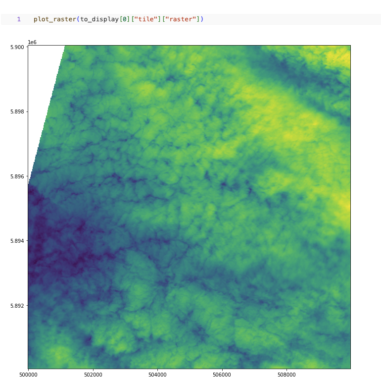
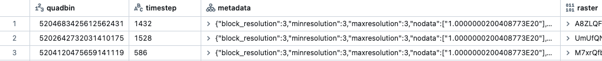

=====================
Rasterio + GDAL UDFs
=====================

Intro
################

Rasterio (https://rasterio.readthedocs.io/en/latest/) is a Python library for reading and writing geospatial raster datasets.
It uses GDAL (https://gdal.org/) for file I/O and raster formatting and provides a Python API for GDAL functions.
It is a great library for working with raster data in Python and it is a popular choice for many geospatial data scientists.
Rasterio UDFs provide a way to use Rasterio Python API in Spark for distributed processing of raster data.
The data structures used by Mosaic are compatible with Rasterio and can be used interchangeably.
In this section we will show how to use Rasterio UDFs to process raster data in Mosaic + Spark.
We assume that you have a basic understanding of Rasterio and GDAL. We also provide an example which directly calls GDAL
Translate and Warp.

Please note that we advise the users to set these configuration to ensure proper distribution.

.. code-block:: python

    spark.conf.set("spark.sql.execution.arrow.enabled", "true")
    spark.conf.set("spark.sql.execution.arrow.maxRecordsPerBatch", "1024")
    spark.conf.set("spark.sql.execution.arrow.fallback.enabled", "true")
    spark.conf.set("spark.sql.adaptive.coalescePartitions.enabled", "false")
    spark.conf.set("spark.sql.shuffle.partitions", "400") # maybe higher, depending

Rasterio raster plotting
#############################################

In this example we will show how to plot a raster file using Rasterio Python API.

Firstly we will create a spark DataFrame from a directory of raster files.

.. code-block:: python

    df = spark.read.format("gdal").load("dbfs:/path/to/raster/files").repartition(400)
    df.show()
    +-----------------------------------------------------------+------------------------------+-----------+---------------------+-------+-------+-----------+----------------------+-------------+-------+---------------------------------------------------------------------------------------------------------------+
    |                                                      path |             modificationTime |    length |                uuid | ySize | xSize | bandCount |             metadata | subdatasets |  srid |                                                                                                          tile |
    +-----------------------------------------------------------+------------------------------+-----------+---------------------+-------+-------+-----------+----------------------+-------------+-------+---------------------------------------------------------------------------------------------------------------+
    | dbfs:/FileStore/geospatial/odin/alaska/B02/-424495268.tif | 1970-01-20T15:49:53.135+0000 | 211660514 | 7836235824828840960 | 10980 | 10980 |         1 | {AREA_OR_POINT=Po... |          {} | 32602 | {index_id: 593308294097928191, raster: [00 01 10 ... 00], parentPath: "dbfs:/path_to_file", driver: "GTiff" } |
    | dbfs:/FileStore/geospatial/odin/alaska/B02/-524425268.tif | 1970-01-20T15:49:53.135+0000 | 212060218 | 7836235824828840961 | 10980 | 10980 |         1 | {AREA_OR_POINT=Po... |          {} | 32602 | {index_id: 593308294097927192, raster: [00 01 10 ... 00], parentPath: "dbfs:/path_to_file", driver: "GTiff" } |
    | dbfs:/FileStore/geospatial/odin/alaska/B02/1241323268.tif | 1970-01-20T15:49:53.135+0000 | 211660897 | 7836235824828840962 | 10980 | 10980 |         1 | {AREA_OR_POINT=Po... |          {} | 32602 | {index_id: 593308294097929991, raster: [00 01 10 ... 00], parentPath: "dbfs:/path_to_file", driver: "GTiff" } |
    | ...                                                       | ...                          | ...       | ...                 | ...   | ...   | ...       | ...                  | ...         | ...   | ...                                                                                                           |
    +-----------------------------------------------------------+------------------------------+-----------+---------------------+-------+-------+-----------+----------------------+-------------+-------+---------------------------------------------------------------------------------------------------------------+

Next we will define a function that will plot a given raster file.

.. code-block:: python

    import numpy as np
    import rasterio
    from rasterio.io import MemoryFile
    from io import BytesIO
    from pyspark.sql.functions import udf

    def plot_raster(raster):
        fig, ax = pyplot.subplots(1, figsize=(12, 12))

        with MemoryFile(BytesIO(raster)) as memfile:
            with memfile.open() as src:
                show(src, ax=ax)
                pyplot.show()

Finally we will apply the function to the DataFrame collected results.
Note that in order to plot the raster we need to collect the results to the driver.
Please apply reasonable filters to the DataFrame before collecting the results.

.. code-block:: python

    plot_raster(df.select("tile").limit(1).collect()[0]["tile"]["raster"])

   Fig 1. Plot raster using Rasterio Python API

UDF example for computing band statistics
#############################################

In this example we will show how to compute band statistics for a raster file.

Firstly we will create a spark DataFrame from a directory of raster files.

.. code-block:: python

    df = spark.read.format("gdal").load("dbfs:/path/to/raster/files").repartition(400)
    df.show()
    +-----------------------------------------------------------+------------------------------+-----------+---------------------+-------+-------+-----------+----------------------+-------------+-------+---------------------------------------------------------------------------------------------------------------+
    |                                                      path |             modificationTime |    length |                uuid | ySize | xSize | bandCount |             metadata | subdatasets |  srid |                                                                                                          tile |
    +-----------------------------------------------------------+------------------------------+-----------+---------------------+-------+-------+-----------+----------------------+-------------+-------+---------------------------------------------------------------------------------------------------------------+
    | dbfs:/FileStore/geospatial/odin/alaska/B02/-424495268.tif | 1970-01-20T15:49:53.135+0000 | 211660514 | 7836235824828840960 | 10980 | 10980 |         1 | {AREA_OR_POINT=Po... |          {} | 32602 | {index_id: 593308294097928191, raster: [00 01 10 ... 00], parentPath: "dbfs:/path_to_file", driver: "GTiff" } |
    | dbfs:/FileStore/geospatial/odin/alaska/B02/-524425268.tif | 1970-01-20T15:49:53.135+0000 | 212060218 | 7836235824828840961 | 10980 | 10980 |         1 | {AREA_OR_POINT=Po... |          {} | 32602 | {index_id: 593308294097927192, raster: [00 01 10 ... 00], parentPath: "dbfs:/path_to_file", driver: "GTiff" } |
    | dbfs:/FileStore/geospatial/odin/alaska/B02/1241323268.tif | 1970-01-20T15:49:53.135+0000 | 211660897 | 7836235824828840962 | 10980 | 10980 |         1 | {AREA_OR_POINT=Po... |          {} | 32602 | {index_id: 593308294097929991, raster: [00 01 10 ... 00], parentPath: "dbfs:/path_to_file", driver: "GTiff" } |
    | ...                                                       | ...                          | ...       | ...                 | ...   | ...   | ...       | ...                  | ...         | ...   | ...                                                                                                           |
    +-----------------------------------------------------------+------------------------------+-----------+---------------------+-------+-------+-----------+----------------------+-------------+-------+---------------------------------------------------------------------------------------------------------------+

Next we will define a function that will compute band statistics for a given raster file.

.. code-block:: python

    import numpy as np
    import rasterio
    from rasterio.io import MemoryFile
    from io import BytesIO
    from pyspark.sql.functions import udf

    @udf("double")
    def compute_band_mean(raster):
      with MemoryFile(BytesIO(raster)) as memfile:
        with memfile.open() as dataset:
          return dataset.statistics(bidx = 1).mean

Finally we will apply the function to the DataFrame.

.. code-block:: python

    df.select(compute_band_mean("tile.raster")).show()
    +----------------------------+
    | compute_band_mean(raster)  |
    +----------------------------+
    |         0.0111000000000000 |
    |         0.0021000000000000 |
    |         0.3001000000000000 |
    | ...                        |
    +----------------------------+

UDF example for computing NDVI
#############################################

In this example we will show how to compute NDVI for a raster file.
NDVI is a common index used to assess vegetation health.
It is computed as follows: ndvi = (nir - red) / (nir + red).
NDVI output is a single band raster file with values in the range [-1, 1].
We will show how to return a raster object as a result of a UDF.

Firstly we will create a spark DataFrame from a directory of raster files.

.. code-block:: python

    df = spark.read.format("gdal").load("dbfs:/path/to/raster/files").repartition(400)
    df.show()
    +-----------------------------------------------------------+------------------------------+-----------+---------------------+-------+-------+-----------+----------------------+-------------+-------+---------------------------------------------------------------------------------------------------------------+
    |                                                      path |             modificationTime |    length |                uuid | ySize | xSize | bandCount |             metadata | subdatasets |  srid |                                                                                                          tile |
    +-----------------------------------------------------------+------------------------------+-----------+---------------------+-------+-------+-----------+----------------------+-------------+-------+---------------------------------------------------------------------------------------------------------------+
    | dbfs:/FileStore/geospatial/odin/alaska/B02/-424495268.tif | 1970-01-20T15:49:53.135+0000 | 211660514 | 7836235824828840960 | 10980 | 10980 |         1 | {AREA_OR_POINT=Po... |          {} | 32602 | {index_id: 593308294097928191, raster: [00 01 10 ... 00], parentPath: "dbfs:/path_to_file", driver: "GTiff" } |
    | dbfs:/FileStore/geospatial/odin/alaska/B02/-524425268.tif | 1970-01-20T15:49:53.135+0000 | 212060218 | 7836235824828840961 | 10980 | 10980 |         1 | {AREA_OR_POINT=Po... |          {} | 32602 | {index_id: 593308294097927192, raster: [00 01 10 ... 00], parentPath: "dbfs:/path_to_file", driver: "GTiff" } |
    | dbfs:/FileStore/geospatial/odin/alaska/B02/1241323268.tif | 1970-01-20T15:49:53.135+0000 | 211660897 | 7836235824828840962 | 10980 | 10980 |         1 | {AREA_OR_POINT=Po... |          {} | 32602 | {index_id: 593308294097929991, raster: [00 01 10 ... 00], parentPath: "dbfs:/path_to_file", driver: "GTiff" } |
    | ...                                                       | ...                          | ...       | ...                 | ...   | ...   | ...       | ...                  | ...         | ...   | ...                                                                                                           |
    +-----------------------------------------------------------+------------------------------+-----------+---------------------+-------+-------+-----------+----------------------+-------------+-------+---------------------------------------------------------------------------------------------------------------+

Next we will define a function that will compute NDVI for a given raster file.

.. code-block:: python

    import numpy as np
    import rasterio
    from rasterio.io import MemoryFile
    from io import BytesIO
    from pyspark.sql.functions import udf

    @udf("binary")
    def compute_ndvi(raster, nir_band, red_band):
      with MemoryFile(BytesIO(raster)) as memfile:
        with memfile.open() as dataset:
          red = dataset.read(red_band)
          nir = dataset.read(nir_band)
          ndvi = (nir - red) / (nir + red)
          profile = dataset.profile
          profile.update(count = 1, dtype = rasterio.float32)
          # Write the NDVI to a tmp file and return it as binary
          # This is a workaround an issue occurring when using
          # MemoryFile for writing using an updated profile
          with tempfile.NamedTemporaryFile() as tmp:
            with rasterio.open(tmp.name, "w", **profile) as dst:
              dst.write(ndvi.astype(rasterio.float32))
            with open(tmp.name, "rb") as f:
              return f.read()

Finally we will apply the function to the DataFrame.

.. code-block:: python

    df.select(compute_ndvi("tile.raster", lit(1), lit(2))).show()
    # The output is a binary column containing the NDVI raster
    +------------------------------+
    | compute_ndvi(raster, 1, 2)   |
    +------------------------------+
    | 000000 ... 00000000000000000 |
    | 000000 ... 00000000000000000 |
    | 000000 ... 00000000000000000 |
    | ...                          |
    +------------------------------+

    # We can update the tile column with the NDVI raster in place as well
    # This will overwrite the existing raster field in the tile column
    df.select(col("tile").withField("raster", compute_ndvi("tile.raster", lit(1), lit(2)))).show()
    +-----------------------------------------------------------+------------------------------+-----------+---------------------+-------+-------+-----------+----------------------+-------------+-------+---------------------------------------------------------------------------------------------------------------+
    |                                                      path |             modificationTime |    length |                uuid | ySize | xSize | bandCount |             metadata | subdatasets |  srid |                                                                                                          tile |
    +-----------------------------------------------------------+------------------------------+-----------+---------------------+-------+-------+-----------+----------------------+-------------+-------+---------------------------------------------------------------------------------------------------------------+
    | dbfs:/FileStore/geospatial/odin/alaska/B02/-424495268.tif | 1970-01-20T15:49:53.135+0000 | 211660514 | 7836235824828840960 | 10980 | 10980 |         1 | {AREA_OR_POINT=Po... |          {} | 32602 | {index_id: 593308294097928191, raster: [00 01 10 ... 00], parentPath: "dbfs:/path_to_file", driver: "GTiff" } |
    | dbfs:/FileStore/geospatial/odin/alaska/B02/-524425268.tif | 1970-01-20T15:49:53.135+0000 | 212060218 | 7836235824828840961 | 10980 | 10980 |         1 | {AREA_OR_POINT=Po... |          {} | 32602 | {index_id: 593308294097927192, raster: [00 01 10 ... 00], parentPath: "dbfs:/path_to_file", driver: "GTiff" } |
    | dbfs:/FileStore/geospatial/odin/alaska/B02/1241323268.tif | 1970-01-20T15:49:53.135+0000 | 211660897 | 7836235824828840962 | 10980 | 10980 |         1 | {AREA_OR_POINT=Po... |          {} | 32602 | {index_id: 593308294097929991, raster: [00 01 10 ... 00], parentPath: "dbfs:/path_to_file", driver: "GTiff" } |
    | ...                                                       | ...                          | ...       | ...                 | ...   | ...   | ...       | ...                  | ...         | ...   | ...                                                                                                           |
    +-----------------------------------------------------------+------------------------------+-----------+---------------------+-------+-------+-----------+----------------------+-------------+-------+---------------------------------------------------------------------------------------------------------------+

UDF example for writing raster files to disk
#############################################

In this example we will show how to write a raster file to disk using Rasterio Python API.
This is an examples showing how to materialize a raster binary object as a raster file on disk.
The format of the output file should match the driver format of the binary object.

Firstly we will create a spark DataFrame from a directory of raster files.

.. code-block:: python

    df = spark.read.format("gdal").load("dbfs:/path/to/raster/files").repartition(400)
    df.show()
    +-----------------------------------------------------------+------------------------------+-----------+---------------------+-------+-------+-----------+----------------------+-------------+-------+---------------------------------------------------------------------------------------------------------------+
    |                                                      path |             modificationTime |    length |                uuid | ySize | xSize | bandCount |             metadata | subdatasets |  srid |                                                                                                          tile |
    +-----------------------------------------------------------+------------------------------+-----------+---------------------+-------+-------+-----------+----------------------+-------------+-------+---------------------------------------------------------------------------------------------------------------+
    | dbfs:/FileStore/geospatial/odin/alaska/B02/-424495268.tif | 1970-01-20T15:49:53.135+0000 | 211660514 | 7836235824828840960 | 10980 | 10980 |         1 | {AREA_OR_POINT=Po... |          {} | 32602 | {index_id: 593308294097928191, raster: [00 01 10 ... 00], parentPath: "dbfs:/path_to_file", driver: "GTiff" } |
    | dbfs:/FileStore/geospatial/odin/alaska/B02/-524425268.tif | 1970-01-20T15:49:53.135+0000 | 212060218 | 7836235824828840961 | 10980 | 10980 |         1 | {AREA_OR_POINT=Po... |          {} | 32602 | {index_id: 593308294097927192, raster: [00 01 10 ... 00], parentPath: "dbfs:/path_to_file", driver: "GTiff" } |
    | dbfs:/FileStore/geospatial/odin/alaska/B02/1241323268.tif | 1970-01-20T15:49:53.135+0000 | 211660897 | 7836235824828840962 | 10980 | 10980 |         1 | {AREA_OR_POINT=Po... |          {} | 32602 | {index_id: 593308294097929991, raster: [00 01 10 ... 00], parentPath: "dbfs:/path_to_file", driver: "GTiff" } |
    | ...                                                       | ...                          | ...       | ...                 | ...   | ...   | ...       | ...                  | ...         | ...   | ...                                                                                                           |
    +-----------------------------------------------------------+------------------------------+-----------+---------------------+-------+-------+-----------+----------------------+-------------+-------+---------------------------------------------------------------------------------------------------------------+

Next we will define a function that will write a given raster file to disk. A "gotcha" to keep in mind is that you do
not want to have a file context manager open when you go to write out its context as the context manager will not yet
have been flushed. Another "gotcha" might be that the raster dataset does not have CRS included; if this arises, we
recommend adjusting the function to specify the CRS and set it on the dst variable, more at
`rasterio.crs <https://rasterio.readthedocs.io/en/stable/api/rasterio.crs.html>`__. We would also point out that notional
"file_id" param can be constructed as a repeatable name from other field(s) in your dataframe / table or be random,
depending on your needs.

.. code-block:: python

    @udf("string")
    def write_raster(raster, driver, file_id, fuse_dir):
        from io import BytesIO
        from pathlib import Path
        from rasterio.io import MemoryFile
        import numpy as np
        import rasterio
        import shutil
        import tempfile

        # - [1] populate the initial profile
        # # profile is needed in order to georeference the image
        with tempfile.TemporaryDirectory() as tmp_dir:
            profile = None
            data_arr = None
            with MemoryFile(BytesIO(raster)) as memfile:
                with memfile.open() as dataset:
                    profile = dataset.profile
                    data_arr = dataset.read()
            # here you can update profile using .update method
            # example https://rasterio.readthedocs.io/en/latest/topics/writing.html
            # - [2] get the correct extension
            extensions_map = rasterio.drivers.raster_driver_extensions()
            driver_map = {v: k for k, v in extensions_map.items()}
            extension = driver_map[driver] #e.g. GTiff
            file_name = f"{file_id}.{extension}"
            # - [3] write local raster
            # - this is showing a single band [1]
            #   being written
            tmp_path = f"{tmp_dir}/{file_name}"
            with rasterio.open(
              tmp_path,
              "w",
              **profile
            ) as dst:
                dst.write(data_arr) # <- adjust as needed
            # - [4] copy to fuse path
            Path(fuse_dir).mkdir(parents=True, exist_ok=True)
            fuse_path = f"{fuse_dir}/{file_name}"
            if not os.path.exists(fuse_path):
                shutil.copyfile(tmp_path, fuse_path)
        return fuse_path

Finally we will apply the function to the DataFrame.

.. code-block:: python

    df.select(
      write_raster(
        "tile.raster",
        lit("GTiff").alias("driver"),
        "uuid",
        lit("/dbfs/path/to/output/dir").alias("fuse_dir")
      )
    ).display()
    +----------------------------------------------+
    | write_raster(raster, driver, uuid, fuse_dir) |
    +----------------------------------------------+
    | /dbfs/path/to/output/dir/1234.tif            |
    | /dbfs/path/to/output/dir/4545.tif            |
    | /dbfs/path/to/output/dir/3215.tif            |
    | ...                                          |
    +----------------------------------------------+

Sometimes you don't need to be quite as fancy. Consider when you simply want to specify to write out raster contents,
assuming you specify the extension in the file_name. This is just writing binary column to file, nothing further. Again,
we use a notional "uuid" column as part of "file_name" param, which would have the same considerations as mentioned
above.

.. code-block:: python

    @udf("string")
    def write_binary(raster_bin, file_name, fuse_dir):
        from pathlib import Path
        import os
        import shutil
        import tempfile

        Path(fuse_dir).mkdir(parents=True, exist_ok=True)
        fuse_path = f"{fuse_dir}/{file_name}"
        if not os.path.exists(fuse_path):
            with tempfile.TemporaryDirectory() as tmp_dir:
                tmp_path = f"{tmp_dir}/{file_name}"
                # - write within the tmp_dir context
                # - flush the writer before copy
                tmp_file = open(tmp_path, "wb")
                tmp_file.write(raster_bin)  # <- write entire binary content
                tmp_file.close()
                # - copy local to fuse
                shutil.copyfile(tmp_path, fuse_path)
        return fuse_path

Finally we will apply the function to the DataFrame.

.. code-block:: python

    df.select(
      write_binary(
        "tile.raster",
        F.concat("uuid", F.lit(".tif")).alias("file_name"),
        F.lit("/dbfs/path/to/output/dir").alias("fuse_dir")
      )
    ).display()
    +-------------------------------------------+
    | write_binary(raster, file_name, fuse_dir) |
    +-------------------------------------------+
    | /dbfs/path/to/output/dir/1234.tif         |
    | /dbfs/path/to/output/dir/4545.tif         |
    | /dbfs/path/to/output/dir/3215.tif         |
    | ...                                       |
    +-------------------------------------------+

UDF example for generating Google Maps compatible tiles
#######################################################

Delta Tables can be used as the basis for serving pre-generated tiles as an option. Here is an example UDF that applies
a few gdal operations on each band, to write to Google Maps Compatible tiles transformed into 3857 (Web Mercator). Note:
the 'quadbin' column shown in this example was generated separately using CARTO's `quadbin <https://pypi.org/project/quadbin/>`__
package. You can replace the calls with whatever you need to do. The output structure looks something like the following:

The UDF example sets raster extent, block size, and interpolation. It specifies source SRID as 4326;
additionally, output type and nodata values are specified. COG overviews are not generated
nor is an ALPHA band, but they could be. Again, you would modify this example to suit your needs.

.. code-block:: python

    @udf("binary")
    def transform_raw_raster(raster):
     import tempfile
     import uuid
     from osgeo import gdal

     with tempfile.TemporaryDirectory() as tmp_dir:
       fn1 = f"{tmp_dir}/{uuid.uuid4().hex}.tif"
       fn2 = f"{tmp_dir}/{uuid.uuid4().hex}.tif"
       fn3 = f"{tmp_dir}/{uuid.uuid4().hex}.tif"
       fn4 = f"{tmp_dir}/{uuid.uuid4().hex}.tif"

       with open(fn1, "wb") as f:
         f.write(raster)

       gdal.Translate(fn2, fn1, options="-of GTiff -a_ullr -180 90 180 -90 -a_nodata -32767 -ot Int16")
       gdal.Warp(fn3, fn2, options= "-tr 0.125 -0.125 -r cubicspline")
       gdal.Warp(fn4, fn3, options= "-of COG -co BLOCKSIZE=1024 -co TILING_SCHEME=GoogleMapsCompatible -co COMPRESS=DEFLATE -co OVERVIEWS=NONE -co ADD_ALPHA=NO -co RESAMPLING=cubicspline -s_srs EPSG:4326")

       with open(fn4, "rb") as f:
         res = f.read()
       return res

Example of calling the UDF (original data was NetCDF). If you have more than 1 band, this assumes :code:`transform_raw_rasters` UDF is called after
:code:`rst_separatebands` function (or you could potentially modify the UDF to operate on multiple bands).

.. code-block:: python

    base_table = (
     df
       .select(
         "path",
         "metadata",
         "tile"
       )
       .withColumn("subdatasets", mos.rst_subdatasets("tile"))
       .where(F.array_contains(F.map_values("subdatasets"), "sfcWind"))
       .withColumn("tile", mos.rst_getsubdataset("tile", F.lit("sfcWind")))
       .withColumn("tile", mos.rst_separatebands("tile"))
       .repartition(sc.defaultParallelism)
       .withColumn(
         "tile",
         F.col("tile")
           .withField("raster", transform_raw_raster("tile.raster"))
           .withField(
             "metadata",
             F.map_concat("tile.metadata", F.create_map(F.lit("driver"), F.lit("GTiff")))
           )
       )
       .withColumn("srid", mos.rst_srid("tile"))
       .withColumn("srid", F.when(F.col("srid") == F.lit(0), F.lit(4326)).otherwise(F.col("srid")))
       .withColumn("timestep", F.element_at(mos.rst_metadata("tile"), "NC_GLOBAL#GDAL_MOSAIC_BAND_INDEX"))
       .withColumn("tile", mos.rst_transform("tile", F.lit(3857)))
       .repartition(sc.defaultParallelism, "timestep")
    )
