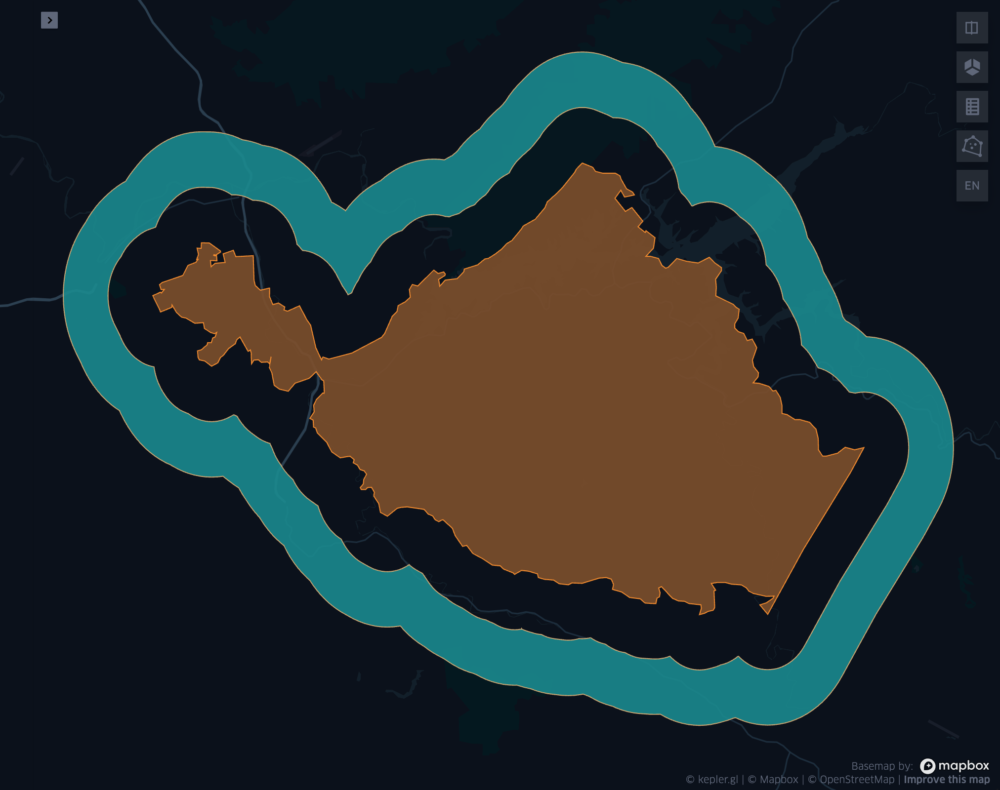

=================
Spatial functions
=================

flatten_polygons
****************

.. function:: flatten_polygons(col)

    Explodes a MultiPolygon geometry into one row per constituent Polygon.

    :param col: MultiPolygon Geometry
    :type col: Column
    :rtype: Column: StringType

    :example:

.. tabs::
   .. code-tab:: py

    df = spark.createDataFrame([
            {'wkt': 'MULTIPOLYGON (((30 20, 45 40, 10 40, 30 20)), ((15 5, 40 10, 10 20, 5 10, 15 5)))'}
        ])
    df.select(flatten_polygons('wkt')).show(2, False)
    +------------------------------------------+
    |element                                   |
    +------------------------------------------+
    |POLYGON ((30 20, 45 40, 10 40, 30 20))    |
    |POLYGON ((15 5, 40 10, 10 20, 5 10, 15 5))|
    +------------------------------------------+

   .. code-tab:: scala

    val df = List(("MULTIPOLYGON (((30 20, 45 40, 10 40, 30 20)), ((15 5, 40 10, 10 20, 5 10, 15 5)))")).toDF("wkt")
    df.select(flatten_polygons(col("wkt"))).show(false)
    +------------------------------------------+
    |element                                   |
    +------------------------------------------+
    |POLYGON ((30 20, 45 40, 10 40, 30 20))    |
    |POLYGON ((15 5, 40 10, 10 20, 5 10, 15 5))|
    +------------------------------------------+

   .. code-tab:: sql

    SELECT flatten_polygons("'MULTIPOLYGON (((30 20, 45 40, 10 40, 30 20)), ((15 5, 40 10, 10 20, 5 10, 15 5)))'")
    +------------------------------------------+
    |element                                   |
    +------------------------------------------+
    |POLYGON ((30 20, 45 40, 10 40, 30 20))    |
    |POLYGON ((15 5, 40 10, 10 20, 5 10, 15 5))|
    +------------------------------------------+

   .. code-tab:: r R

    df <- createDataFrame(data.frame(wkt = 'MULTIPOLYGON (((30 20, 45 40, 10 40, 30 20)), ((15 5, 40 10, 10 20, 5 10, 15 5)))'))
    showDF(select(df, flatten_polygons(column("wkt"))), truncate=F)
    +------------------------------------------+
    |element                                   |
    +------------------------------------------+
    |POLYGON ((30 20, 45 40, 10 40, 30 20))    |
    |POLYGON ((15 5, 40 10, 10 20, 5 10, 15 5))|
    +------------------------------------------+

st_area
*******

.. function:: st_area(col)

    Compute the area of a geometry.

    :param col: Geometry
    :type col: Column
    :rtype: Column: DoubleType

    :example:

.. tabs::
   .. code-tab:: py

    df = spark.createDataFrame([{'wkt': 'POLYGON ((30 10, 40 40, 20 40, 10 20, 30 10))'}])
    df.select(st_area('wkt')).show()
    +------------+
    |st_area(wkt)|
    +------------+
    |       550.0|
    +------------+

   .. code-tab:: scala

    val df = List(("POLYGON ((30 10, 40 40, 20 40, 10 20, 30 10))")).toDF("wkt")
    df.select(st_area(col("wkt"))).show()
    +------------+
    |st_area(wkt)|
    +------------+
    |       550.0|
    +------------+

   .. code-tab:: sql

    SELECT st_area("POLYGON ((30 10, 40 40, 20 40, 10 20, 30 10))")
    +------------+
    |st_area(wkt)|
    +------------+
    |       550.0|
    +------------+

   .. code-tab:: r R

    df <- createDataFrame(data.frame(wkt = "POLYGON ((30 10, 40 40, 20 40, 10 20, 30 10))"))
    showDF(select(df, st_area(column("wkt"))))
    +------------+
    |st_area(wkt)|
    +------------+
    |       550.0|
    +------------+

.. note:: Results of this function are always expressed in the original units of the input geometry.

st_buffer
*********

.. function:: st_buffer(col, radius)

    Buffer the input geometry by radius `radius` and return a new, buffered geometry.

    :param col: Geometry
    :type col: Column
    :param radius: Double
    :type radius: Column (DoubleType)
    :rtype: Column: Geometry

    :example:

.. tabs::
   .. code-tab:: py

    df = spark.createDataFrame([{'wkt': 'POLYGON ((30 10, 40 40, 20 40, 10 20, 30 10))'}])
    df.select(st_buffer('wkt', lit(2.))).show()
    +--------------------+
    | st_buffer(wkt, 2.0)|
    +--------------------+
    |POLYGON ((29.1055...|
    +--------------------+

   .. code-tab:: scala

    val df = List(("POLYGON ((30 10, 40 40, 20 40, 10 20, 30 10))")).toDF("wkt")
    df.select(st_buffer(col("wkt"), 2d)).show()
    +--------------------+
    | st_buffer(wkt, 2.0)|
    +--------------------+
    |POLYGON ((29.1055...|
    +--------------------+

   .. code-tab:: sql

    SELECT st_buffer("POLYGON ((30 10, 40 40, 20 40, 10 20, 30 10))", 2d)
    +--------------------+
    | st_buffer(wkt, 2.0)|
    +--------------------+
    |POLYGON ((29.1055...|
    +--------------------+

   .. code-tab:: r R

    df <- createDataFrame(data.frame(wkt = "POLYGON ((30 10, 40 40, 20 40, 10 20, 30 10))"))
    showDF(select(df, st_buffer(column("wkt"), lit(2))))
    +--------------------+
    | st_buffer(wkt, 2.0)|
    +--------------------+
    |POLYGON ((29.1055...|
    +--------------------+

st_bufferloop
*************

.. function:: st_bufferloop(col, innerRadius, outerRadius)

    Returns a difference between st_buffer(col, outerRadius) and st_buffer(col, innerRadius).
    The resulting geometry is a loop with a width of outerRadius - innerRadius.

    :param col: Geometry
    :type col: Column
    :param innerRadius: Radius of the resulting geometry hole.
    :type innerRadius: Column (DoubleType)
    :param outerRadius: Radius of the resulting geometry.
    :type outerRadius: Column (DoubleType)
    :rtype: Column: Geometry

    :example:

.. tabs::
   .. code-tab:: py

    df = spark.createDataFrame([{'wkt': 'POLYGON ((30 10, 40 40, 20 40, 10 20, 30 10))'}])
    df.select(st_bufferloop('wkt', lit(2.), lit(2.1)).show()
    +-------------------------+
    | st_buffer(wkt, 2.0, 2.1)|
    +-------------------------+
    |     POLYGON ((29.1055...|
    +-------------------------+

   .. code-tab:: scala

    val df = List(("POLYGON ((30 10, 40 40, 20 40, 10 20, 30 10))")).toDF("wkt")
    df.select(st_bufferloop('wkt', lit(2.), lit(2.1))).show()
    +-------------------------+
    | st_buffer(wkt, 2.0, 2.1)|
    +-------------------------+
    |     POLYGON ((29.1055...|
    +-------------------------+

   .. code-tab:: sql

    SELECT st_bufferloop("POLYGON ((30 10, 40 40, 20 40, 10 20, 30 10))", 2d, 2.1d)
    +-------------------------+
    | st_buffer(wkt, 2.0, 2.1)|
    +-------------------------+
    |     POLYGON ((29.1055...|
    +-------------------------+

   .. code-tab:: r R

    df <- createDataFrame(data.frame(wkt = "POLYGON ((30 10, 40 40, 20 40, 10 20, 30 10))"))
    showDF(select(df, st_bufferloop('wkt', lit(2.), lit(2.1))))
    +-------------------------+
    | st_buffer(wkt, 2.0, 2.1)|
    +-------------------------+
    |     POLYGON ((29.1055...|
    +-------------------------+

   Fig 1. ST_BufferLoop(geom, 0.02, 0.04)

st_centroid2D [Deprecated]
**************************

.. function:: st_centroid2D(col)

    Returns the x and y coordinates representing the centroid of the input geometry.

    :param col: Geometry
    :type col: Column
    :rtype: Column: StructType[x: DoubleType, y: DoubleType]

    :example:

.. tabs::
   .. code-tab:: py

    df = spark.createDataFrame([{'wkt': 'POLYGON ((30 10, 40 40, 20 40, 10 20, 30 10))'}])
    df.select(st_centroid2D('wkt')).show()
    +---------------------------------------+
    |st_centroid(wkt)                       |
    +---------------------------------------+
    |{25.454545454545453, 26.96969696969697}|
    +---------------------------------------+

   .. code-tab:: scala

    val df = List(("POLYGON ((30 10, 40 40, 20 40, 10 20, 30 10))")).toDF("wkt")
    df.select(st_centroid2D(col("wkt"))).show()
    +---------------------------------------+
    |st_centroid(wkt)                       |
    +---------------------------------------+
    |{25.454545454545453, 26.96969696969697}|
    +---------------------------------------+

   .. code-tab:: sql

    SELECT st_centroid2D("POLYGON ((30 10, 40 40, 20 40, 10 20, 30 10))")
    +---------------------------------------+
    |st_centroid(wkt)                       |
    +---------------------------------------+
    |{25.454545454545453, 26.96969696969697}|
    +---------------------------------------+

   .. code-tab:: r R

    df <- createDataFrame(data.frame(wkt = "POLYGON ((30 10, 40 40, 20 40, 10 20, 30 10))"))
    showDF(select(df, st_centroid2D(column("wkt"))), truncate=F)
    +---------------------------------------+
    |st_centroid(wkt)                       |
    +---------------------------------------+
    |{25.454545454545453, 26.96969696969697}|
    +---------------------------------------+

st_centroid
*************

.. function:: st_centroid(col)

    Returns the POINT geometry representing the centroid of the input geometry.

    :param col: Geometry
    :type col: Column
    :rtype: Column: Geometry

    :example:

.. tabs::
   .. code-tab:: py

    df = spark.createDataFrame([{'wkt': 'POLYGON ((30 10, 40 40, 20 40, 10 20, 30 10))'}])
    df.select(st_centroid('wkt')).show()
    +---------------------------------------------+
    |st_centroid(wkt)                             |
    +---------------------------------------------+
    |POINT (25.454545454545453, 26.96969696969697)|
    +---------------------------------------------+

   .. code-tab:: scala

    val df = List(("POLYGON ((30 10, 40 40, 20 40, 10 20, 30 10))")).toDF("wkt")
    df.select(st_centroid(col("wkt"))).show()
    +---------------------------------------------+
    |st_centroid(wkt)                             |
    +---------------------------------------------+
    |POINT (25.454545454545453, 26.96969696969697)|
    +---------------------------------------------+

   .. code-tab:: sql

    SELECT st_centroid("POLYGON ((30 10, 40 40, 20 40, 10 20, 30 10))")
    +---------------------------------------------+
    |st_centroid(wkt)                             |
    +---------------------------------------------+
    |POINT (25.454545454545453, 26.96969696969697)|
    +---------------------------------------------+

   .. code-tab:: r R

    df <- createDataFrame(data.frame(wkt = "POLYGON ((30 10, 40 40, 20 40, 10 20, 30 10))"))
    showDF(select(df, st_centroid(column("wkt"))), truncate=F)
    +---------------------------------------------+
    |st_centroid(wkt)                             |
    +---------------------------------------------+
    |POINT (25.454545454545453, 26.96969696969697)|
    +---------------------------------------------+

st_convexhull
*************

.. function:: st_convexhull(col)

    Compute the convex hull of a geometry or multi-geometry object.

    :param col: Geometry
    :type col: Column
    :rtype: Column

    :example:

.. tabs::
   .. code-tab:: py

    df = spark.createDataFrame([{'wkt': 'MULTIPOINT ((10 40), (40 30), (20 20), (30 10))'}])
    df.select(st_convexhull('wkt')).show(1, False)
    +---------------------------------------------+
    |st_convexhull(wkt)                           |
    +---------------------------------------------+
    |POLYGON ((10 40, 20 20, 30 10, 40 30, 10 40))|
    +---------------------------------------------+

   .. code-tab:: scala

    val df = List(("MULTIPOINT ((10 40), (40 30), (20 20), (30 10))")).toDF("wkt")
    df.select(st_convexhull(col("wkt"))).show(false)
    +---------------------------------------------+
    |st_convexhull(wkt)                           |
    +---------------------------------------------+
    |POLYGON ((10 40, 20 20, 30 10, 40 30, 10 40))|
    +---------------------------------------------+

   .. code-tab:: sql

    SELECT st_convexhull("MULTIPOINT ((10 40), (40 30), (20 20), (30 10))")
    +---------------------------------------------+
    |st_convexhull(wkt)                           |
    +---------------------------------------------+
    |POLYGON ((10 40, 20 20, 30 10, 40 30, 10 40))|
    +---------------------------------------------+

   .. code-tab:: r R

    df <- createDataFrame(data.frame(wkt = "MULTIPOINT ((10 40), (40 30), (20 20), (30 10))"))
    showDF(select(df, st_convexhull(column("wkt"))))
    +---------------------------------------------+
    |st_convexhull(wkt)                           |
    +---------------------------------------------+
    |POLYGON ((10 40, 20 20, 30 10, 40 30, 10 40))|
    +---------------------------------------------+

st_difference
*************

.. function:: st_difference(left_geom, right_geom)

    Returns the point set difference of the left and right geometry.

    :param left_geom: Geometry
    :type left_geom: Column
    :param right_geom: Geometry
    :type right_geom: Column
    :rtype Column: Geometry

    :example:

.. tabs::
   .. code-tab:: py

    df = spark.createDataFrame([{'left': 'POLYGON ((10 10, 20 10, 20 20, 10 20, 10 10))', 'right': 'POLYGON ((15 15, 25 15, 25 25, 15 25, 15 15))'}])
    df.select(st_difference(col('left'), col('right'))).show()
    +-----------------------------------------------------------+
    | st_difference(left, right)                                |
    +-----------------------------------------------------------+
    |POLYGON ((10 10, 20 10, 20 15, 15 15, 15 20, 10 20, 10 10))|
    +-----------------------------------------------------------+

   .. code-tab:: scala

    val df = List(("POLYGON ((10 10, 20 10, 20 20, 10 20, 10 10))", "POLYGON ((15 15, 25 15, 25 25, 15 25, 15 15))")).toDF("left", "right")
    df.select(st_difference(col('left'), col('right'))).show()
    +-----------------------------------------------------------+
    | st_difference(left, right)                                |
    +-----------------------------------------------------------+
    |POLYGON ((10 10, 20 10, 20 15, 15 15, 15 20, 10 20, 10 10))|
    +-----------------------------------------------------------+

   .. code-tab:: sql

    SELECT st_difference("POLYGON ((10 10, 20 10, 20 20, 10 20, 10 10))", "POLYGON ((15 15, 25 15, 25 25, 15 25, 15 15))")
    +-----------------------------------------------------------+
    | st_difference(left, right)                                |
    +-----------------------------------------------------------+
    |POLYGON ((10 10, 20 10, 20 15, 15 15, 15 20, 10 20, 10 10))|
    +-----------------------------------------------------------+

   .. code-tab:: r R

    df <- createDataFrame(data.frame(p1 = "POLYGON ((10 10, 20 10, 20 20, 10 20, 10 10))", p2 = "POLYGON ((15 15, 25 15, 25 25, 15 25, 15 15))"))
    showDF(select(df, st_difference(column("p1"), column("p2"))), truncate=F)
    +-----------------------------------------------------------+
    | st_difference(left, right)                                |
    +-----------------------------------------------------------+
    |POLYGON ((10 10, 20 10, 20 15, 15 15, 15 20, 10 20, 10 10))|
    +-----------------------------------------------------------+

st_distance
***********

.. function:: st_distance(geom1, geom2)

    Compute the distance between `geom1` and `geom2`.

    :param geom1: Geometry
    :type geom1: Column
    :param geom2: Geometry
    :type geom2: Column
    :rtype: Column: DoubleType

    :example:

.. tabs::
   .. code-tab:: py

    df = spark.createDataFrame([{'point': 'POINT (5 5)', 'poly': 'POLYGON ((30 10, 40 40, 20 40, 10 20, 30 10))'}])
    df.select(st_distance('poly', 'point')).show()
    +------------------------+
    |st_distance(poly, point)|
    +------------------------+
    |      15.652475842498529|
    +------------------------+

   .. code-tab:: scala

    val df = List(("POINT (5 5)", "POLYGON ((30 10, 40 40, 20 40, 10 20, 30 10))")).toDF("point", "poly")
    df.select(st_distance(col("poly"), col("point"))).show()
    +------------------------+
    |st_distance(poly, point)|
    +------------------------+
    |      15.652475842498529|
    +------------------------+

   .. code-tab:: sql

    SELECT st_distance("POLYGON ((30 10, 40 40, 20 40, 10 20, 30 10))", "POINT (5 5)")
    +------------------------+
    |st_distance(poly, point)|
    +------------------------+
    |      15.652475842498529|
    +------------------------+

   .. code-tab:: r R

    df <- createDataFrame(data.frame(point = c( "POINT (5 5)"), poly = "POLYGON ((30 10, 40 40, 20 40, 10 20, 30 10))"))
    showDF(select(df, st_distance(column("poly"), column("point"))))
    +------------------------+
    |st_distance(poly, point)|
    +------------------------+
    |      15.652475842498529|
    +------------------------+

.. note:: Results of this function are always expressed in the original units of the input geometries.

st_dump
*******

.. function:: st_dump(col)

    Explodes a multi-geometry into one row per constituent geometry.

    :param col: The input multi-geometry
    :type col: Column
    :rtype: Column

    :example:

.. tabs::
   .. code-tab:: py

    df = spark.createDataFrame([{'wkt': 'MULTIPOINT ((10 40), (40 30), (20 20), (30 10))'}])
    df.select(st_dump('wkt')).show(5, False)
    +-------------+
    |element      |
    +-------------+
    |POINT (10 40)|
    |POINT (40 30)|
    |POINT (20 20)|
    |POINT (30 10)|
    +-------------+

   .. code-tab:: scala

    val df = List(("MULTIPOINT ((10 40), (40 30), (20 20), (30 10))")).toDF("wkt")
    df.select(st_dump(col("wkt"))).show(false)
    +-------------+
    |element      |
    +-------------+
    |POINT (10 40)|
    |POINT (40 30)|
    |POINT (20 20)|
    |POINT (30 10)|
    +-------------+

   .. code-tab:: sql

    SELECT st_dump("MULTIPOINT ((10 40), (40 30), (20 20), (30 10))")
    +-------------+
    |element      |
    +-------------+
    |POINT (10 40)|
    |POINT (40 30)|
    |POINT (20 20)|
    |POINT (30 10)|
    +-------------+
   .. code-tab:: r R

    df <- createDataFrame(data.frame(wkt = "MULTIPOINT ((10 40), (40 30), (20 20), (30 10))"))
    showDF(select(df, st_dump(column("wkt"))))
    +-------------+
    |element      |
    +-------------+
    |POINT (10 40)|
    |POINT (40 30)|
    |POINT (20 20)|
    |POINT (30 10)|
    +-------------+

st_envelope
***********

.. function:: st_envelope(col)

    Returns the minimum bounding box of the input geometry, as a geometry.
    This bounding box is defined by the rectangular polygon with corner points `(x_min, y_min)`, `(x_max, y_min)`, `(x_min, y_max)`, `(x_max, y_max)`.

    :param col: Geometry
    :type col: Column
    :rtype: Column

    :example:

.. tabs::
   .. code-tab:: py

    df = spark.createDataFrame([{'wkt': 'POLYGON ((10 10, 20 10, 15 20, 10 10))'}])
    df.select(st_envelope('wkt')).show()
    +-----------------------------------------------+
    | st_envelope(wkt)                              |
    +-----------------------------------------------+
    | POLYGON ((10 10, 20 10, 20 20, 10 20, 10 10)) |
    +-----------------------------------------------+

   .. code-tab:: scala

    df = List(("POLYGON ((10 10, 20 10, 15 20, 10 10))")).toDF("wkt")
    df.select(st_envelope('wkt')).show()
    +-----------------------------------------------+
    | st_envelope(wkt)                              |
    +-----------------------------------------------+
    | POLYGON ((10 10, 20 10, 20 20, 10 20, 10 10)) |
    +-----------------------------------------------+

   .. code-tab:: sql

    SELECT st_envelope("POLYGON ((10 10, 20 10, 15 20, 10 10))")
    +-----------------------------------------------+
    | st_envelope(wkt)                              |
    +-----------------------------------------------+
    | POLYGON ((10 10, 20 10, 20 20, 10 20, 10 10)) |
    +-----------------------------------------------+

   .. code-tab:: r R

    df <- createDataFrame(data.frame(wkt = "POLYGON ((10 10, 20 10, 15 20, 10 10))")
    showDF(select(df, st_envelope(column("wkt"))), truncate=F)
    +-----------------------------------------------+
    | st_envelope(wkt)                              |
    +-----------------------------------------------+
    | POLYGON ((10 10, 20 10, 20 20, 10 20, 10 10)) |
    +-----------------------------------------------+

st_geometrytype
***************

.. function:: st_geometrytype(col)

    Returns the type of the input geometry ("POINT", "LINESTRING", "POLYGON" etc.).

    :param col: Geometry
    :type col: Column
    :rtype: Column: StringType

    :example:

.. tabs::
   .. code-tab:: py

    df = spark.createDataFrame([{'wkt': 'POLYGON ((30 10, 40 40, 20 40, 10 20, 30 10))'}])
    df.select(st_geometrytype('wkt')).show()
    +--------------------+
    |st_geometrytype(wkt)|
    +--------------------+
    |             POLYGON|
    +--------------------+

   .. code-tab:: scala

    val df = List(("POLYGON ((30 10, 40 40, 20 40, 10 20, 30 10))")).toDF("wkt")
    df.select(st_geometrytype(col("wkt"))).show()
    +--------------------+
    |st_geometrytype(wkt)|
    +--------------------+
    |             POLYGON|
    +--------------------+

   .. code-tab:: sql

    SELECT st_geometrytype("POLYGON((0 0, 10 0, 10 10, 0 10, 0 0), (15 15, 15 20, 20 20, 20 15, 15 15))")
    +--------------------+
    |st_geometrytype(wkt)|
    +--------------------+
    |             POLYGON|
    +--------------------+

   .. code-tab:: r R

    df <- createDataFrame(data.frame(wkt = "POLYGON ((30 10, 40 40, 20 40, 10 20, 30 10))"))
    showDF(select(df, st_geometrytype(column("wkt"))), truncate=F)
    +--------------------+
    |st_geometrytype(wkt)|
    +--------------------+
    |             POLYGON|
    +--------------------+

st_haversine
***********

.. function:: st_haversine(lat1, lng1, lat2, lng2)

    Compute the haversine distance between lat1/lng1 and lat2/lng2.

    :param lat1: DoubleType
    :type lat1: Column
    :param lng1: DoubleType
    :type lng1: Column
    :param lat2: DoubleType
    :type lat2: Column
    :param lng2: DoubleType
    :type lng2: Column
    :rtype: Column: DoubleType

    :example:

.. tabs::
   .. code-tab:: py

    df = spark.createDataFrame([{'lat1': 0.0, 'lng1': 90.0, 'lat2': 0.0, 'lng2': 0.0}])
    df.select(st_distance('lat1', 'lng1', 'lat2', 'lng2')).show()
    +------------------------------------+
    |st_haversine(lat1, lng1, lat2, lng2)|
    +------------------------------------+
    |                   10007.55722101796|
    +------------------------------------+

   .. code-tab:: scala

    val df = List((0.0, 90.0, 0.0, 0.0)).toDF("lat1", "lng1", "lat2", "lng2")
    df.select(st_haversine(col("lat1"), col("lng1"), col("lat2"), col("lng2"))).show()
    +------------------------------------+
    |st_haversine(lat1, lng1, lat2, lng2)|
    +------------------------------------+
    |                   10007.55722101796|
    +------------------------------------+

   .. code-tab:: sql

    SELECT st_haversine(0.0, 90.0, 0.0, 0.0)
    +------------------------------------+
    |st_haversine(lat1, lng1, lat2, lng2)|
    +------------------------------------+
    |                   10007.55722101796|
    +------------------------------------+

   .. code-tab:: r R

    df <- createDataFrame(data.frame(lat1 = c(0.0), lng1 = c(90.0), lat2 = c(0.0), lng2 = c(0.0)))
    showDF(select(df, st_haversine(column("lat1"), column("lng1"), column("lat2"), column("lng2"))))
    +------------------------------------+
    |st_haversine(lat1, lng1, lat2, lng2)|
    +------------------------------------+
    |                   10007.55722101796|
    +------------------------------------+

.. note:: Results of this function are always expressed in km^2, while the input lat/lng pairs are expected to be in degrees.

st_hasvalidcoordinates
**********************

.. function:: st_hasvalidcoordinates(geom, crs, which)

    Checks if all points in `geom` are valid with respect to crs bounds.
    CRS bounds can be provided either as bounds or as reprojected_bounds.

    :param geom: Geometry
    :type geom: Column
    :param crs: CRS name (EPSG ID), e.g. "EPSG:2192"
    :type crs: Column
    :param which: Check against geographic `"bounds"` or geometric `"reprojected_bounds"` bounds.
    :type which: Column
    :rtype: Column: IntegerType

    :example:

.. tabs::
   .. code-tab:: py

    df = spark.createDataFrame([{'wkt': 'POLYGON((5.84 45.64, 5.92 45.64, 5.89 45.81, 5.79 45.81, 5.84 45.64))'}])
    df.select(st_hasvalidcoordinates(col('wkt'), lit('EPSG:2192'), lit('bounds'))).show()
    +----------------------------------------------+
    |st_hasvalidcoordinates(wkt, EPSG:2192, bounds)|
    +----------------------------------------------+
    |                                          true|
    +----------------------------------------------+

   .. code-tab:: scala

    val df = List(("POLYGON((5.84 45.64, 5.92 45.64, 5.89 45.81, 5.79 45.81, 5.84 45.64))")).toDF("wkt")
    df.select(st_hasvalidcoordinates(col("wkt"), lit("EPSG:2192"), lit("bounds"))).show()
    +----------------------------------------------+
    |st_hasvalidcoordinates(wkt, EPSG:2192, bounds)|
    +----------------------------------------------+
    |                                          true|
    +----------------------------------------------+

   .. code-tab:: sql

    SELECT st_hasvalidcoordinates("POLYGON((5.84 45.64, 5.92 45.64, 5.89 45.81, 5.79 45.81, 5.84 45.64))", "EPSG:2192", "bounds")
    +----------------------------------------------+
    |st_hasvalidcoordinates(wkt, EPSG:2192, bounds)|
    +----------------------------------------------+
    |                                          true|
    +----------------------------------------------+

   .. code-tab:: r R

    df <- createDataFrame(data.frame(wkt = "POLYGON((5.84 45.64, 5.92 45.64, 5.89 45.81, 5.79 45.81, 5.84 45.64))"))
    showDF(select(df, st_hasvalidcoordinates(column("wkt"), lit("EPSG:2192"), lit("bounds"))), truncate=F)
    +----------------------------------------------+
    |st_hasvalidcoordinates(wkt, EPSG:2192, bounds)|
    +----------------------------------------------+
    |true                                          |
    +----------------------------------------------+

st_intersection
***************

.. function:: st_intersection(geom1, geom2)

    Returns a geometry representing the intersection of `left_geom` and `right_geom`.

    :param geom1: Geometry
    :type geom1: Column
    :param geom2: Geometry
    :type geom2: Column
    :rtype: Column

    :example:

.. tabs::
   .. code-tab:: py

    df = spark.createDataFrame([{'p1': 'POLYGON ((0 0, 0 3, 3 3, 3 0))', 'p2': 'POLYGON ((2 2, 2 4, 4 4, 4 2))'}])
    df.select(st_intersection(col('p1'), col('p2'))).show(1, False)
    +-----------------------------------+
    |st_intersection(p1, p2)            |
    +-----------------------------------+
    |POLYGON ((2 2, 3 2, 3 3, 2 3, 2 2))|
    +-----------------------------------+

   .. code-tab:: scala

    val df = List(("POLYGON ((0 0, 0 3, 3 3, 3 0))", "POLYGON ((2 2, 2 4, 4 4, 4 2))")).toDF("p1", "p2")
    df.select(st_intersection(col("p1"), col("p2"))).show(false)
    +-----------------------------------+
    |st_intersection(p1, p2)            |
    +-----------------------------------+
    |POLYGON ((2 2, 3 2, 3 3, 2 3, 2 2))|
    +-----------------------------------+

   .. code-tab:: sql

    SELECT st_intersection("POLYGON ((0 0, 0 3, 3 3, 3 0))", "POLYGON ((2 2, 2 4, 4 4, 4 2))")
    +-----------------------------------+
    |st_intersection(p1, p2)            |
    +-----------------------------------+
    |POLYGON ((2 2, 3 2, 3 3, 2 3, 2 2))|
    +-----------------------------------+

   .. code-tab:: r R

    df <- createDataFrame(data.frame(p1 = "POLYGON ((0 0, 0 3, 3 3, 3 0))", p2 = "POLYGON ((2 2, 2 4, 4 4, 4 2))"))
    showDF(select(df, st_intersection(column("p1"), column("p2"))), truncate=F)
    +-----------------------------------+
    |st_intersection(p1, p2)            |
    +-----------------------------------+
    |POLYGON ((2 2, 3 2, 3 3, 2 3, 2 2))|
    +-----------------------------------+

st_isvalid
**********

.. function:: st_isvalid(col)

    Returns `true` if the geometry is valid.

    :param col: Geometry
    :type col: Column
    :rtype: Column: BooleanType

    :example:

.. tabs::
   .. code-tab:: py

    df = spark.createDataFrame([{'wkt': 'POLYGON ((30 10, 40 40, 20 40, 10 20, 30 10))'}])
    df.select(st_isvalid('wkt')).show()
    +---------------+
    |st_isvalid(wkt)|
    +---------------+
    |           true|
    +---------------+

    df = spark.createDataFrame([{
        'wkt': 'POLYGON((0 0, 10 0, 10 10, 0 10, 0 0), (15 15, 15 20, 20 20, 20 15, 15 15))'
        }])
    df.select(st_isvalid('wkt')).show()
    +---------------+
    |st_isvalid(wkt)|
    +---------------+
    |          false|
    +---------------+

   .. code-tab:: scala

    val df = List(("POLYGON ((30 10, 40 40, 20 40, 10 20, 30 10))")).toDF("wkt")
    df.select(st_isvalid(col("wkt"))).show()
    +---------------+
    |st_isvalid(wkt)|
    +---------------+
    |           true|
    +---------------+

    val df = List(("POLYGON((0 0, 10 0, 10 10, 0 10, 0 0), (15 15, 15 20, 20 20, 20 15, 15 15))")).toDF("wkt")
    df.select(st_isvalid(col("wkt"))).show()
    +---------------+
    |st_isvalid(wkt)|
    +---------------+
    |          false|
    +---------------+

   .. code-tab:: sql

    SELECT st_isvalid("POLYGON ((30 10, 40 40, 20 40, 10 20, 30 10))")
    +---------------+
    |st_isvalid(wkt)|
    +---------------+
    |           true|
    +---------------+

    SELECT st_isvalid("POLYGON((0 0, 10 0, 10 10, 0 10, 0 0), (15 15, 15 20, 20 20, 20 15, 15 15))")
    +---------------+
    |st_isvalid(wkt)|
    +---------------+
    |          false|
    +---------------+

   .. code-tab:: r R

    df <- createDataFrame(data.frame(wkt = "POLYGON ((30 10, 40 40, 20 40, 10 20, 30 10))"))
    showDF(select(df, st_isvalid(column("wkt"))), truncate=F)
    +---------------+
    |st_isvalid(wkt)|
    +---------------+
    |           true|
    +---------------+

    df <- createDataFrame(data.frame(wkt = "POLYGON((0 0, 10 0, 10 10, 0 10, 0 0), (15 15, 15 20, 20 20, 20 15, 15 15))"))
    showDF(select(df, st_isvalid(column("wkt"))), truncate=F)
    +---------------+
    |st_isvalid(wkt)|
    +---------------+
    |          false|
    +---------------+

.. note:: Validity assertions will be dependent on the chosen geometry API.
    The assertions used in the ESRI geometry API (JTS is the default) follow the definitions in the
    "Simple feature access - Part 1" document (OGC 06-103r4) for each geometry type.

st_length
************

.. function:: st_length(col)

    Compute the length of a geometry.

    :param col: Geometry
    :type col: Column
    :rtype: Column: DoubleType

    :example:

.. tabs::
   .. code-tab:: py

    df = spark.createDataFrame([{'wkt': 'POLYGON ((30 10, 40 40, 20 40, 10 20, 30 10))'}])
    df.select(st_length('wkt')).show()
    +-----------------+
    |   st_length(wkt)|
    +-----------------+
    |96.34413615167959|
    +-----------------+

   .. code-tab:: scala

    val df = List(("POLYGON ((30 10, 40 40, 20 40, 10 20, 30 10))")).toDF("wkt")
    df.select(st_length(col("wkt"))).show()
    +-----------------+
    |   st_length(wkt)|
    +-----------------+
    |96.34413615167959|
    +-----------------+

   .. code-tab:: sql

    SELECT st_length("POLYGON ((30 10, 40 40, 20 40, 10 20, 30 10))")
    +-----------------+
    |   st_length(wkt)|
    +-----------------+
    |96.34413615167959|
    +-----------------+
   .. code-tab:: r R

    df <- createDataFrame(data.frame(wkt = "POLYGON ((30 10, 40 40, 20 40, 10 20, 30 10))"))
    showDF(select(df, st_length(column("wkt"))))
    +-----------------+
    |   st_length(wkt)|
    +-----------------+
    |96.34413615167959|
    +-----------------+

.. note:: Results of this function are always expressed in the original units of the input geometry.

.. note:: Alias for :ref:`st_perimeter`.

st_numpoints
************

.. function:: st_numpoints(col)

    Returns the number of points in `geom`.

    :param col: Geometry
    :type col: Column
    :rtype: Column: IntegerType

    :example:

.. tabs::
   .. code-tab:: py

    df = spark.createDataFrame([{'wkt': 'POLYGON ((30 10, 40 40, 20 40, 10 20, 30 10))'}])
    df.select(st_numpoints('wkt')).show()
    +-----------------+
    |st_numpoints(wkt)|
    +-----------------+
    |                5|
    +-----------------+

   .. code-tab:: scala

    val df = List(("POLYGON ((30 10, 40 40, 20 40, 10 20, 30 10))")).toDF("wkt")
    df.select(st_numpoints(col("wkt"))).show()
    +-----------------+
    |st_numpoints(wkt)|
    +-----------------+
    |                5|
    +-----------------+

   .. code-tab:: sql

    SELECT st_numpoints("POLYGON ((30 10, 40 40, 20 40, 10 20, 30 10))")
    +-----------------+
    |st_numpoints(wkt)|
    +-----------------+
    |                5|
    +-----------------+

   .. code-tab:: r R

    df <- createDataFrame(data.frame(wkt = "POLYGON ((30 10, 40 40, 20 40, 10 20, 30 10))"))
    showDF(select(df, st_numpoints(column("wkt"))))
    +-----------------+
    |st_numpoints(wkt)|
    +-----------------+
    |                5|
    +-----------------+

st_perimeter
************

.. function:: st_perimeter(col)

    Compute the perimeter length of a geometry.

    :param col: Geometry
    :type col: Column
    :rtype: Column: DoubleType

    :example:

.. tabs::
   .. code-tab:: py

    df = spark.createDataFrame([{'wkt': 'POLYGON ((30 10, 40 40, 20 40, 10 20, 30 10))'}])
    df.select(st_perimeter('wkt')).show()
    +-----------------+
    |st_perimeter(wkt)|
    +-----------------+
    |96.34413615167959|
    +-----------------+

   .. code-tab:: scala

    val df = List(("POLYGON ((30 10, 40 40, 20 40, 10 20, 30 10))")).toDF("wkt")
    df.select(st_perimeter(col("wkt"))).show()
    +-----------------+
    |st_perimeter(wkt)|
    +-----------------+
    |96.34413615167959|
    +-----------------+

   .. code-tab:: sql

    SELECT st_perimeter("POLYGON ((30 10, 40 40, 20 40, 10 20, 30 10))")
    +-----------------+
    |st_perimeter(wkt)|
    +-----------------+
    |96.34413615167959|
    +-----------------+
   .. code-tab:: r R

    df <- createDataFrame(data.frame(wkt = "POLYGON ((30 10, 40 40, 20 40, 10 20, 30 10))"))
    showDF(select(df, st_perimeter(column("wkt"))))
    +-----------------+
    |st_perimeter(wkt)|
    +-----------------+
    |96.34413615167959|
    +-----------------+

.. note:: Results of this function are always expressed in the original units of the input geometry.

.. note:: Alias for :ref:`st_length`.

st_rotate
*********

.. function:: st_rotate(geom, td)

    Rotates `geom` using the rotational factor `td`.

    :param geom: Geometry
    :type geom: Column
    :param td: Rotation (in radians)
    :type td: Column (DoubleType)
    :rtype: Column

    :example:

.. tabs::
   .. code-tab:: py

    from math import pi
    df = spark.createDataFrame([{'wkt': 'POLYGON ((30 10, 40 40, 20 40, 10 20, 30 10))'}])
    df.select(st_rotate('wkt', lit(pi))).show(1, False)
    +-------------------------------------------------------+
    |st_rotate(wkt, 3.141592653589793)                      |
    +-------------------------------------------------------+
    |POLYGON ((-30 -10, -40 -40, -20 -40, -10 -20, -30 -10))|
    +-------------------------------------------------------+

   .. code-tab:: scala

    import math.Pi
    val df = List(("POLYGON ((30 10, 40 40, 20 40, 10 20, 30 10))")).toDF("wkt")
    df.select(st_rotate(col("wkt"), lit(Pi))).show(false)
    +-------------------------------------------------------+
    |st_rotate(wkt, 3.141592653589793)                      |
    +-------------------------------------------------------+
    |POLYGON ((-30 -10, -40 -40, -20 -40, -10 -20, -30 -10))|
    +-------------------------------------------------------+

   .. code-tab:: sql

    SELECT st_rotate("POLYGON ((30 10, 40 40, 20 40, 10 20, 30 10))", pi())
    +-------------------------------------------------------+
    |st_rotate(wkt, 3.141592653589793)                      |
    +-------------------------------------------------------+
    |POLYGON ((-30 -10, -40 -40, -20 -40, -10 -20, -30 -10))|
    +-------------------------------------------------------+

   .. code-tab:: r R

    df <- createDataFrame(data.frame(wkt = "POLYGON ((30 10, 40 40, 20 40, 10 20, 30 10))"))
    showDF(select(df, st_rotate(column("wkt"), lit(pi))), truncate=F)
    +-------------------------------------------------------+
    |st_rotate(wkt, 3.141592653589793)                      |
    +-------------------------------------------------------+
    |POLYGON ((-30 -10, -40 -40, -20 -40, -10 -20, -30 -10))|
    +-------------------------------------------------------+

st_scale
********

.. function:: st_scale(geom, xd, yd)

    Scales `geom` using the scaling factors `xd` and `yd`.

    :param geom: Geometry
    :type geom: Column
    :param xd: Scale factor in the x-direction
    :type xd: Column (DoubleType)
    :param yd: Scale factor in the y-direction
    :type yd: Column (DoubleType)
    :rtype: Column

    :example:

.. tabs::
   .. code-tab:: py

    df = spark.createDataFrame([{'wkt': 'POLYGON ((30 10, 40 40, 20 40, 10 20, 30 10))'}])
    df.select(st_scale('wkt', lit(0.5), lit(2))).show(1, False)
    +--------------------------------------------+
    |st_scale(wkt, 0.5, 2)                       |
    +--------------------------------------------+
    |POLYGON ((15 20, 20 80, 10 80, 5 40, 15 20))|
    +--------------------------------------------+

   .. code-tab:: scala

    val df = List(("POLYGON ((30 10, 40 40, 20 40, 10 20, 30 10))")).toDF("wkt")
    df.select(st_scale(col("wkt"), lit(0.5), lit(2.0))).show(false)
    +--------------------------------------------+
    |st_scale(wkt, 0.5, 2)                       |
    +--------------------------------------------+
    |POLYGON ((15 20, 20 80, 10 80, 5 40, 15 20))|
    +--------------------------------------------+

   .. code-tab:: sql

    SELECT st_scale("POLYGON ((30 10, 40 40, 20 40, 10 20, 30 10))", 0.5d, 2.0d)
    +--------------------------------------------+
    |st_scale(wkt, 0.5, 2)                       |
    +--------------------------------------------+
    |POLYGON ((15 20, 20 80, 10 80, 5 40, 15 20))|
    +--------------------------------------------+

   .. code-tab:: r R

    df <- createDataFrame(data.frame(wkt = "POLYGON ((30 10, 40 40, 20 40, 10 20, 30 10))"))
    showDF(select(df, st_scale(column('wkt'), lit(0.5), lit(2))), truncate=F)
    +--------------------------------------------+
    |st_scale(wkt, 0.5, 2)                       |
    +--------------------------------------------+
    |POLYGON ((15 20, 20 80, 10 80, 5 40, 15 20))|
    +--------------------------------------------+

st_setsrid
**********

.. function:: st_setsrid(geom, srid)

    Sets the Coordinate Reference System well-known identifier (SRID) for `geom`.

    :param geom: Geometry
    :type geom: Column
    :param srid: The spatial reference identifier of `geom`, expressed as an integer, e.g. `4326` for EPSG:4326 / WGS84
    :type srid: Column (IntegerType)
    :rtype: Column

    :example:

.. tabs::
   .. code-tab:: py

    df = spark.createDataFrame([{'wkt': 'MULTIPOINT ((10 40), (40 30), (20 20), (30 10))'}])
    df.select(st_setsrid(st_geomfromwkt('wkt'), lit(4326))).show(1)
    +---------------------------------+
    |st_setsrid(convert_to(wkt), 4326)|
    +---------------------------------+
    |             {2, 4326, [[[10.0...|
    +---------------------------------+

   .. code-tab:: scala

    val df = List("MULTIPOINT ((10 40), (40 30), (20 20), (30 10))").toDF("wkt")
    df.select(st_setsrid(st_geomfromwkt(col("wkt")), lit(4326))).show
    +---------------------------------+
    |st_setsrid(convert_to(wkt), 4326)|
    +---------------------------------+
    |             {2, 4326, [[[10.0...|
    +---------------------------------+

   .. code-tab:: sql

    select st_setsrid(st_geomfromwkt("MULTIPOINT ((10 40), (40 30), (20 20), (30 10))"), 4326)
    +---------------------------------+
    |st_setsrid(convert_to(wkt), 4326)|
    +---------------------------------+
    |             {2, 4326, [[[10.0...|
    +---------------------------------+

   .. code-tab:: r R

    df <- createDataFrame(data.frame(wkt = "MULTIPOINT ((10 40), (40 30), (20 20), (30 10))"))
    showDF(select(df, st_setsrid(st_geomfromwkt(column("wkt")), lit(4326L))))
    +---------------------------------+
    |st_setsrid(convert_to(wkt), 4326)|
    +---------------------------------+
    |             {2, 4326, [[[10.0...|
    +---------------------------------+

.. note::
    ST_SetSRID does not transform the coordinates of `geom`,
    rather it tells Mosaic the SRID in which the current coordinates are expressed.
    ST_SetSRID can only operate on geometries encoded in GeoJSON or the Mosaic internal format.

st_simplify
***********

.. function:: st_simplify(geom, tol)

    Returns the simplified geometry.

    :param geom: Geometry
    :type geom: Column
    :param tol: Tolerance
    :type tol: Column
    :rtype: Column: Geometry

    :example:

.. tabs::
   .. code-tab:: py

    df = spark.createDataFrame([{'wkt': 'LINESTRING (0 1, 1 2, 2 1, 3 0)'}])
    df.select(st_simplify('wkt', 1.0)).show()
    +----------------------------+
    | st_simplify(wkt, 1.0)      |
    +----------------------------+
    | LINESTRING (0 1, 1 2, 3 0) |
    +----------------------------+

   .. code-tab:: scala

    df = List(("LINESTRING (0 1, 1 2, 2 1, 3 0)")).toDF("wkt")
    df.select(st_simplify('wkt', 1.0)).show()
    +----------------------------+
    | st_simplify(wkt, 1.0)      |
    +----------------------------+
    | LINESTRING (0 1, 1 2, 3 0) |
    +----------------------------+

   .. code-tab:: sql

    SELECT st_simplify("LINESTRING (0 1, 1 2, 2 1, 3 0)", 1.0)
    +----------------------------+
    | st_simplify(wkt, 1.0)      |
    +----------------------------+
    | LINESTRING (0 1, 1 2, 3 0) |
    +----------------------------+

   .. code-tab:: r R

    df <- createDataFrame(data.frame(wkt = "LINESTRING (0 1, 1 2, 2 1, 3 0)")
    showDF(select(df, st_simplify(column("wkt"), 1.0)), truncate=F)
    +----------------------------+
    | st_simplify(wkt, 1.0)      |
    +----------------------------+
    | LINESTRING (0 1, 1 2, 3 0) |
    +----------------------------+

.. note::
    The specified tolerance will be ignored by the ESRI geometry API.

st_srid
*******

.. function:: st_srid(geom)

    Looks up the Coordinate Reference System well-known identifier (SRID) for `geom`.

    :param geom: Geometry
    :type geom: Column
    :rtype: Column

    :example:

.. tabs::
   .. code-tab:: py

    json_geom = '{"type":"MultiPoint","coordinates":[[10,40],[40,30],[20,20],[30,10]],"crs":{"type":"name","properties":{"name":"EPSG:4326"}}}'
    df = spark.createDataFrame([{'json': json_geom}])
    df.select(st_srid(as_json('json'))).show(1)
    +----------------------+
    |st_srid(as_json(json))|
    +----------------------+
    |                  4326|
    +----------------------+

   .. code-tab:: scala

    val df =
       List("""{"type":"MultiPoint","coordinates":[[10,40],[40,30],[20,20],[30,10]],"crs":{"type":"name","properties":{"name":"EPSG:4326"}}}""")
       .toDF("json")
    df.select(st_srid(as_json(col("json")))).show(1)
    +----------------------+
    |st_srid(as_json(json))|
    +----------------------+
    |                  4326|
    +----------------------+

   .. code-tab:: sql

    select st_srid(as_json('{"type":"MultiPoint","coordinates":[[10,40],[40,30],[20,20],[30,10]],"crs":{"type":"name","properties":{"name":"EPSG:4326"}}}'))
    +------------+
    |st_srid(...)|
    +------------+
    |4326        |
    +------------+

   .. code-tab:: r R

    json_geom <- '{"type":"MultiPoint","coordinates":[[10,40],[40,30],[20,20],[30,10]],"crs":{"type":"name","properties":{"name":"EPSG:4326"}}}'
    df <- createDataFrame(data.frame(json=json_geom))
    showDF(select(df, st_srid(as_json(column('json')))))
    +------------+
    |st_srid(...)|
    +------------+
    |4326        |
    +------------+

.. note::
    ST_SRID can only operate on geometries encoded in GeoJSON or the Mosaic internal format.

st_transform
************

.. function:: st_transform(geom, srid)

    Transforms the horizontal (XY) coordinates of `geom` from the current reference system to that described by `srid`.

    :param geom: Geometry
    :type geom: Column
    :param srid: Target spatial reference system for `geom`, expressed as an integer, e.g. `3857` for EPSG:3857 / Pseudo-Mercator
    :type srid: Column (IntegerType)
    :rtype: Column

    :example:

.. tabs::
   .. code-tab:: py

    df = (
      spark.createDataFrame([{'wkt': 'MULTIPOINT ((10 40), (40 30), (20 20), (30 10))'}])
      .withColumn('geom', st_setsrid(st_geomfromwkt('wkt'), lit(4326)))
    )
    df.select(st_astext(st_transform('geom', lit(3857)))).show(1, False)
    +--------------------------------------------------------------------------------------------------------------------------------------------------------------------------+
    |convert_to(st_transform(geom, 3857))                                                                                                                                      |
    +--------------------------------------------------------------------------------------------------------------------------------------------------------------------------+
    |MULTIPOINT ((1113194.9079327357 4865942.279503176), (4452779.631730943 3503549.843504374), (2226389.8158654715 2273030.926987689), (3339584.723798207 1118889.9748579597))|
    +--------------------------------------------------------------------------------------------------------------------------------------------------------------------------+

   .. code-tab:: scala

    val df = List("MULTIPOINT ((10 40), (40 30), (20 20), (30 10))").toDF("wkt")
      .withColumn("geom", st_setsrid(st_geomfromwkt(col("wkt")), lit(4326)))
    df.select(st_astext(st_transform(col("geom"), lit(3857)))).show(1, false)
    +--------------------------------------------------------------------------------------------------------------------------------------------------------------------------+
    |convert_to(st_transform(geom, 3857))                                                                                                                                      |
    +--------------------------------------------------------------------------------------------------------------------------------------------------------------------------+
    |MULTIPOINT ((1113194.9079327357 4865942.279503176), (4452779.631730943 3503549.843504374), (2226389.8158654715 2273030.926987689), (3339584.723798207 1118889.9748579597))|
    +--------------------------------------------------------------------------------------------------------------------------------------------------------------------------+

   .. code-tab:: sql

    select st_astext(st_transform(st_setsrid(st_geomfromwkt("MULTIPOINT ((10 40), (40 30), (20 20), (30 10))"), 4326), 3857))
    +--------------------------------------------------------------------------------------------------------------------------------------------------------------------------+
    |convert_to(st_transform(geom, 3857))                                                                                                                                      |
    +--------------------------------------------------------------------------------------------------------------------------------------------------------------------------+
    |MULTIPOINT ((1113194.9079327357 4865942.279503176), (4452779.631730943 3503549.843504374), (2226389.8158654715 2273030.926987689), (3339584.723798207 1118889.9748579597))|
    +--------------------------------------------------------------------------------------------------------------------------------------------------------------------------+

   .. code-tab:: r R

    df <- createDataFrame(data.frame(wkt = "MULTIPOINT ((10 40), (40 30), (20 20), (30 10))"))
    df <- withColumn(df, 'geom', st_setsrid(st_geomfromwkt(column('wkt')), lit(4326L)))
    >>>
    showDF(select(df, st_astext(st_transform(column('geom'), lit(3857L)))), truncate=F)
    +--------------------------------------------------------------------------------------------------------------------------------------------------------------------------+
    |convert_to(st_transform(geom, 3857))                                                                                                                                      |
    +--------------------------------------------------------------------------------------------------------------------------------------------------------------------------+
    |MULTIPOINT ((1113194.9079327357 4865942.279503176), (4452779.631730943 3503549.843504374), (2226389.8158654715 2273030.926987689), (3339584.723798207 1118889.9748579597))|
    +--------------------------------------------------------------------------------------------------------------------------------------------------------------------------+

.. note::
    If `geom` does not have an associated SRID, use ST_SetSRID to set this before calling ST_Transform.

st_translate
************

.. function:: st_translate(geom, xd, yd)

    Translates `geom` to a new location using the distance parameters `xd` and `yd`.

    :param geom: Geometry
    :type geom: Column
    :param xd: Offset in the x-direction
    :type xd: Column (DoubleType)
    :param yd: Offset in the y-direction
    :type yd: Column (DoubleType)
    :rtype: Column

    :example:

.. tabs::
   .. code-tab:: py

    df = spark.createDataFrame([{'wkt': 'MULTIPOINT ((10 40), (40 30), (20 20), (30 10))'}])
    df.select(st_translate('wkt', lit(10), lit(-5))).show(1, False)
    +----------------------------------------------+
    |st_translate(wkt, 10, -5)                     |
    +----------------------------------------------+
    |MULTIPOINT ((20 35), (50 25), (30 15), (40 5))|
    +----------------------------------------------+

   .. code-tab:: scala

    val df = List(("MULTIPOINT ((10 40), (40 30), (20 20), (30 10))")).toDF("wkt")
    df.select(st_translate(col("wkt"), lit(10d), lit(-5d))).show(false)
    +----------------------------------------------+
    |st_translate(wkt, 10, -5)                     |
    +----------------------------------------------+
    |MULTIPOINT ((20 35), (50 25), (30 15), (40 5))|
    +----------------------------------------------+

   .. code-tab:: sql

    SELECT st_translate("MULTIPOINT ((10 40), (40 30), (20 20), (30 10))", 10d, -5d)
    +----------------------------------------------+
    |st_translate(wkt, 10, -5)                     |
    +----------------------------------------------+
    |MULTIPOINT ((20 35), (50 25), (30 15), (40 5))|
    +----------------------------------------------+

   .. code-tab:: r R

    df <- createDataFrame(data.frame(wkt = "MULTIPOINT ((10 40), (40 30), (20 20), (30 10))"))
    showDF(select(df, st_translate(column('wkt'), lit(10), lit(-5))))
    +----------------------------------------------+
    |st_translate(wkt, 10, -5)                     |
    +----------------------------------------------+
    |MULTIPOINT ((20 35), (50 25), (30 15), (40 5))|
    +----------------------------------------------+

st_union
********

.. function:: st_union(left_geom, right_geom)

    Returns the point set union of the input geometries.

    :param left_geom: Geometry
    :type left_geom: Column
    :param right_geom: Geometry
    :type right_geom: Column
    :rtype: Column: Geometry

    :example:

.. tabs::
   .. code-tab:: py

    df = spark.createDataFrame([{'left': 'POLYGON ((10 10, 20 10, 20 20, 10 20, 10 10))', 'right': 'POLYGON ((15 15, 25 15, 25 25, 15 25, 15 15))'}])
    df.select(st_union(col('left'), col('right'))).show()
    +-------------------------------------------------------------------------+
    | st_union(left, right)                                                   |
    +-------------------------------------------------------------------------+
    |POLYGON ((20 15, 20 10, 10 10, 10 20, 15 20, 15 25, 25 25, 25 15, 20 15))|
    +-------------------------------------------------------------------------+

   .. code-tab:: scala

    val df = List(("POLYGON ((10 10, 20 10, 20 20, 10 20, 10 10))", "POLYGON ((15 15, 25 15, 25 25, 15 25, 15 15))")).toDF("left", "right")
    df.select(st_union(col('left'), col('right'))).show()
    +-------------------------------------------------------------------------+
    | st_union(left, right)                                                   |
    +-------------------------------------------------------------------------+
    |POLYGON ((20 15, 20 10, 10 10, 10 20, 15 20, 15 25, 25 25, 25 15, 20 15))|
    +-------------------------------------------------------------------------+

   .. code-tab:: sql

    SELECT st_union("POLYGON ((10 10, 20 10, 20 20, 10 20, 10 10))", "POLYGON ((15 15, 25 15, 25 25, 15 25, 15 15))")
    +-------------------------------------------------------------------------+
    | st_union(left, right)                                                   |
    +-------------------------------------------------------------------------+
    |POLYGON ((20 15, 20 10, 10 10, 10 20, 15 20, 15 25, 25 25, 25 15, 20 15))|
    +-------------------------------------------------------------------------+

   .. code-tab:: r R

    df <- createDataFrame(data.frame(p1 = "POLYGON ((10 10, 20 10, 20 20, 10 20, 10 10))", p2 = "POLYGON ((15 15, 25 15, 25 25, 15 25, 15 15))"))
    showDF(select(df, st_union(column("p1"), column("p2"))), truncate=F)
    +-------------------------------------------------------------------------+
    | st_union(left, right)                                                   |
    +-------------------------------------------------------------------------+
    |POLYGON ((20 15, 20 10, 10 10, 10 20, 15 20, 15 25, 25 25, 25 15, 20 15))|
    +-------------------------------------------------------------------------+

st_unaryunion
*************

.. function:: st_unaryunion(col)

    Returns a geometry that represents the point set union of the given geometry

    :param col: Geometry
    :type col: Column
    :rtype: Column: Geometry

    :example:

.. tabs::
   .. code-tab:: py

    df = spark.createDataFrame([{'wkt': 'MULTIPOLYGON (((10 10, 20 10, 20 20, 10 20, 10 10)), ((15 15, 25 15, 25 25, 15 25, 15 15)))'}])
    df.select(st_unaryunion('wkt')).show()
    +-------------------------------------------------------------------------+
    | st_unaryunion(wkt, 2.0)                                                 |
    +-------------------------------------------------------------------------+
    |POLYGON ((20 15, 20 10, 10 10, 10 20, 15 20, 15 25, 25 25, 25 15, 20 15))|
    +-------------------------------------------------------------------------+

   .. code-tab:: scala

    val df = List(("MULTIPOLYGON (((10 10, 20 10, 20 20, 10 20, 10 10)), ((15 15, 25 15, 25 25, 15 25, 15 15)))")).toDF("wkt")
    df.select(st_unaryunion(col("wkt"))).show()
    +-------------------------------------------------------------------------+
    | st_unaryunion(wkt, 2.0)                                                 |
    +-------------------------------------------------------------------------+
    |POLYGON ((20 15, 20 10, 10 10, 10 20, 15 20, 15 25, 25 25, 25 15, 20 15))|
    +-------------------------------------------------------------------------+

   .. code-tab:: sql

    SELECT st_unaryunion("MULTIPOLYGON (((10 10, 20 10, 20 20, 10 20, 10 10)), ((15 15, 25 15, 25 25, 15 25, 15 15)))")
    +-------------------------------------------------------------------------+
    | st_unaryunion(wkt, 2.0)                                                 |
    +-------------------------------------------------------------------------+
    |POLYGON ((20 15, 20 10, 10 10, 10 20, 15 20, 15 25, 25 25, 25 15, 20 15))|
    +-------------------------------------------------------------------------+

   .. code-tab:: r R

    df <- createDataFrame(data.frame(wkt = "MULTIPOLYGON (((10 10, 20 10, 20 20, 10 20, 10 10)), ((15 15, 25 15, 25 25, 15 25, 15 15)))")
    showDF(select(df, st_unaryunion(column("wkt"))), truncate=F)
    +-------------------------------------------------------------------------+
    | st_unaryunion(wkt, 2.0)                                                 |
    +-------------------------------------------------------------------------+
    |POLYGON ((20 15, 20 10, 10 10, 10 20, 15 20, 15 25, 25 25, 25 15, 20 15))|
    +-------------------------------------------------------------------------+

st_x
****

.. function:: st_x(col)

    Returns the x coordinate of the input geometry.

    :param col: Geometry
    :type col: Column
    :rtype: Column: DoubleType

    :example:

.. tabs::
    .. code-tab:: py

     df = spark.createDataFrame([{'wkt': 'POINT (30 10)'}])
     df.select(st_x('wkt')).show()
     +-----------------+
     |st_x(wkt)        |
     +-----------------+
     |             30.0|
     +-----------------+

    .. code-tab:: scala

     val df = List(("POINT (30 10)")).toDF("wkt")
     df.select(st_x(col("wkt"))).show()
     +-----------------+
     |st_x(wkt)        |
     +-----------------+
     |             30.0|
     +-----------------+

    .. code-tab:: sql

     SELECT st_x("POINT (30 10)")
     +-----------------+
     |st_x(wkt)        |
     +-----------------+
     |             30.0|
     +-----------------+

    .. code-tab:: r R

     df <- createDataFrame(data.frame(wkt = "POINT (30 10)"))
     showDF(select(df, st_x(column("wkt"))), truncate=F)
     +-----------------+
     |st_x(wkt)        |
     +-----------------+
     |             30.0|
     +-----------------+

st_xmax
*******

.. function:: st_xmax(col)

    Returns the largest x coordinate in the input geometry.

    :param col: Geometry
    :type col: Column
    :rtype: Column: DoubleType

    :example:

.. tabs::
   .. code-tab:: py

    df = spark.createDataFrame([{'wkt': 'POLYGON ((30 10, 40 40, 20 40, 10 20, 30 10))'}])
    df.select(st_xmax('wkt')).show()
    +-----------------+
    |st_minmaxxyz(wkt)|
    +-----------------+
    |             40.0|
    +-----------------+

   .. code-tab:: scala

    val df = List(("POLYGON ((30 10, 40 40, 20 40, 10 20, 30 10))")).toDF("wkt")
    df.select(st_xmax(col("wkt"))).show()
    +-----------------+
    |st_minmaxxyz(wkt)|
    +-----------------+
    |             40.0|
    +-----------------+

   .. code-tab:: sql

    SELECT st_xmax("POLYGON ((30 10, 40 40, 20 40, 10 20, 30 10))")
    +-----------------+
    |st_minmaxxyz(wkt)|
    +-----------------+
    |             40.0|
    +-----------------+

   .. code-tab:: r R

    df <- createDataFrame(data.frame(wkt = "POLYGON ((30 10, 40 40, 20 40, 10 20, 30 10))"))
    showDF(select(df, st_xmax(column("wkt"))), truncate=F)
    +-----------------+
    |st_minmaxxyz(wkt)|
    +-----------------+
    |             40.0|
    +-----------------+

st_xmin
*******

.. function:: st_xmin(col)

    Returns the smallest x coordinate in the input geometry.

    :param col: Geometry
    :type col: Column
    :rtype: Column: DoubleType

    :example:

.. tabs::
   .. code-tab:: py

    df = spark.createDataFrame([{'wkt': 'POLYGON ((30 10, 40 40, 20 40, 10 20, 30 10))'}])
    df.select(st_xmin('wkt')).show()
    +-----------------+
    |st_minmaxxyz(wkt)|
    +-----------------+
    |             10.0|
    +-----------------+

   .. code-tab:: scala

    val df = List(("POLYGON ((30 10, 40 40, 20 40, 10 20, 30 10))")).toDF("wkt")
    df.select(st_xmin(col("wkt"))).show()
    +-----------------+
    |st_minmaxxyz(wkt)|
    +-----------------+
    |             10.0|
    +-----------------+

   .. code-tab:: sql

    SELECT st_xmin("POLYGON ((30 10, 40 40, 20 40, 10 20, 30 10))")
    +-----------------+
    |st_minmaxxyz(wkt)|
    +-----------------+
    |             10.0|
    +-----------------+

   .. code-tab:: r R

    df <- createDataFrame(data.frame(wkt = "POLYGON ((30 10, 40 40, 20 40, 10 20, 30 10))"))
    showDF(select(df, st_xmin(column("wkt"))), truncate=F)
    +-----------------+
    |st_minmaxxyz(wkt)|
    +-----------------+
    |             10.0|
    +-----------------+

st_y
****
.. function:: st_y(col)

    Returns the y coordinate of the input geometry.

    :param col: Geometry
    :type col: Column
    :rtype: Column: DoubleType

    :example:

.. tabs::
    .. code-tab:: py

     df = spark.createDataFrame([{'wkt': 'POINT (30 10)'}])
     df.select(st_y('wkt')).show()
     +-----------------+
     |st_y(wkt)        |
     +-----------------+
     |             10.0|
     +-----------------+

    .. code-tab:: scala

     val df = List(("POINT (30 10)")).toDF("wkt")
     df.select(st_y(col("wkt"))).show()
     +-----------------+
     |st_y(wkt)        |
     +-----------------+
     |             10.0|
     +-----------------+

    .. code-tab:: sql

     SELECT st_y("POINT (30 10)")
     +-----------------+
     |st_y(wkt)        |
     +-----------------+
     |             10.0|
     +-----------------+

    .. code-tab:: r R

     df <- createDataFrame(data.frame(wkt = "POINT (30 10)"))
     showDF(select(df, st_y(column("wkt"))), truncate=F)
     +-----------------+
     |st_y(wkt)        |
     +-----------------+
     |             10.0|
     +-----------------+

st_ymax
*******

.. function:: st_ymax(col)

    Returns the largest y coordinate in the input geometry.

    :param col: Geometry
    :type col: Column
    :rtype: Column: DoubleType

    :example:

.. tabs::
   .. code-tab:: py

    df = spark.createDataFrame([{'wkt': 'POLYGON ((30 10, 40 40, 20 40, 10 20, 30 10))'}])
    df.select(st_ymax('wkt')).show()
    +-----------------+
    |st_minmaxxyz(wkt)|
    +-----------------+
    |             40.0|
    +-----------------+

   .. code-tab:: scala

    val df = List(("POLYGON ((30 10, 40 40, 20 40, 10 20, 30 10))")).toDF("wkt")
    df.select(st_ymax(col("wkt"))).show()
    +-----------------+
    |st_minmaxxyz(wkt)|
    +-----------------+
    |             40.0|
    +-----------------+

   .. code-tab:: sql

    SELECT st_ymax("POLYGON ((30 10, 40 40, 20 40, 10 20, 30 10))")
    +-----------------+
    |st_minmaxxyz(wkt)|
    +-----------------+
    |             40.0|
    +-----------------+

   .. code-tab:: r R

    df <- createDataFrame(data.frame(wkt = "POLYGON ((30 10, 40 40, 20 40, 10 20, 30 10))"))
    showDF(select(df, st_ymax(column("wkt"))), truncate=F)
    +-----------------+
    |st_minmaxxyz(wkt)|
    +-----------------+
    |             40.0|
    +-----------------+

st_ymin
*******

.. function:: st_ymin(col)

    Returns the smallest y coordinate in the input geometry.

    :param col: Geometry
    :type col: Column
    :rtype: Column: DoubleType

    :example:

.. tabs::
   .. code-tab:: py

    df = spark.createDataFrame([{'wkt': 'POLYGON ((30 10, 40 40, 20 40, 10 20, 30 10))'}])
    df.select(st_ymin('wkt')).show()
    +-----------------+
    |st_minmaxxyz(wkt)|
    +-----------------+
    |             10.0|
    +-----------------+

   .. code-tab:: scala

    val df = List(("POLYGON ((30 10, 40 40, 20 40, 10 20, 30 10))")).toDF("wkt")
    df.select(st_ymin(col("wkt"))).show()
    +-----------------+
    |st_minmaxxyz(wkt)|
    +-----------------+
    |             10.0|
    +-----------------+

   .. code-tab:: sql

    SELECT st_ymin("POLYGON ((30 10, 40 40, 20 40, 10 20, 30 10))")
    +-----------------+
    |st_minmaxxyz(wkt)|
    +-----------------+
    |             10.0|
    +-----------------+

   .. code-tab:: r R

    df <- createDataFrame(data.frame(wkt = "POLYGON ((30 10, 40 40, 20 40, 10 20, 30 10))"))
    showDF(select(df, st_ymin(column("wkt"))), truncate=F)
    +-----------------+
    |st_minmaxxyz(wkt)|
    +-----------------+
    |             10.0|
    +-----------------+

st_zmax
*******

.. function:: st_zmax(col)

    Returns the largest z coordinate in the input geometry.

    :param col: Geometry
    :type col: Column
    :rtype: Column: DoubleType

    :example:

.. tabs::
    .. code-tab:: py

     df = spark.createDataFrame([{'wkt': 'POINT (30 10 20)'}])
     df.select(st_zmax('wkt')).show()
     +-----------------+
     |st_minmaxxyz(wkt)|
     +-----------------+
     |             20.0|
     +-----------------+

    .. code-tab:: scala

     val df = List(("POINT (30 10 20)")).toDF("wkt")
     df.select(st_zmax(col("wkt"))).show()
     +-----------------+
     |st_minmaxxyz(wkt)|
     +-----------------+
     |             20.0|
     +-----------------+

    .. code-tab:: sql

     SELECT st_zmax("POINT (30 10 20)")
     +-----------------+
     |st_minmaxxyz(wkt)|
     +-----------------+
     |             20.0|
     +-----------------+

    .. code-tab:: r R

     df <- createDataFrame(data.frame(wkt = "POINT (30 10 20)"))
     showDF(select(df, st_zmax(column("wkt"))), truncate=F)
     +-----------------+
     |st_minmaxxyz(wkt)|
     +-----------------+
     |             20.0|
     +-----------------+

st_zmin
*******

.. function:: st_zmin(col)

    Returns the smallest z coordinate in the input geometry.

    :param col: Geometry
    :type col: Column
    :rtype: Column: DoubleType

    :example:

.. tabs::
    .. code-tab:: py

     df = spark.createDataFrame([{'wkt': 'POINT (30 10 20)'}])
     df.select(st_zmin('wkt')).show()
     +-----------------+
     |st_minmaxxyz(wkt)|
     +-----------------+
     |             20.0|
     +-----------------+

    .. code-tab:: scala

     val df = List(("POINT (30 10 20)")).toDF("wkt")
     df.select(st_zmin(col("wkt"))).show()
     +-----------------+
     |st_minmaxxyz(wkt)|
     +-----------------+
     |             20.0|
     +-----------------+

    .. code-tab:: sql

     SELECT st_zmin("POINT (30 10 20)")
     +-----------------+
     |st_minmaxxyz(wkt)|
     +-----------------+
     |             20.0|
     +-----------------+

    .. code-tab:: r R

     df <- createDataFrame(data.frame(wkt = "POINT (30 10 20)"))
     showDF(select(df, st_zmin(column("wkt"))), truncate=F)
     +-----------------+
     |st_minmaxxyz(wkt)|
     +-----------------+
     |             20.0|
     +-----------------+

