=====================
Spatial grid indexing
=====================

Spatial grid indexing is the process of mapping a geometry (or a point) to one or more cells (or cell ID)
from the selected spatial grid.

The grid system can be specified by using the spark configuration `spark.databricks.labs.mosaic.index.system`
before enabling Mosaic.

The valid values are:
    * `H3` - Good all-rounder for any location on earth
    * `BNG` - Local grid system Great Britain (EPSG:27700)
    * `CUSTOM(minX,maxX,minY,maxY,splits,rootCellSizeX,rootCellSizeY)` - Can be used with any local or global CRS
        * `minX`,`maxX`,`minY`,`maxY` can be positive or negative integers defining the grid bounds
        * `splits` defines how many splits are applied to each cell for an increase in resolution step (usually 2 or 10)
        * `rootCellSizeX`,`rootCellSizeY` define the size of the cells on resolution 0

Example

.. tabs::
   .. code-tab:: py

    spark.conf.set("spark.databricks.labs.mosaic.index.system", "H3") # Default
    # spark.conf.set("spark.databricks.labs.mosaic.index.system", "BNG")
    # spark.conf.set("spark.databricks.labs.mosaic.index.system", "CUSTOM(-180,180,-90,90,2,30,30)")

    import mosaic as mos
    mos.enable_mosaic(spark, dbutils)

grid_longlatascellid
********************

.. function:: grid_longlatascellid(lon, lat, resolution)

    Returns the `resolution` grid index associated with
    the input `lon` and `lat` coordinates.

    :param lon: Longitude
    :type lon: Column: DoubleType
    :param lat: Latitude
    :type lat: Column: DoubleType
    :param resolution: Index resolution
    :type resolution: Column: Integer
    :rtype: Column: LongType

    :example:

.. tabs::
   .. code-tab:: py

    df = spark.createDataFrame([{'lon': 30., 'lat': 10.}])
    df.select(grid_longlatascellid('lon', 'lat', lit(10))).show(1, False)
    +----------------------------------+
    |grid_longlatascellid(lon, lat, 10)|
    +----------------------------------+
    |                623385352048508927|
    +----------------------------------+

   .. code-tab:: scala

    val df = List((30.0, 10.0)).toDF("lon", "lat")
    df.select(grid_longlatascellid(col("lon"), col("lat"), lit(10))).show()
    +----------------------------------+
    |grid_longlatascellid(lon, lat, 10)|
    +----------------------------------+
    |                623385352048508927|
    +----------------------------------+

   .. code-tab:: sql

    SELECT grid_longlatascellid(30d, 10d, 10)
    +----------------------------------+
    |grid_longlatascellid(lon, lat, 10)|
    +----------------------------------+
    |                623385352048508927|
    +----------------------------------+

   .. code-tab:: r R

    df <- createDataFrame(data.frame(lon = 30.0, lat = 10.0))
    showDF(select(df, grid_longlatascellid(column("lon"), column("lat"), lit(10L))), truncate=F)
    +----------------------------------+
    |grid_longlatascellid(lon, lat, 10)|
    +----------------------------------+
    |                623385352048508927|
    +----------------------------------+

.. raw:: html

   

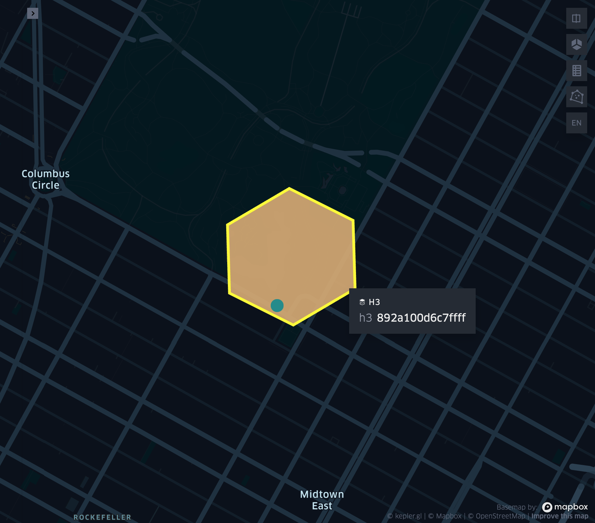

   Fig 1. Point to grid cell in H3(9)

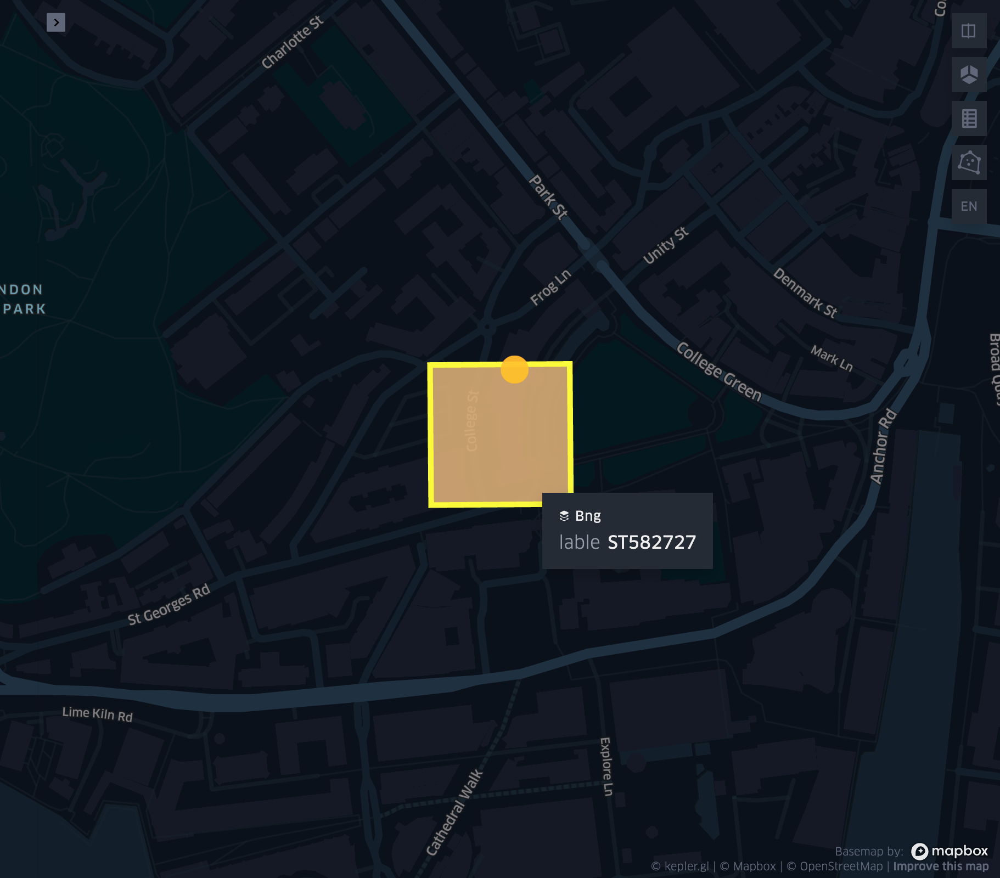

   Fig 2. Point to grid cell in BNG(4)

.. raw:: html

   

grid_pointascellid
******************

.. function:: grid_pointascellid(geometry, resolution)

    Returns the `resolution` grid index associated
    with the input point geometry `geometry`.

    :param geometry: Geometry
    :type geometry: Column
    :param resolution: Index resolution
    :type resolution: Column: Integer
    :rtype: Column: LongType

    :example:

.. tabs::
   .. code-tab:: py

    df = spark.createDataFrame([{'lon': 30., 'lat': 10.}])
    df.select(grid_pointascellid(st_point('lon', 'lat'), lit(10))).show(1, False)
    +------------------------------------------+
    |grid_pointascellid(st_point(lon, lat), 10)|
    +------------------------------------------+
    |623385352048508927                        |
    +------------------------------------------+

   .. code-tab:: scala

    val df = List((30.0, 10.0)).toDF("lon", "lat")
    df.select(grid_pointascellid(st_point(col("lon"), col("lat")), lit(10))).show()
    +------------------------------------------+
    |grid_pointascellid(st_point(lon, lat), 10)|
    +------------------------------------------+
    |623385352048508927                        |
    +------------------------------------------+

   .. code-tab:: sql

    SELECT grid_pointascellid(st_point(30d, 10d), 10)
    +------------------------------------------+
    |grid_pointascellid(st_point(lon, lat), 10)|
    +------------------------------------------+
    |623385352048508927                        |
    +------------------------------------------+

   .. code-tab:: r R

    df <- createDataFrame(data.frame(lon = 30.0, lat = 10.0))
    showDF(select(df, grid_pointascellid(st_point(column("lon"), column("lat")), lit(10L))), truncate=F)
    +------------------------------------------+
    |grid_pointascellid(st_point(lon, lat), 10)|
    +------------------------------------------+
    |623385352048508927                        |
    +------------------------------------------+

.. raw:: html

   

   Fig 1. Point to grid cell in H3(9)

   Fig 2. Point to grid cell in BNG(4)

.. raw:: html

   

grid_polyfill
*************

.. function:: grid_polyfill(geometry, resolution)

    Returns the set of grid indices of which centroid is contained in the input `geometry` at `resolution`.

    When using `H3 <https://h3geo.org/>` index system, this is equivalent to the
    `H3 polyfill <https://h3geo.org/docs/api/regions/#polyfill>` method

    :param geometry: Geometry
    :type geometry: Column
    :param resolution: Index resolution
    :type resolution: Column: Integer
    :rtype: Column: ArrayType[LongType]

    :example:

.. tabs::
   .. code-tab:: py

    df = spark.createDataFrame([{
        'wkt': 'MULTIPOLYGON (((30 20, 45 40, 10 40, 30 20)), ((15 5, 40 10, 10 20, 5 10, 15 5)))'
        }])
    df.select(grid_polyfill('wkt', lit(0))).show(1, False)
    +------------------------------------------------------------+
    |grid_polyfill(wkt, 0)                                       |
    +------------------------------------------------------------+
    |[577586652210266111, 578360708396220415, 577269992861466623]|
    +------------------------------------------------------------+

   .. code-tab:: scala

    val df = List(("MULTIPOLYGON (((30 20, 45 40, 10 40, 30 20)), ((15 5, 40 10, 10 20, 5 10, 15 5)))")).toDF("wkt")
    df.select(grid_polyfill(col("wkt"), lit(0))).show(false)
    +------------------------------------------------------------+
    |grid_polyfill(wkt, 0)                                       |
    +------------------------------------------------------------+
    |[577586652210266111, 578360708396220415, 577269992861466623]|
    +------------------------------------------------------------+

   .. code-tab:: sql

    SELECT grid_polyfill("MULTIPOLYGON (((30 20, 45 40, 10 40, 30 20)), ((15 5, 40 10, 10 20, 5 10, 15 5)))", 0)
    +------------------------------------------------------------+
    |grid_polyfill(wkt, 0)                                       |
    +------------------------------------------------------------+
    |[577586652210266111, 578360708396220415, 577269992861466623]|
    +------------------------------------------------------------+

   .. code-tab:: r R

    df <- createDataFrame(data.frame(wkt = "MULTIPOLYGON (((30 20, 45 40, 10 40, 30 20)), ((15 5, 40 10, 10 20, 5 10, 15 5)))"))
    showDF(select(df, grid_polyfill(column("wkt"), lit(0L))), truncate=F)
    +------------------------------------------------------------+
    |grid_polyfill(wkt, 0)                                       |
    +------------------------------------------------------------+
    |[577586652210266111, 578360708396220415, 577269992861466623]|
    +------------------------------------------------------------+

.. raw:: html

   

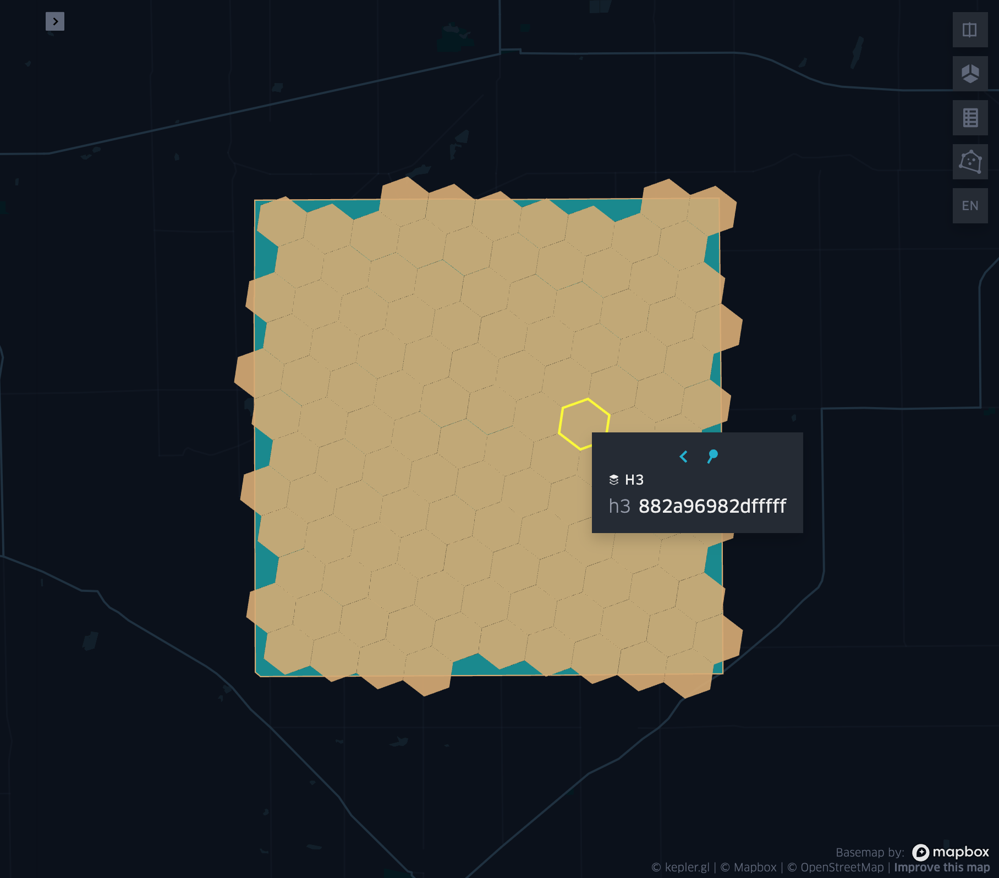

   Fig 1. Polyfill of a polygon in H3(8)

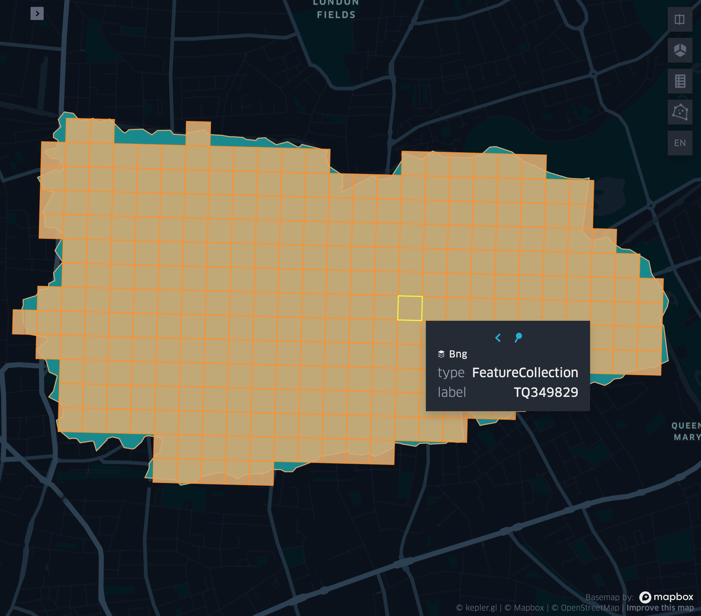

   Fig 2. Polyfill of a polygon in BNG(4)

.. raw:: html

   

grid_boundaryaswkb
******************

.. function:: grid_boundaryaswkb(cellid)

    Returns the boundary of the grid cell as a WKB.

    :param cellid: Grid cell id
    :type cellid: Column: Union(LongType, StringType)

    :example:

.. tabs::
   .. code-tab:: py

    df = spark.createDataFrame([{'cellid': 613177664827555839}])
    df.select(grid_boundaryaswkb("cellid").show(1, False)
    +--------------------------+
    |grid_boundaryaswkb(cellid)|
    +--------------------------+
    |[01 03 00 00 00 00 00 00..|
    +--------------------------+

   .. code-tab:: scala

    val df = List((613177664827555839)).toDF("cellid")
    df.select(grid_boundaryaswkb(col("cellid")).show()
    +--------------------------+
    |grid_boundaryaswkb(cellid)|
    +--------------------------+
    |[01 03 00 00 00 00 00 00..|
    +--------------------------+

   .. code-tab:: sql

    SELECT grid_boundaryaswkb(613177664827555839)
    +--------------------------+
    |grid_boundaryaswkb(cellid)|
    +--------------------------+
    |[01 03 00 00 00 00 00 00..|
    +--------------------------+

   .. code-tab:: r R

    df <- createDataFrame(data.frame(cellid = 613177664827555839))
    showDF(select(df, grid_boundaryaswkb(column("cellid")), truncate=F)
    +--------------------------+
    |grid_boundaryaswkb(cellid)|
    +--------------------------+
    |[01 03 00 00 00 00 00 00..|
    +--------------------------+

grid_boundary
******************

.. function:: grid_boundary(cellid, format)

    Returns the boundary of the grid cell as a geometry in specified format.

    :param cellid: Grid cell id
    :type cellid: Column: Union(LongType, StringType)
    :param format: Geometry format
    :type format: Column: StringType

    :example:

.. tabs::
   .. code-tab:: py

    df = spark.createDataFrame([{'cellid': 613177664827555839}])
    df.select(grid_boundary("cellid", "WKT").show(1, False)
    +--------------------------+
    |grid_boundary(cellid, WKT)|
    +--------------------------+
    |          "POLYGON (( ..."|
    +--------------------------+

   .. code-tab:: scala

    val df = List((613177664827555839)).toDF("cellid")
    df.select(grid_boundary(col("cellid"), lit("WKT").show()
    +--------------------------+
    |grid_boundary(cellid, WKT)|
    +--------------------------+
    |          "POLYGON (( ..."|
    +--------------------------+

   .. code-tab:: sql

    SELECT grid_boundary(613177664827555839, "WKT")
    +--------------------------+
    |grid_boundary(cellid, WKT)|
    +--------------------------+
    |          "POLYGON (( ..."|
    +--------------------------+

   .. code-tab:: r R

    df <- createDataFrame(data.frame(cellid = 613177664827555839))
    showDF(select(df, grid_boundary(column("cellid"), lit("WKT")), truncate=F)
    +--------------------------+
    |grid_boundary(cellid, WKT)|
    +--------------------------+
    |          "POLYGON (( ..."|
    +--------------------------+

grid_tessellate
***************

.. function:: grid_tessellate(geometry, resolution, keep_core_geometries)

    Cuts the original `geometry` into several pieces along the grid index borders at the specified `resolution`.

    Returns an array of Mosaic chips **covering** the input `geometry` at `resolution`.

    A Mosaic chip is a struct type composed of:

    - `is_core`: Identifies if the chip is fully contained within the geometry: Boolean

    - `index_id`: Index ID of the configured spatial indexing (default H3): Integer

    - `wkb`: Geometry in WKB format equal to the intersection of the index shape and the original `geometry`: Binary

    In contrast to :ref:`grid_tessellateexplode`, `grid_tessellate` does not explode the list of shapes.

    In contrast to :ref:`grid_polyfill`, `grid_tessellate` fully covers the original `geometry` even if the index centroid
    falls outside of the original geometry. This makes it suitable to index lines as well.

    :param geometry: Geometry
    :type geometry: Column
    :param resolution: Index resolution
    :type resolution: Column: Integer
    :param keep_core_geometries: Whether to keep the core geometries or set them to null
    :type keep_core_geometries: Column: Boolean
    :rtype: Column: ArrayType[MosaicType]

    :example:

.. tabs::
   .. code-tab:: py

    df = spark.createDataFrame([{'wkt': 'MULTIPOLYGON (((30 20, 45 40, 10 40, 30 20)), ((15 5, 40 10, 10 20, 5 10, 15 5)))'}])
    df.select(grid_tessellate('wkt', lit(0))).printSchema()
    root
     |-- grid_tessellate(wkt, 0): mosaic (nullable = true)
     |    |-- chips: array (nullable = true)
     |    |    |-- element: mosaic_chip (containsNull = true)
     |    |    |    |-- is_core: boolean (nullable = true)
     |    |    |    |-- index_id: long (nullable = true)
     |    |    |    |-- wkb: binary (nullable = true)

    df.select(grid_tessellate('wkt', lit(0))).show()
    +-----------------------+
    |grid_tessellate(wkt, 0)|
    +-----------------------+
    |   {[{false, 5774810...|
    +-----------------------+

   .. code-tab:: scala

    val df = List(("MULTIPOLYGON (((30 20, 45 40, 10 40, 30 20)), ((15 5, 40 10, 10 20, 5 10, 15 5)))")).toDF("wkt")
    df.select(grid_tessellate(col("wkt"), lit(0))).printSchema
    root
     |-- grid_tessellate(wkt, 0): mosaic (nullable = true)
     |    |-- chips: array (nullable = true)
     |    |    |-- element: mosaic_chip (containsNull = true)
     |    |    |    |-- is_core: boolean (nullable = true)
     |    |    |    |-- index_id: long (nullable = true)
     |    |    |    |-- wkb: binary (nullable = true)

    df.select(grid_tessellate(col("wkt"), lit(0))).show()
    +-----------------------+
    |grid_tessellate(wkt, 0)|
    +-----------------------+
    |   {[{false, 5774810...|
    +-----------------------+

   .. code-tab:: sql

    SELECT grid_tessellate("MULTIPOLYGON (((30 20, 45 40, 10 40, 30 20)), ((15 5, 40 10, 10 20, 5 10, 15 5)))", 0)
    +-----------------------+
    |grid_tessellate(wkt, 0)|
    +-----------------------+
    |   {[{false, 5774810...|
    +-----------------------+

   .. code-tab:: r R

    df <- createDataFrame(data.frame(wkt = "MULTIPOLYGON (((30 20, 45 40, 10 40, 30 20)), ((15 5, 40 10, 10 20, 5 10, 15 5)))"))
    schema(select(df, grid_tessellate(column("wkt"), lit(0L))))
    root
     |-- grid_tessellate(wkt, 0): mosaic (nullable = true)
     |    |-- chips: array (nullable = true)
     |    |    |-- element: mosaic_chip (containsNull = true)
     |    |    |    |-- is_core: boolean (nullable = true)
     |    |    |    |-- index_id: long (nullable = true)
     |    |    |    |-- wkb: binary (nullable = true)
    showDF(select(df, grid_tessellate(column("wkt"), lit(0L))))
    +-----------------------+
    |grid_tessellate(wkt, 0)|
    +-----------------------+
    |   {[{false, 5774810...|
    +-----------------------+

.. raw:: html

   

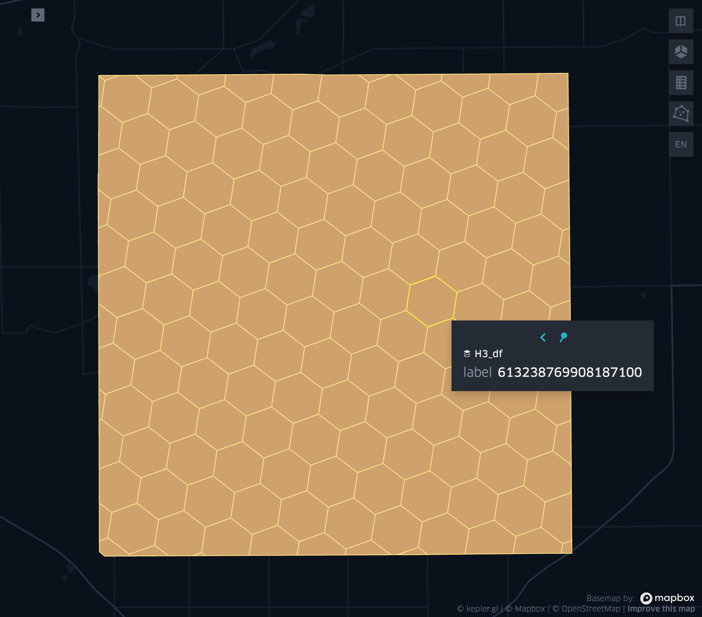

   Fig 1. Tessellation of a polygon in H3(8)

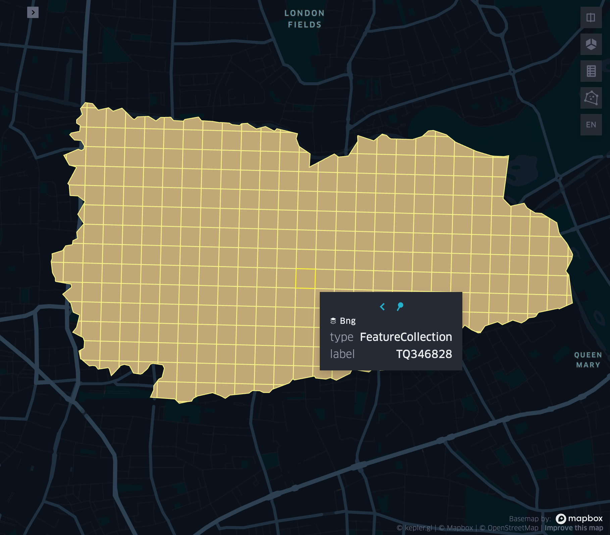

   Fig 2. Tessellation of a polygon in BNG(4)

.. raw:: html

   

grid_tessellateexplode
**********************

.. function:: grid_tessellateexplode(geometry, resolution, keep_core_geometries)

    Cuts the original `geometry` into several pieces along the grid index borders at the specified `resolution`.

    Returns the set of Mosaic chips **covering** the input `geometry` at `resolution`.

    A Mosaic chip is a struct type composed of:

    - `is_core`: Identifies if the chip is fully contained within the geometry: Boolean

    - `index_id`: Index ID of the configured spatial indexing (default H3): Integer

    - `wkb`: Geometry in WKB format equal to the intersection of the index shape and the original `geometry`: Binary

    In contrast to :ref:`grid_tessellate`, `grid_tessellateexplode` generates one result row per chip.

    In contrast to :ref:`grid_polyfill`, `grid_tessellateexplode` fully covers the original `geometry` even if the index centroid
    falls outside of the original geometry. This makes it suitable to index lines as well.

    :param geometry: Geometry
    :type geometry: Column
    :param resolution: Index resolution
    :type resolution: Column: Integer
    :param keep_core_geometries: Whether to keep the core geometries or set them to null
    :type keep_core_geometries: Column: Boolean
    :rtype: Column: MosaicType

    :example:

.. tabs::
   .. code-tab:: py

    df = spark.createDataFrame([{'wkt': 'MULTIPOLYGON (((30 20, 45 40, 10 40, 30 20)), ((15 5, 40 10, 10 20, 5 10, 15 5)))'}])
    df.select(grid_tessellateexplode('wkt', lit(0))).show()
    +-----------------------------------------------+
    |is_core|          index_id|                 wkb|
    +-------+------------------+--------------------+
    |  false|577481099093999615|[01 03 00 00 00 0...|
    |  false|578044049047420927|[01 03 00 00 00 0...|
    |  false|578782920861286399|[01 03 00 00 00 0...|
    |  false|577023702256844799|[01 03 00 00 00 0...|
    |  false|577938495931154431|[01 03 00 00 00 0...|
    |  false|577586652210266111|[01 06 00 00 00 0...|
    |  false|577269992861466623|[01 03 00 00 00 0...|
    |  false|578360708396220415|[01 03 00 00 00 0...|
    +-------+------------------+--------------------+

   .. code-tab:: scala

    val df = List(("MULTIPOLYGON (((30 20, 45 40, 10 40, 30 20)), ((15 5, 40 10, 10 20, 5 10, 15 5)))")).toDF("wkt")
    df.select(grid_tessellateexplode(col("wkt"), lit(0))).show()
    +-----------------------------------------------+
    |is_core|          index_id|                 wkb|
    +-------+------------------+--------------------+
    |  false|577481099093999615|[01 03 00 00 00 0...|
    |  false|578044049047420927|[01 03 00 00 00 0...|
    |  false|578782920861286399|[01 03 00 00 00 0...|
    |  false|577023702256844799|[01 03 00 00 00 0...|
    |  false|577938495931154431|[01 03 00 00 00 0...|
    |  false|577586652210266111|[01 06 00 00 00 0...|
    |  false|577269992861466623|[01 03 00 00 00 0...|
    |  false|578360708396220415|[01 03 00 00 00 0...|
    +-------+------------------+--------------------+

   .. code-tab:: sql

    SELECT grid_tessellateexplode("MULTIPOLYGON (((30 20, 45 40, 10 40, 30 20)), ((15 5, 40 10, 10 20, 5 10, 15 5)))", 0)
    +-----------------------------------------------+
    |is_core|          index_id|                 wkb|
    +-------+------------------+--------------------+
    |  false|577481099093999615|[01 03 00 00 00 0...|
    |  false|578044049047420927|[01 03 00 00 00 0...|
    |  false|578782920861286399|[01 03 00 00 00 0...|
    |  false|577023702256844799|[01 03 00 00 00 0...|
    |  false|577938495931154431|[01 03 00 00 00 0...|
    |  false|577586652210266111|[01 06 00 00 00 0...|
    |  false|577269992861466623|[01 03 00 00 00 0...|
    |  false|578360708396220415|[01 03 00 00 00 0...|
    +-------+------------------+--------------------+

   .. code-tab:: r R

    df <- createDataFrame(data.frame(wkt = 'MULTIPOLYGON (((30 20, 45 40, 10 40, 30 20)), ((15 5, 40 10, 10 20, 5 10, 15 5)))'))
    showDF(select(df, grid_tessellateexplode(column("wkt"), lit(0L))))
    +-----------------------------------------------+
    |is_core|          index_id|                 wkb|
    +-------+------------------+--------------------+
    |  false|577481099093999615|[01 03 00 00 00 0...|
    |  false|578044049047420927|[01 03 00 00 00 0...|
    |  false|578782920861286399|[01 03 00 00 00 0...|
    |  false|577023702256844799|[01 03 00 00 00 0...|
    |  false|577938495931154431|[01 03 00 00 00 0...|
    |  false|577586652210266111|[01 06 00 00 00 0...|
    |  false|577269992861466623|[01 03 00 00 00 0...|
    |  false|578360708396220415|[01 03 00 00 00 0...|
    +-------+------------------+--------------------+

.. raw:: html

   

   Fig 1. Tessellation of a polygon in H3(8)

   Fig 2. Tessellation of a polygon in BNG(4)

.. raw:: html

   

grid_cellarea
*************

.. function:: grid_cellarea(cellid)

    Returns the area of a given cell in km^2.

    :param cellid: Grid cell ID
    :type cellid: Column: Long
    :rtype: Column: DoubleType

    :example:

.. tabs::
   .. code-tab:: py

    df = spark.createDataFrame([{'grid_cellid': 613177664827555839}])
    df.withColumn(grid_cellarea('grid_cellid').alias("area")).show()
    +------------------------------------+
    |         grid_cellid|           area|
    +--------------------+---------------+
    |  613177664827555839|     0.78595419|
    +--------------------+---------------+

   .. code-tab:: scala

    val df = List((613177664827555839)).toDF("grid_cellid")
    df.select(grid_cellarea('grid_cellid').alias("area")).show()
    +------------------------------------+
    |         grid_cellid|           area|
    +--------------------+---------------+
    |  613177664827555839|     0.78595419|
    +--------------------+---------------+

   .. code-tab:: sql

    SELECT grid_cellarea(613177664827555839)
    +------------------------------------+
    |         grid_cellid|           area|
    +--------------------+---------------+
    |  613177664827555839|     0.78595419|
    +--------------------+---------------+

   .. code-tab:: r R

    df <- createDataFrame(data.frame(grid_cellid = 613177664827555839))
    showDF(select(df, grid_cellarea(column("grid_cellid"))))
    +------------------------------------+
    |         grid_cellid|           area|
    +--------------------+---------------+
    |  613177664827555839|     0.78595419|
    +--------------------+---------------+

grid_cellkring
**************

.. function:: grid_cellkring(cellid, k)

    Returns the k-ring of a given cell.

    :param cellid: Grid cell ID
    :type cellid: Column: Long
    :param k: K-ring size
    :type k: Column: Integer
    :rtype: Column: ArrayType(Long)

    :example:

.. tabs::
   .. code-tab:: py

    df = spark.createDataFrame([{'grid_cellid': 613177664827555839}])
    df.select(grid_cellkring('grid_cellid', lit(2)).alias("kring")).show()
    +-------------------------------------------------------------------+
    |         grid_cellid|                                         kring|
    +--------------------+----------------------------------------------+
    |  613177664827555839|[613177664827555839, 613177664825458687, ....]|
    +--------------------+----------------------------------------------+

   .. code-tab:: scala

    val df = List((613177664827555839)).toDF("grid_cellid")
    df.select(grid_cellkring('grid_cellid', lit(2)).alias("kring")).show()
    +-------------------------------------------------------------------+
    |         grid_cellid|                                         kring|
    +--------------------+----------------------------------------------+
    |  613177664827555839|[613177664827555839, 613177664825458687, ....]|
    +--------------------+----------------------------------------------+

   .. code-tab:: sql

    SELECT grid_cellkring(613177664827555839, 2)
    +-------------------------------------------------------------------+
    |         grid_cellid|                                         kring|
    +--------------------+----------------------------------------------+
    |  613177664827555839|[613177664827555839, 613177664825458687, ....]|
    +--------------------+----------------------------------------------+

   .. code-tab:: r R

    df <- createDataFrame(data.frame(grid_cellid = 613177664827555839))
    showDF(select(df, grid_cellkring(column("grid_cellid"), lit(2L))))
    +-------------------------------------------------------------------+
    |         grid_cellid|                                         kring|
    +--------------------+----------------------------------------------+
    |  613177664827555839|[613177664827555839, 613177664825458687, ....]|
    +--------------------+----------------------------------------------+

.. raw:: html

   

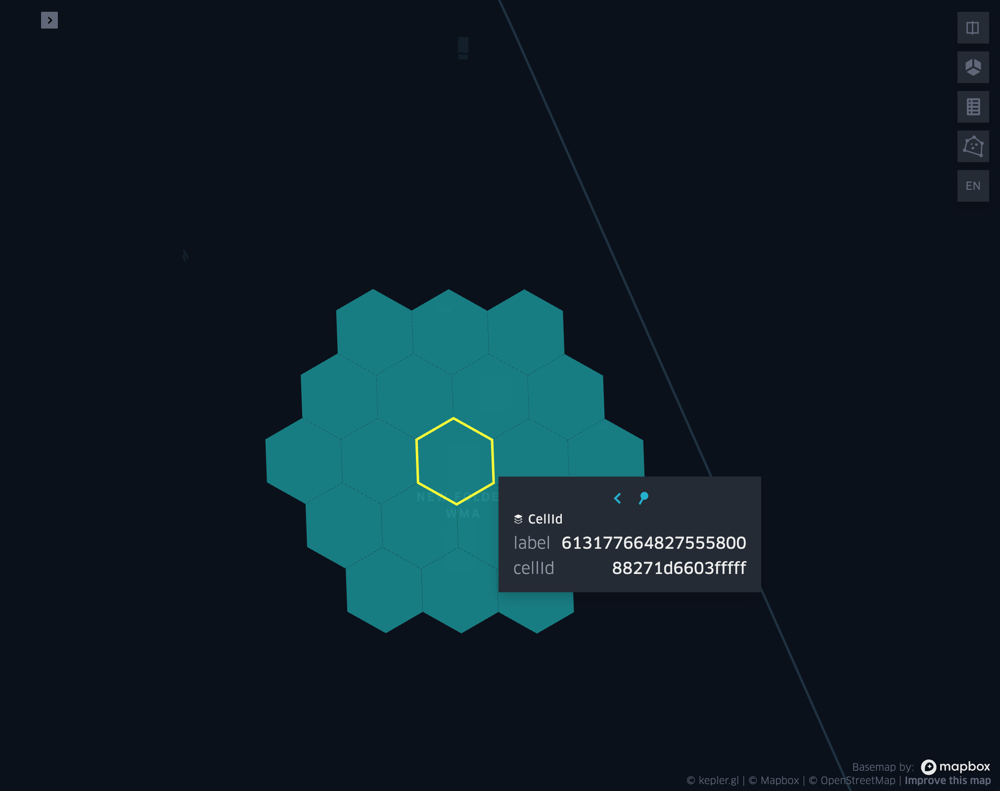

   Fig 1. Cell based kring(2) in H3(8)

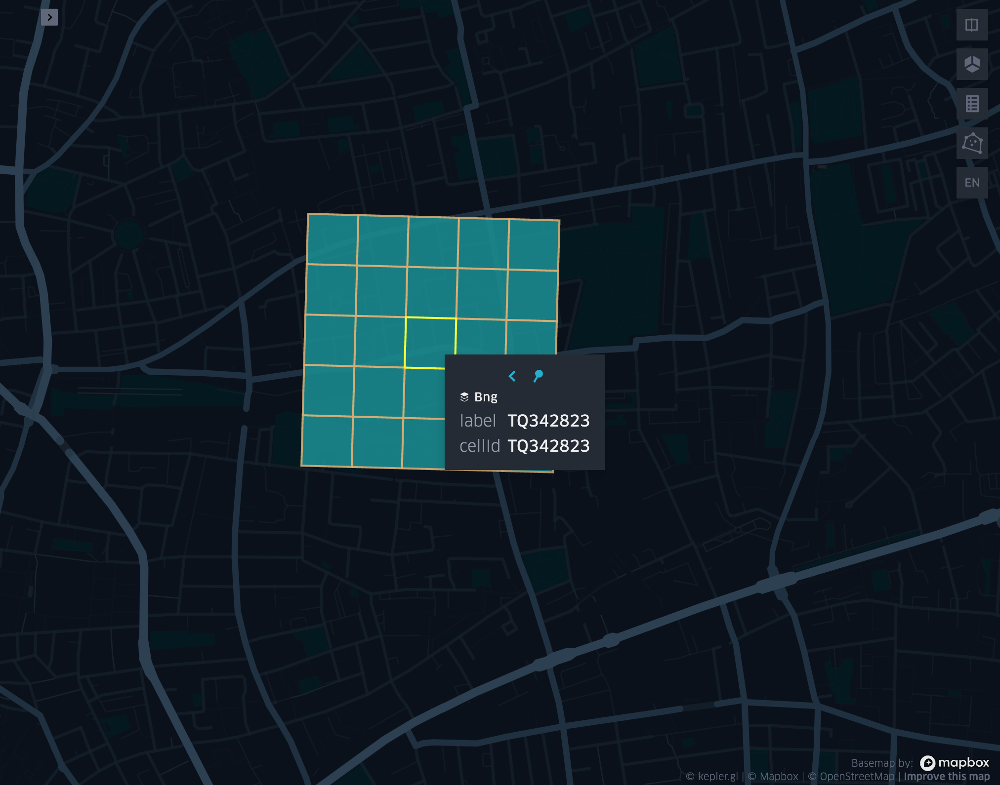

   Fig 2. Cell based kring(2) in BNG(4)

.. raw:: html

   

grid_cellkringexplode
*********************

.. function:: grid_cellkringexplode(cellid, k)

    Returns the k-ring of a given cell exploded.

    :param cellid: Grid cell ID
    :type cellid: Column: Long
    :param k: K-ring size
    :type k: Column: Integer
    :rtype: Column: Long

    :example:

.. tabs::
   .. code-tab:: py

    df = spark.createDataFrame([{'grid_cellid': 613177664827555839}])
    df.select(grid_cellkringexplode('grid_cellid', lit(2)).alias("kring")).show()
    +------------------+
    |             kring|
    +------------------+
    |613177664827555839|
    |613177664825458687|
    |613177664831750143|
    |613177664884178943|
    |               ...|
    +------------------+

   .. code-tab:: scala

    val df = List((613177664827555839)).toDF("grid_cellid")
    df.select(grid_cellkringexplode('grid_cellid', lit(2)).alias("kring")).show()
    +------------------+
    |             kring|
    +------------------+
    |613177664827555839|
    |613177664825458687|
    |613177664831750143|
    |613177664884178943|
    |               ...|
    +------------------+

   .. code-tab:: sql

    SELECT grid_cellkringexplode(613177664827555839, 2)
    +------------------+
    |             kring|
    +------------------+
    |613177664827555839|
    |613177664825458687|
    |613177664831750143|
    |613177664884178943|
    |               ...|
    +------------------+

   .. code-tab:: r R

    df <- createDataFrame(data.frame(grid_cellid = 613177664827555839))
    showDF(select(df, grid_cellkringexplode(column("grid_cellid"), lit(2L))))
    +------------------+
    |             kring|
    +------------------+
    |613177664827555839|
    |613177664825458687|
    |613177664831750143|
    |613177664884178943|
    |               ...|
    +------------------+

.. raw:: html

   

   Fig 1. Cell based kring(2) in H3(8)

   Fig 2. Cell based kring(2) in BNG(4)

.. raw:: html

   

grid_cell_intersection
**************

.. function:: grid_cell_intersection(left_chip, right_chip)

    Returns the chip representing the intersection of two chips based on the same grid cell

    :param left_chip: Chip
    :type left_chip: Column: ChipType(LongType)
    :param left_chip: Chip
    :type left_chip: Column: ChipType(LongType)
    :rtype: Column: ChipType(LongType)

    :example:

.. tabs::
   .. code-tab:: py

    df = spark.createDataFrame([{"chip": {"is_core": False, "index_id": 590418571381702655, "wkb": ...}})])
    df.select(grid_cell_intersection("chip", "chip").alias("intersection")).show()
    ---------------------------------------------------------+
    |                                           intersection |
    +--------------------------------------------------------+
    |{is_core: false, index_id: 590418571381702655, wkb: ...}|
    +--------------------------------------------------------+

   .. code-tab:: scala

    val df = List((...)).toDF("chip")
    df.select(grid_cell_intersection("chip", "chip").alias("intersection")).show()
    ---------------------------------------------------------+
    |                                           intersection |
    +--------------------------------------------------------+
    |{is_core: false, index_id: 590418571381702655, wkb: ...}|
    +--------------------------------------------------------+

   .. code-tab:: sql

    SELECT grid_cell_intersection({"is_core": False, "index_id": 590418571381702655, "wkb": ...})
    ---------------------------------------------------------+
    |                                           intersection |
    +--------------------------------------------------------+
    |{is_core: false, index_id: 590418571381702655, wkb: ...}|
    +--------------------------------------------------------+

   .. code-tab:: r R

    df <- createDataFrame(data.frame(...))
    showDF(select(df, grid_cell_intersection(column("chip"))))
    ---------------------------------------------------------+
    |                                           intersection |
    +--------------------------------------------------------+
    |{is_core: false, index_id: 590418571381702655, wkb: ...}|
    +--------------------------------------------------------+

grid_cell_union
**************

.. function:: grid_cell_union(left_chip, right_chip)

    Returns the chip representing the union of two chips based on the same grid cell

    :param left_chip: Chip
    :type left_chip: Column: ChipType(LongType)
    :param left_chip: Chip
    :type left_chip: Column: ChipType(LongType)
    :rtype: Column: ChipType(LongType)

    :example:

.. tabs::
   .. code-tab:: py

    df = spark.createDataFrame([{"chip": {"is_core": False, "index_id": 590418571381702655, "wkb": ...}})])
    df.select(grid_cell_union("chip", "chip").alias("union")).show()
    ---------------------------------------------------------+
    |                                           union        |
    +--------------------------------------------------------+
    |{is_core: false, index_id: 590418571381702655, wkb: ...}|
    +--------------------------------------------------------+

   .. code-tab:: scala

    val df = List((...)).toDF("chip")
    df.select(grid_cell_union("chip", "chip").alias("union")).show()
    ---------------------------------------------------------+
    |                                           union        |
    +--------------------------------------------------------+
    |{is_core: false, index_id: 590418571381702655, wkb: ...}|
    +--------------------------------------------------------+

   .. code-tab:: sql

    SELECT grid_cell_union({"is_core": False, "index_id": 590418571381702655, "wkb": ...})
    ---------------------------------------------------------+
    |                                           union        |
    +--------------------------------------------------------+
    |{is_core: false, index_id: 590418571381702655, wkb: ...}|
    +--------------------------------------------------------+

   .. code-tab:: r R

    df <- createDataFrame(data.frame(...))
    showDF(select(df, grid_cell_union(column("chip"))))
    ---------------------------------------------------------+
    |                                           union        |
    +--------------------------------------------------------+
    |{is_core: false, index_id: 590418571381702655, wkb: ...}|
    +--------------------------------------------------------+

grid_cellkloop
**************

.. function:: grid_cellkloop(cellid, k)

    Returns the k loop (hollow ring) of a given cell.

    :param cellid: Grid cell ID
    :type cellid: Column: Long
    :param k: K-loop size
    :type k: Column: Integer
    :rtype: Column: ArrayType(Long)

    :example:

.. tabs::
   .. code-tab:: py

    df = spark.createDataFrame([{'grid_cellid': 613177664827555839}])
    df.select(grid_cellkloop('grid_cellid', lit(2)).alias("kloop")).show()
    +-------------------------------------------------------------------+
    |         grid_cellid|                                         kloop|
    +--------------------+----------------------------------------------+
    |  613177664827555839|[613177664827555839, 613177664825458687, ....]|
    +--------------------+----------------------------------------------+

   .. code-tab:: scala

    val df = List((613177664827555839)).toDF("grid_cellid")
    df.select(grid_cellkloop('grid_cellid', lit(2)).alias("kloop")).show()
    +-------------------------------------------------------------------+
    |         grid_cellid|                                         kloop|
    +--------------------+----------------------------------------------+
    |  613177664827555839|[613177664827555839, 613177664825458687, ....]|
    +--------------------+----------------------------------------------+

   .. code-tab:: sql

    SELECT grid_cellkloop(613177664827555839, 2)
    +-------------------------------------------------------------------+
    |         grid_cellid|                                         kloop|
    +--------------------+----------------------------------------------+
    |  613177664827555839|[613177664827555839, 613177664825458687, ....]|
    +--------------------+----------------------------------------------+

   .. code-tab:: r R

    df <- createDataFrame(data.frame(grid_cellid = 613177664827555839))
    showDF(select(df, grid_cellkloop(column("grid_cellid"), lit(2L))))
    +-------------------------------------------------------------------+
    |         grid_cellid|                                         kloop|
    +--------------------+----------------------------------------------+
    |  613177664827555839|[613177664827555839, 613177664825458687, ....]|
    +--------------------+----------------------------------------------+

.. raw:: html

   

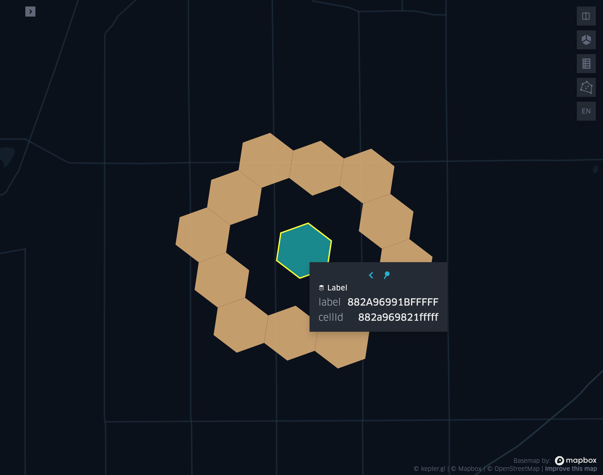

   Fig 1. Cell based kring(2) in H3(8)

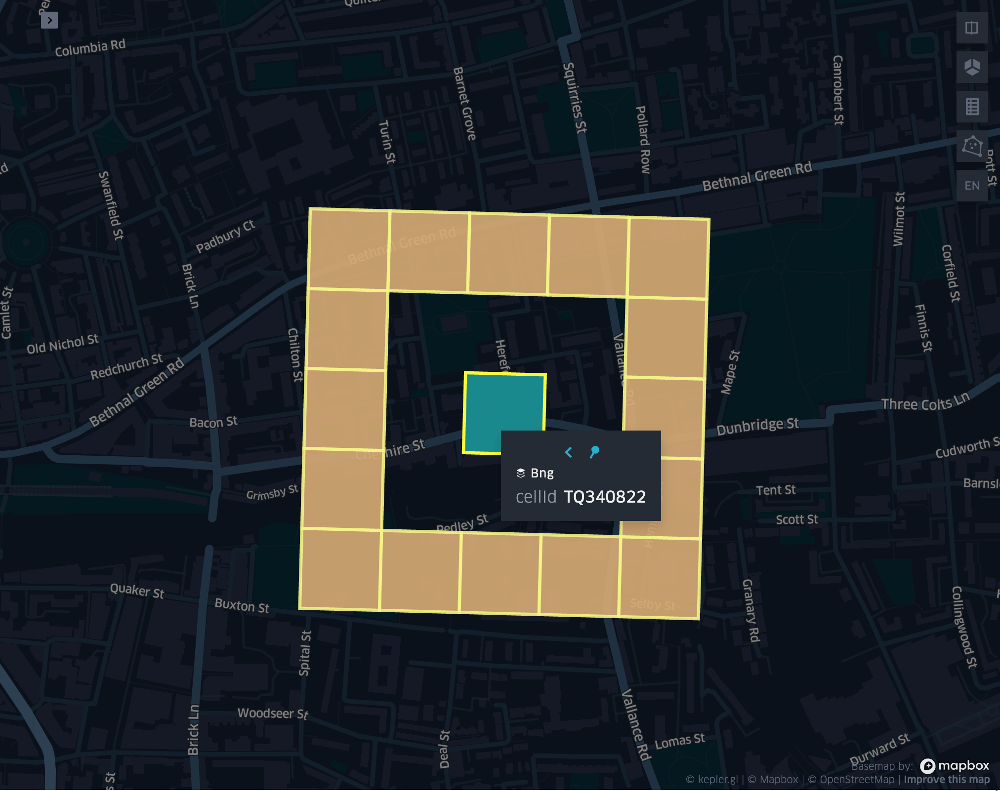

   Fig 2. Cell based kring(2) in BNG(4)

.. raw:: html

   

grid_cellkloopexplode
*********************

.. function:: grid_cellkloopexplode(cellid, k)

    Returns the k loop (hollow ring) of a given cell exploded.

    :param cellid: Grid cell ID
    :type cellid: Column: Long
    :param k: K-loop size
    :type k: Column: Integer
    :rtype: Column: Long

    :example:

.. tabs::
   .. code-tab:: py

    df = spark.createDataFrame([{'grid_cellid': 613177664827555839}])
    df.select(grid_cellkloopexplode('grid_cellid', lit(2)).alias("kloop")).show()
    +------------------+
    |             kloop|
    +------------------+
    |613177664827555839|
    |613177664825458687|
    |613177664831750143|
    |613177664884178943|
    |               ...|
    +------------------+

   .. code-tab:: scala

    val df = List((613177664827555839)).toDF("grid_cellid")
    df.select(grid_cellkloopexplode('grid_cellid', lit(2)).alias("kloop")).show()
    +------------------+
    |             kloop|
    +------------------+
    |613177664827555839|
    |613177664825458687|
    |613177664831750143|
    |613177664884178943|
    |               ...|
    +------------------+

   .. code-tab:: sql

    SELECT grid_cellkloopexplode(613177664827555839, 2)
    +------------------+
    |             kloop|
    +------------------+
    |613177664827555839|
    |613177664825458687|
    |613177664831750143|
    |613177664884178943|
    |               ...|
    +------------------+

   .. code-tab:: r R

    df <- createDataFrame(data.frame(grid_cellid = 613177664827555839))
    showDF(select(df, grid_cellkloopexplode(column("grid_cellid"), lit(2L))))
    +------------------+
    |             kloop|
    +------------------+
    |613177664827555839|
    |613177664825458687|
    |613177664831750143|
    |613177664884178943|
    |               ...|
    +------------------+

.. raw:: html

   

   Fig 1. Cell based kring(2) in H3(8)

   Fig 2. Cell based kring(2) in BNG(4)

.. raw:: html

   

grid_geometrykring
******************

.. function:: grid_geometrykring(geometry, resolution, k)

    Returns the k-ring of a given geometry respecting the boundary shape.

    :param geometry: Geometry to be used
    :type geometry: Column
    :param resolution: Resolution of the index used to calculate the k-ring
    :type resolution: Column: Integer
    :param k: K-ring size
    :type k: Column: Integer
    :rtype: Column: ArrayType(Long)

    :example:

.. tabs::
   .. code-tab:: py

    df = spark.createDataFrame([{'geometry': "MULTIPOLYGON (((30 20, 45 40, 10 40, 30 20)), ((15 5, 40 10, 10 20, 5 10, 15 5)))"}])
    df.select(grid_geometrykring('geometry', lit(8), lit(1)).alias("kring")).show()
    +-------------------------------------------------------------------+
    |            geometry|                                         kring|
    +--------------------+----------------------------------------------+
    |  "MULTIPOLYGON(..."|[613177664827555839, 613177664825458687, ....]|
    +--------------------+----------------------------------------------+

   .. code-tab:: scala

    val df = List((613177664827555839)).toDF("geometry")
    df.select(grid_geometrykring('geometry', lit(8), lit(1)).alias("kring")).show()
    +-------------------------------------------------------------------+
    |            geometry|                                         kring|
    +--------------------+----------------------------------------------+
    |  "MULTIPOLYGON(..."|[613177664827555839, 613177664825458687, ....]|
    +--------------------+----------------------------------------------+

   .. code-tab:: sql

    SELECT grid_geometrykring('MULTIPOLYGON (((30 20, 45 40, 10 40, 30 20)), ((15 5, 40 10, 10 20, 5 10, 15 5)))', 8, 1)
    +-------------------------------------------------------------------+
    |            geometry|                                         kring|
    +--------------------+----------------------------------------------+
    |  "MULTIPOLYGON(..."|[613177664827555839, 613177664825458687, ....]|
    +--------------------+----------------------------------------------+

   .. code-tab:: r R

    df <- createDataFrame(data.frame(geometry = 613177664827555839))
    showDF(select(df, grid_geometrykring('geometry', lit(8L), lit(1L))))
    +-------------------------------------------------------------------+
    |            geometry|                                         kring|
    +--------------------+----------------------------------------------+
    |  "MULTIPOLYGON(..."|[613177664827555839, 613177664825458687, ....]|
    +--------------------+----------------------------------------------+

.. raw:: html

   

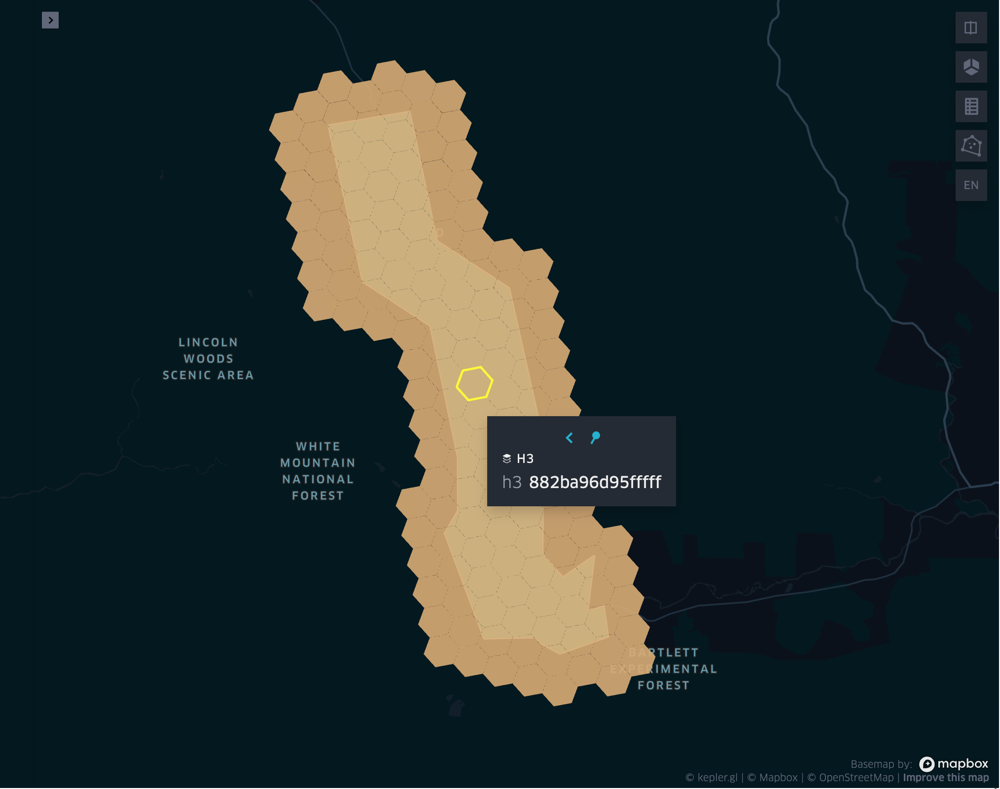

   Fig 1. Geometry based kring(1) in H3(8)

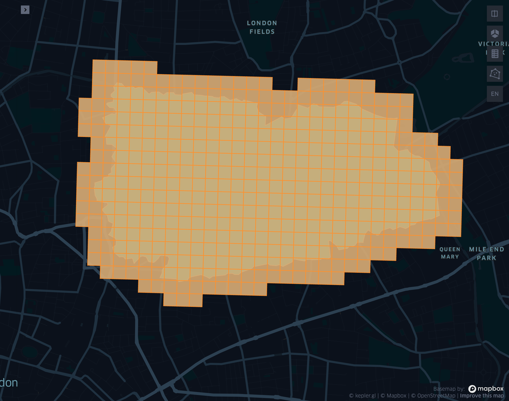

   Fig 2. Geometry based kring(1) in BNG(4)

.. raw:: html

   

grid_geometrykringexplode
*************************

.. function:: grid_geometrykringexplode(geometry, resolution, k)

    Returns the k-ring of a given geometry exploded.

    :param geometry: Geometry to be used
    :type geometry: Column
    :param resolution: Resolution of the index used to calculate the k-ring
    :type resolution: Column: Integer
    :param k: K-ring size
    :type k: Column: Integer
    :rtype: Column: Long

    :example:

.. tabs::
   .. code-tab:: py

    df = spark.createDataFrame([{'geometry': "MULTIPOLYGON (((30 20, 45 40, 10 40, 30 20)), ((15 5, 40 10, 10 20, 5 10, 15 5)))"}])
    df.select(grid_geometrykringexplode('geometry', lit(8), lit(2)).alias("kring")).show()
    +------------------+
    |             kring|
    +------------------+
    |613177664827555839|
    |613177664825458687|
    |613177664831750143|
    |613177664884178943|
    |               ...|
    +------------------+

   .. code-tab:: scala

    val df = List(("MULTIPOLYGON (((30 20, 45 40, 10 40, 30 20)), ((15 5, 40 10, 10 20, 5 10, 15 5)))")).toDF("geometry")
    df.select(grid_geometrykringexplode('geometry', lit(8), lit(2)).alias("kring")).show()
    +------------------+
    |             kring|
    +------------------+
    |613177664827555839|
    |613177664825458687|
    |613177664831750143|
    |613177664884178943|
    |               ...|
    +------------------+

   .. code-tab:: sql

    SELECT grid_geometrykringexplode("MULTIPOLYGON (((30 20, 45 40, 10 40, 30 20)), ((15 5, 40 10, 10 20, 5 10, 15 5)))", 8, 2)
    +------------------+
    |             kring|
    +------------------+
    |613177664827555839|
    |613177664825458687|
    |613177664831750143|
    |613177664884178943|
    |               ...|
    +------------------+

   .. code-tab:: r R

    df <- createDataFrame(data.frame(geometry = "MULTIPOLYGON (((30 20, 45 40, 10 40, 30 20)), ((15 5, 40 10, 10 20, 5 10, 15 5)))"))
    showDF(select(df, grid_cellkringexplode(column("geometry"), lit(8L), lit(2L))))
    +------------------+
    |             kring|
    +------------------+
    |613177664827555839|
    |613177664825458687|
    |613177664831750143|
    |613177664884178943|
    |               ...|
    +------------------+

.. raw:: html

   

   Fig 1. Cell based kring(2) in H3(8)

   Fig 2. Cell based kring(2) in BNG(4)

.. raw:: html

   

grid_geometrykloop
******************

.. function:: grid_geometrykloop(geometry, resolution, k)

    Returns the k-loop (hollow ring) of a given geometry.

    :param geometry: Geometry to be used
    :type geometry: Column
    :param resolution: Resolution of the index used to calculate the k loop
    :type resolution: Column: Integer
    :param k: K-Loop size
    :type k: Column: Integer
    :rtype: Column: ArrayType(Long)

    :example:

.. tabs::
   .. code-tab:: py

    df = spark.createDataFrame([{'geometry': "MULTIPOLYGON (((30 20, 45 40, 10 40, 30 20)), ((15 5, 40 10, 10 20, 5 10, 15 5)))"}])
    df.select(grid_geometrykloop('geometry', lit(2)).alias("kloop")).show()
    +-------------------------------------------------------------------+
    |            geometry|                                         kloop|
    +--------------------+----------------------------------------------+
    |  MULTIPOLYGON ((...|[613177664827555839, 613177664825458687, ....]|
    +--------------------+----------------------------------------------+

   .. code-tab:: scala

    val df = List(("MULTIPOLYGON (((30 20, 45 40, 10 40, 30 20)), ((15 5, 40 10, 10 20, 5 10, 15 5)))")).toDF("geometry")
    df.select(grid_cellkloop('geometry', lit(2)).alias("kloop")).show()
    +-------------------------------------------------------------------+
    |            geometry|                                         kloop|
    +--------------------+----------------------------------------------+
    |  MULTIPOLYGON ((...|[613177664827555839, 613177664825458687, ....]|
    +--------------------+----------------------------------------------+

   .. code-tab:: sql

    SELECT grid_cellkloop("MULTIPOLYGON (((30 20, 45 40, 10 40, 30 20)), ((15 5, 40 10, 10 20, 5 10, 15 5)))", 2)
    +-------------------------------------------------------------------+
    |            geometry|                                         kloop|
    +--------------------+----------------------------------------------+
    |  MULTIPOLYGON ((...|[613177664827555839, 613177664825458687, ....]|
    +--------------------+----------------------------------------------+

   .. code-tab:: r R

    df <- createDataFrame(data.frame(geometry = "MULTIPOLYGON (((30 20, 45 40, 10 40, 30 20)), ((15 5, 40 10, 10 20, 5 10, 15 5)))"))
    showDF(select(df, grid_cellkloop(column("geometry"), lit(2L))))
    +-------------------------------------------------------------------+
    |            geometry|                                         kloop|
    +--------------------+----------------------------------------------+
    |  MULTIPOLYGON ((...|[613177664827555839, 613177664825458687, ....]|
    +--------------------+----------------------------------------------+

.. raw:: html

   

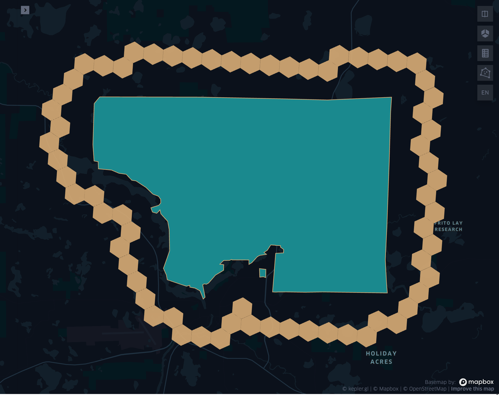

   Fig 1. Cell based kring(2) in H3(8)

.. figure:: ../images/grid_geometrykloop/bng.png
   :figclass: doc-figure-float-left

   Fig 2. Cell based kring(2) in BNG(4)

.. raw:: html

   

grid_geometrykloopexplode
*************************

.. function:: grid_geometrykloopexplode(geometry, resolution, k)

    Returns the k loop (hollow ring) of a given geometry exploded.

    :param geometry: Geometry to be used
    :type geometry: Column
    :param resolution: Resolution of the index used to calculate the k loop
    :type resolution: Column: Integer
    :param k: K-loop size
    :type k: Column: Integer
    :rtype: Column: Long

    :example:

.. tabs::
   .. code-tab:: py

    df = spark.createDataFrame([{'geometry': "MULTIPOLYGON (((30 20, 45 40, 10 40, 30 20)), ((15 5, 40 10, 10 20, 5 10, 15 5)))"}])
    df.select(grid_geometrykloopexplode('geometry', lit(8), lit(2)).alias("kloop")).show()
    +------------------+
    |             kloop|
    +------------------+
    |613177664827555839|
    |613177664825458687|
    |613177664831750143|
    |613177664884178943|
    |               ...|
    +------------------+

   .. code-tab:: scala

    val df = List(("MULTIPOLYGON (((30 20, 45 40, 10 40, 30 20)), ((15 5, 40 10, 10 20, 5 10, 15 5)))")).toDF("geometry")
    df.select(grid_geometrykloopexplode('geometry', lit(8), lit(2)).alias("kloop")).show()
    +------------------+
    |             kloop|
    +------------------+
    |613177664827555839|
    |613177664825458687|
    |613177664831750143|
    |613177664884178943|
    |               ...|
    +------------------+

   .. code-tab:: sql

    SELECT grid_geometrykloopexplode("MULTIPOLYGON (((30 20, 45 40, 10 40, 30 20)), ((15 5, 40 10, 10 20, 5 10, 15 5)))", 8, 2)
    +------------------+
    |             kloop|
    +------------------+
    |613177664827555839|
    |613177664825458687|
    |613177664831750143|
    |613177664884178943|
    |               ...|
    +------------------+

   .. code-tab:: r R

    df <- createDataFrame(data.frame(geometry = "MULTIPOLYGON (((30 20, 45 40, 10 40, 30 20)), ((15 5, 40 10, 10 20, 5 10, 15 5)))"))
    showDF(select(df, grid_geometrykloopexplode(column("geometry"), lit(8L), lit(2L))))
    +------------------+
    |             kloop|
    +------------------+
    |613177664827555839|
    |613177664825458687|
    |613177664831750143|
    |613177664884178943|
    |               ...|
    +------------------+

.. raw:: html

   

   Fig 1. Cell based kring(2) in H3(8)

.. figure:: ../images/grid_geometrykloop/bng.png
   :figclass: doc-figure-float-left

   Fig 2. Cell based kring(2) in BNG(4)

.. raw:: html

   

mosaic_explode [Deprecated]
***************************

.. function:: mosaic_explode(geometry, resolution, keep_core_geometries)

    This is an alias for :ref:`grid_tessellateexplode`

mosaicfill [Deprecated]
************************

.. function:: mosaicfill(geometry, resolution, keep_core_geometries)

    This is an alias for :ref:`grid_tessellate`

point_index_geom [Deprecated]
******************************

.. function:: point_index_geom(point, resolution)

    This is an alias for :ref:`grid_pointascellid`

point_index_lonlat [Deprecated]
********************************

.. function:: point_index_lonlat(point, resolution)

    This is an alias for :ref:`grid_longlatascellid`

polyfill [Deprecated]
**********************

.. function:: polyfill(geom, resolution)

    This is an alias for :ref:`grid_polyfill`
