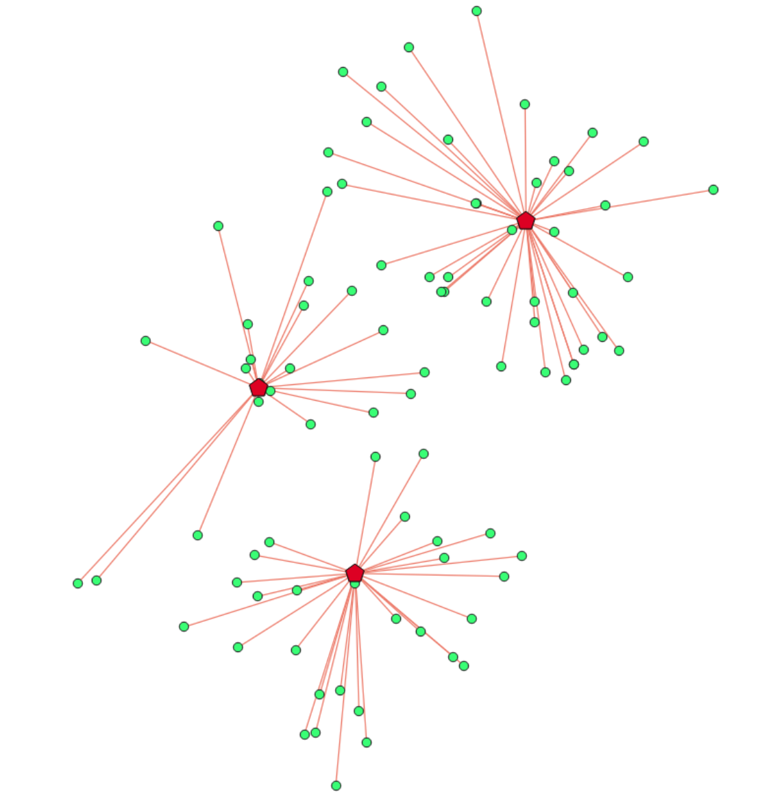
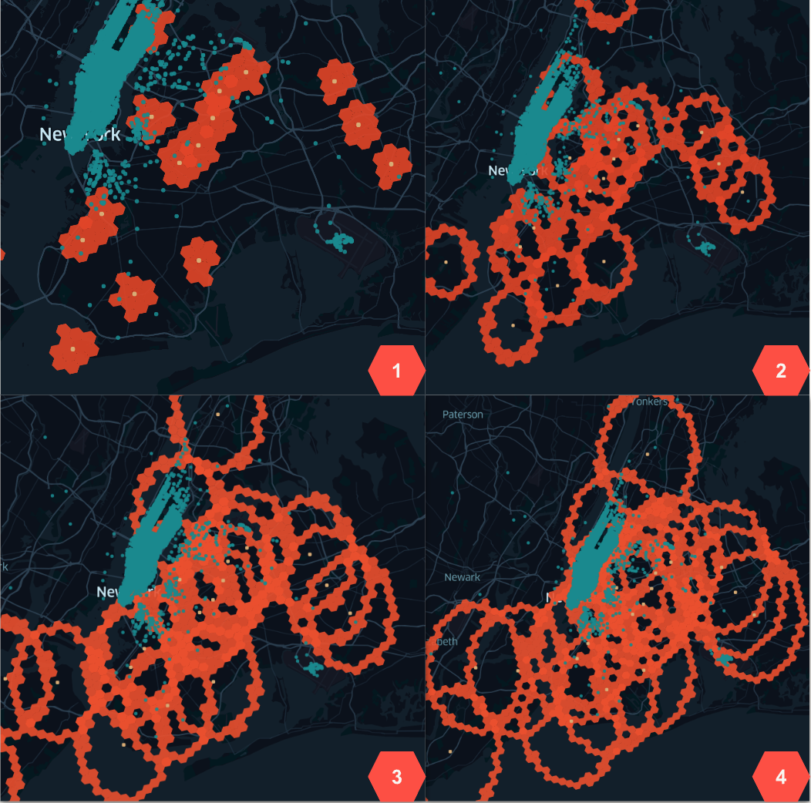
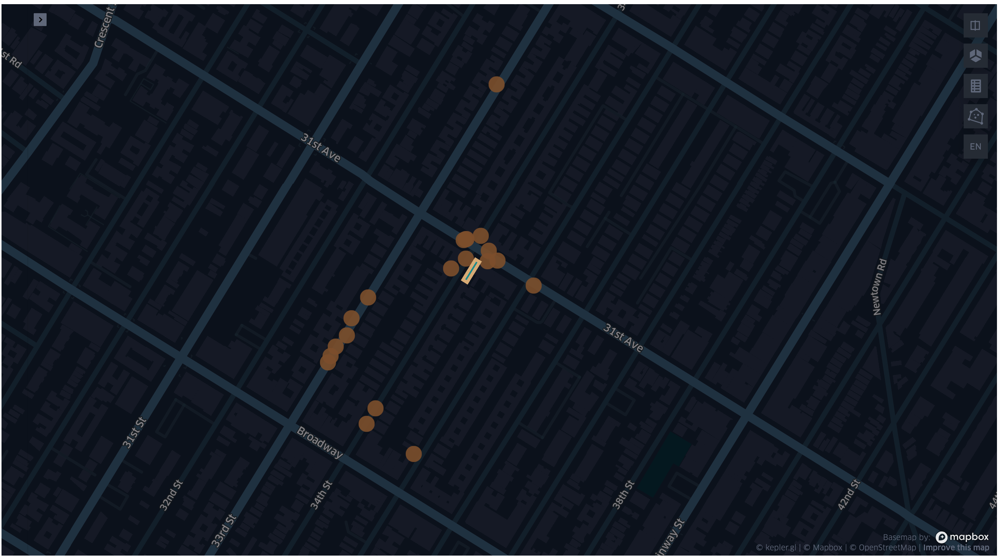
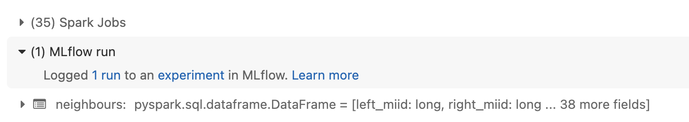
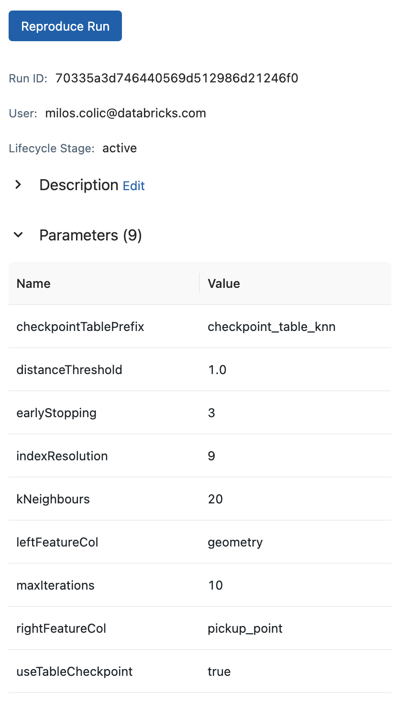
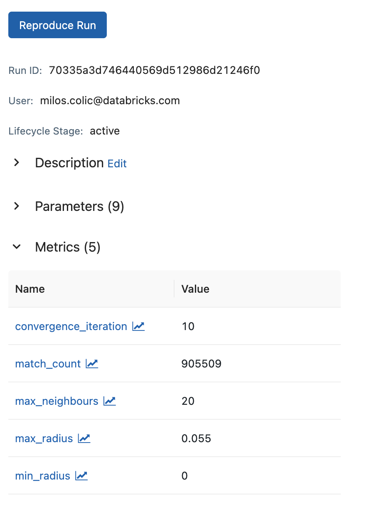
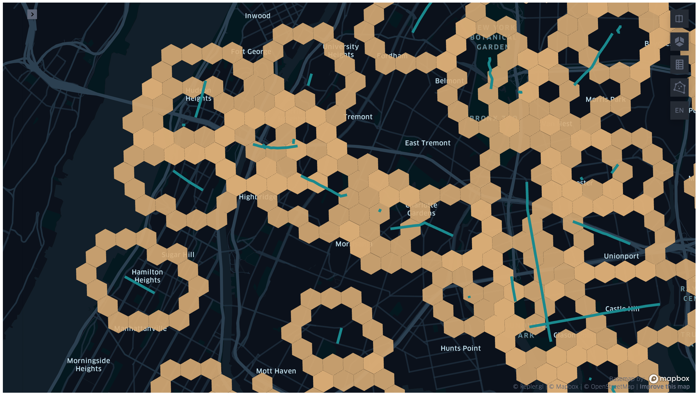

============================
Spatial K Nearest Neighbours
============================

* Runnable notebook based python example available, see `here <https://github.com/databrickslabs/mosaic/tree/main/notebooks/examples/python/SpatialKNN>`__
* Also, reference SpatialKNN code-level APIs `Python <https://github.com/databrickslabs/mosaic/blob/main/python/mosaic/models/knn/spatial_knn.py>`__ |  `Scala <https://github.com/databrickslabs/mosaic/tree/main/src/main/scala/com/databricks/labs/mosaic/models/knn>`__ for any additions or changes

Intro
###################

Nearest neighbour problem is defined as finding an observation from a set S that is the most similar to the given
observation O. The similarity is defined by a distance function d(O, S[i]). The most common distance function is the Euclidean.
The nearest neighbour problem is a special case of the k-nearest neighbour problem, where k=1. The k-nearest neighbour
problem is defined as finding k observations from a set S that are the most similar to the given observation O.

   Fig 1. Nearest neighbour problem

We define spatial k-nearest neighbour problem as finding k observations from a set of candidates C that are the most similar to the
given a landmark L[i], where the similarity is defined by a distance function d(L[i], S[j]) = st_distance(L[i], S[j]).
In our case we further define the similarity as the inverse of the distance, so the most similar observation is the one with
the smallest distance. ST_Distance function is defined as the shortest distance between two geometries in projected units.
We do not restrict the type of geometries that can be used in the problem. The only requirement is that the geometries
must be in the same coordinate system.

Spatial KNN as a Join Relation
##############################

The traditional definition of the nearest neighbour problem is defined as:
"given a set S of points in a space M and a query point q in M, find the point in S that is closest to q".
We have relaxed this definition by allowing the query point to be a set of points. In our case the result of the nearest
neighbour problem is a set of geometries from the candidates set C that are closest to each query geometry from the
set of landmarks L. This in effect formulates a join condition where a point pair (L[i], C[j]) is a match if
st_distance(L[i], C[j]) <= st_distance(L[i], C[k]) where C[k] is the kth nearest neighbour of L[i].

The above definition of k nearest neighbour problem is in effect a left join between the set of landmarks L and the set of
candidates C. The result set isn't symmetric and it does depend on the direction of operation. If S[j] is in the knn set of Q[i]
it does not imply that Q[i] is in the knn set of S[j]. This join would default to a Cartesian product if we were to
use the traditional join syntax. We have to use a different approach.

Spatial KNN as an Iterative Transformation
##########################################

The problem of finding the k-nearest neighbours can be formulated as an iterative transformation. The transformation
is defined as follows:
* For each geometry in set L generate a hex ring in grid index space
* Generate match candidates in the hex ring
* For each match candidate C[j] calculate the distance to the landmark geometry L[i]
* For each landmark geometry L[i] count the matches and stop if the count is equal to k
* If the count is less than k, increase the size of the hex ring and repeat the process
* If the count exceeds k, remove the matches that are furthest from the landmark and stop
iterating over the hex ring for L[i]
* Evaluate early stopping condition (if enabled): Stop if no new match candidates are found
in the hex ring for any L[i] geometry in the set L for N iterations (knn.setEarlyStopIterations(N))
* Continue with the next hex ring until max number of iterations is performed
* Return the geometries that have the smallest distance to the query geometries

   Fig 2. Spatial KNN example over 4 iterations.

Parameters
##########

The transformer has the following parameters:

* candidatesDf: the dataframe containing the geometries that will be used as candidates for the KNN search
* candidatesFeatureCol: the name of the column that contains the candidates geometries
* candidatesRowID: the name of the column that contains the candidates ids
* landmarksFeatureCol: the name of the column that contains the landmarks geometries
* landmarksRowID: the name of the column that contains the landmarks ids
* kNeighbours: the number of neighbours to return
* maxIterations: the maximum number of iterations to perform
* distanceThreshold: the distance threshold to stop the iterations (in CRS units)
* earlyStopIterations: the number of subsequent iterations upon which to stop if no new neighbours 
* checkpointTablePrefix: the prefix of the checkpoint table
* indexResolution: the resolution of the index (grid system specific)
* approximate: whether to stop after max iterations (approximate = true) or to
  perform the finalisation step (approximate = false) - no default value, the caller must specify this parameter

Param distanceThreshold is specific to the CRS used, e.g. for 4326 units are decimal degrees. 
This is useful as a a safety net for coarse grained indexResolution choices which could easily span large chunks of the globe.

If the approximate is set to true the transformer wont perform the finalisation step.
The finalisation takes into account that grid index cells may be skewed at different
locations and we cant ensure radial growth between iterations. That means that some
of the neighbours in returned K set aren't nearest neighbours. The finalisation step
will take the distance between the neighbours and the target geometry and will generate
a buffered geometry around the target geometry. The buffered geometry will be used to
identify missed neighbours. The missed neighbours will be added to the K set and the
set will be sorted by distance to the target geometry. Grid cells can be skewed at different
locations in a different way, meaning the hex rings are more of ellipses than circles.
To account for that we need to perform the finalisation step that is based on buffer geometries.

Usage
#####

Mosaic implements a transformer that implements the iterative approach outlined above.
The transformer is called SpatialKNN and it is used as follows:

.. tabs::
   .. code-tab:: py

    import mosaic as mos
    mos.enable_mosaic(spark, dbutils)
    >>>
    spark.sparkContext.setCheckpointDir("dbfs:/tmp/mosaic/username/checkpoints")
    >>>
    building_df = spark.read.table("building")
    trip_df = spark.read.table("trip")

    from mosaic.models import SpatialKNN
    >>>
    knn = SpatialKNN()

    knn.setUseTableCheckpoint(True)
    knn.setCheckpointTablePrefix("checkpoint_table_knn")
    knn.model.cleanupCheckpoint
    >>>
    # CRS Specific
    # - e.g. 4326 units are decimal degrees
    knn.setDistanceThreshold(1.0)

    # Grid System Specific
    # - e.g. H3 resolutions 0-15
    knn.setIndexResolution(10)
    >>>
    knn.setKNeighbours(5)
    knn.setApproximate(True)
    knn.setMaxIterations(10)
    knn.setEarlyStopIterations(3)
    >>>
    knn.setLandmarksFeatureCol("geom_wkt")
    knn.setLandmarksRowID("left_id") # id will be generated
    >>>
    knn.setCandidatesDf(trip_df.where("pickup_point is not null"))
    knn.setCandidatesFeatureCol("pickup_point")
    knn.setCandidatesRowID("right_id") # id will be generated
    >>>
    neighbours = knn.transform(building_df)
    neighbours.display()
    +-------+--------+-----------+--------------+--------------------------+---------+----------------+
    |left_id|right_id|   geometry|right_geometry|geometry_geometry_distance|iteration|neighbour_number|
    +-------+--------+-----------+--------------+--------------------------+---------+----------------+
    |   1012|    2012|POLYGON(...|LINESTRING(...|                       0.0|        0|               1|
    |   1012|    2013|POLYGON(...|LINESTRING(...|                     2.145|        0|               2|
    |   1012|    2014|POLYGON(...|LINESTRING(...|                    2.1787|        2|               3|
    |   1013|    2013|POLYGON(...|LINESTRING(...|                       0.0|        0|               1|
    |   1013|    2014|POLYGON(...|LINESTRING(...|                    1.1112|        1|               1|
    +-------+--------+-----------+--------------+--------------------------+---------+----------------+

   .. code-tab:: scala

    import com.databricks.labs.mosaic.models.knn.SpatialKNN
    import com.databricks.labs.mosaic.functions.MosaicContext
    import com.databricks.labs.mosaic.H3
    import com.databricks.labs.mosaic.JTS
    >>>
    val mosaicContext = MosaicContext.build(H3, JTS)
    import mosaicContext.functions._
    mosaicContext.register(spark)
    >>>
    spark.sparkContext.setCheckpointDir("dbfs:/tmp/mosaic/username/checkpoints")
    >>>
    val buildingDf = spark.read.table("building")
    val tripDf = spark.read.table("trip")
    >>>
    val knn = SpatialKNN(tripDf)
                .setDistanceThreshold(1.0) // crs specific units
                .setIndexResolution(10) // grid system specific
                .setKNeighbours(5)
                .setMaxIterations(10)
                .setEarlyStopIterations(3)
                .setLandmarksFeatureCol("geom_wkt")
                .setLandmarksRowID("left_id")  // will be generated
                .setCandidatesFeatureCol("pickup_point")
                .setCandidatesRowID("right_id") // will be generated
                .setCheckpointTablePrefix("checkpoint_table_knn")
    >>>
    val neighbours = knn.transform(buildingDf)
    neighbours.display()
    +-------+--------+-----------+--------------+--------------------------+---------+----------------+
    |left_id|right_id|   geometry|right_geometry|geometry_geometry_distance|iteration|neighbour_number|
    +-------+--------+-----------+--------------+--------------------------+---------+----------------+
    |   1012|    2012|POLYGON(...|LINESTRING(...|                       0.0|        0|               1|
    |   1012|    2013|POLYGON(...|LINESTRING(...|                     2.145|        0|               2|
    |   1012|    2014|POLYGON(...|LINESTRING(...|                    2.1787|        2|               3|
    |   1013|    2013|POLYGON(...|LINESTRING(...|                       0.0|        0|               1|
    |   1013|    2014|POLYGON(...|LINESTRING(...|                    1.1112|        1|               1|
    +-------+--------+-----------+--------------+--------------------------+---------+----------------+

Note: the transformer is implemented only in python and scala at the moment.

Mosaic supports all indexing systems for this transformer.
Please see :doc:`Spatial Indexing </api/spatial-indexing>` for supported indexing operations.

Visualisation
#############

The transformer returns a dataframe with the following columns:

* left_id: the id of the left geometry
* right_id: the id of the right geometry
* geometry: the left geometry
* right_geometry: the right geometry
* geometry_geometry_distance: the distance between the left and right geometry
* iteration: the iteration number
* neighbour_number: the number of the neighbour in the K set
* any other column from left dataset will be returned as well
* any other column from right dataset will be returned as well
* any column name that appears in both datasets will be suffixed with _right for the right dataset,
    left dataset column names wont be altered

For visualisation purposes we advise that you select the following columns:

* left_id
* right_id
* geometry
* right_geometry
* geometry_geometry_distance

The following image shows the result of the transformer applied on the buildings and taxi trip pickup locations:

   Fig 3. Spatial KNN example visualisation.

Mlflow Integration
##################

SpatialKNN transformer supports mlflow integration since it extends spark.mllib APIs.
In addition the transformer comes with .getParams() and .getMetrics() methods to facilitate
easy logging with mlflow. The .getParams() method returns a dictionary with the parameters
of the transformer. The .getMetrics() method returns a dictionary with the metrics of the
transformer after the convergence.

.. tabs::
   .. code-tab:: py

    import mosaic as mos
    mos.enable_mosaic(spark, dbutils)
    >>>
    from mosaic.models import SpatialKNN
    import mlflow
    mlflow.autolog(disable=False)
    >>>
    with mlflow.start_run():
    >>>
        knn = SpatialKNN()
        ...
        result_df = knn.transform(...)
    >>>
        mlflow.log_params(knn.getParams())
        mlflow.log_metrics(knn.getMetrics())

   Fig 4. Spatial KNN mlflow integration in notebooks.

.. raw:: html

   

   Fig 5. Spatial KNN mlflow integration params.

   Fig 6. Spatial KNN mlflow integration metrics.

.. raw:: html

   

Model serialisation
###################

The transformer can be serialised and deserialised using the model.write.save() and model.read.load() methods.
The serialised model can be used for audit purposes only.
The transformers are not models in a pure sense - they do not create a new object that can be called on each row.
The outputs of knn transformer is a dataframe with the neighbours of each geometry.
To run the transform method one has to have access to both the landmarks and the candidates datasets.
These datasets are not serialised with the model, and neither are the model outputs.

.. tabs::
   .. code-tab:: py

    import mosaic as mos
    mos.enable_mosaic(spark, dbutils)
    >>>
    spark.sparkContext.setCheckpointDir("dbfs:/tmp/mosaic/username/checkpoints")
    >>>
    from mosaic.models import SpatialKNN
    knn = SpatialKNN()
    ...
    >>>
    knn.write.save("dbfs:/tmp/mosaic/username/knn_model")
    loaded_knn = SpatialKNN.read.load("dbfs:/tmp/mosaic/username/knn_model")
    loaded_knn.getParams()
    {'approximate': 'true',
     'candidatesFeatureCol': 'pickup_point',
     'candidatesRowID': 'candidates_id',
     'checkpointTablePrefix': 'checkpoint_table_knn',
     'distanceThreshold': '1.0',
     'earlyStopIterations': '3',
     'indexResolution': '10',
     'kNeighbours': '20',
     'landmarksFeatureCol': 'geom_wkt',
     'landmarksRowID': 'landmarks_id',
     'maxIterations': '10',
     'useTableCheckpoint': 'true'}

   .. code-tab:: scala

    import com.databricks.labs.mosaic.models.knn.SpatialKNN
    import com.databricks.labs.mosaic.functions.MosaicContext
    import com.databricks.labs.mosaic.H3
    import com.databricks.labs.mosaic.JTS
    >>>
    val mosaicContext = MosaicContext.build(H3, JTS)
    import mosaicContext.functions._
    mosaicContext.register(spark)
    >>>
    spark.sparkContext.setCheckpointDir("dbfs:/tmp/mosaic/username/checkpoints")
    >>>
    val knn = SpatialKNN()
    ...
    >>>
    knn.write.save("dbfs:/tmp/mosaic/username/knn_model")
    val loadedKnn = SpatialKNN.read.load("dbfs:/tmp/mosaic/username/knn_model")
    val params = loadedKnn.getParams()
    params.foreach(println)
    ('approximate': 'true')
    ('candidatesFeatureCol': 'pickup_point')
    ('candidatesRowID': 'candidates_id')
    ('checkpointTablePrefix': 'checkpoint_table_knn')
    ('distanceThreshold': '1.0')
    ('earlyStopIterations': '3')
    ('indexResolution': '10')
    ('kNeighbours': '20')
    ('landmarksFeatureCol': 'geom_wkt')
    ('landmarksRowID': 'landmarks_id')
    ('maxIterations': '10')
    ('useTableCheckpoint': 'true')

Shape Aware Hex Rings
#####################

When performing the iterations the transformer will use the grid to identify
the candidates for the K set. The grid is generated using the shape aware
hex rings algorithm. The algorithm will generate a grid that will be skewed
in the direction of the target geometry.
If the target geometry is a point the hex ring will coincide with the grid
base implementation. If the target geometry is a line the hex ring will be skewed in
the direction of the line. If the target geometry is a polygon the hex ring will be
skewed around the shape of the polygon, the polygon holes will be considered.

   Fig 7. Spatial KNN example of shape aware hex rings.
