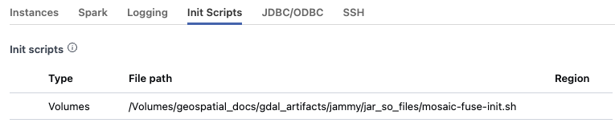

=======================
GDAL Installation guide
=======================

Supported platforms
###################
In order to use Mosaic, you must have access to a Databricks cluster running
Databricks Runtime 11.3 or higher.
If you have cluster creation permissions in your Databricks
workspace, you can create a cluster using the instructions
`here <https://docs.databricks.com/clusters/create.html#use-the-cluster-ui>`__.

You will also need "Can Manage" permissions on this cluster in order to attach the
Mosaic library to your cluster. A workspace administrator will be able to grant 
these permissions and more information about cluster permissions can be found 
in our documentation
`here <https://docs.databricks.com/security/access-control/cluster-acl.html#cluster-level-permissions>`__.

GDAL Installation
####################

Setup GDAL files and scripts
****************************
Mosaic requires GDAL to be installed on the cluster. The easiest way to do this is to use the
the mos.setup_gdal() function. This function will extract the GDAL files and scripts from the
mosaic library and place them in the /dbfs/FileStore/geospatial/mosaic/gdal/ directory.

.. code-block:: py

    import mosaic as mos

    mos.enable_mosaic(spark, dbutils)
    mos.setup_gdal(spark)
    GDAL setup complete.
    Shared objects (*.so) stored in: /dbfs/FileStore/geospatial/mosaic/gdal/.
    Init script stored in: /dbfs/FileStore/geospatial/mosaic/gdal/.
    Please restart the cluster with the generated init script to complete the setup.

Configure the init script
**************************
After the mos.setup_gdal() function has been run, you will need to configure the cluster to use the
init script. This can be done by clicking on the "Edit" button on the cluster page and adding
the following to the "Advanced Options" section:

   Fig 1. Init script configuration

Enable GDAL for a notebook
***********************************
Once the cluster has been restarted, you can enable GDAL for a notebook by running the following
code at the top of the notebook:

.. code-block:: py

    import mosaic as mos

    mos.enable_mosaic(spark, dbutils)
    mos.enable_gdal(spark)
    GDAL enabled.
    GDAL 3.4.3, released 2022/04/22