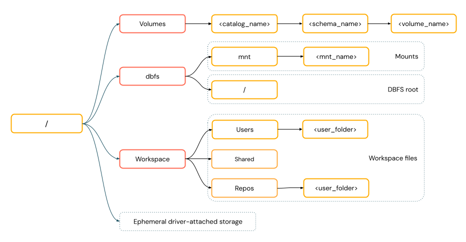

=======================
GDAL Installation guide
=======================

Supported platforms
###################
In order to use Mosaic 0.4 series, you must have access to a Databricks cluster running
Databricks Runtime 13.3 LTS.
If you have cluster creation permissions in your Databricks
workspace, you can create a cluster using the instructions
`here <https://docs.databricks.com/clusters/create.html#use-the-cluster-ui>`__.

You will also need "Can Manage" permissions on this cluster in order to attach the
Mosaic library to your cluster. A workspace administrator will be able to grant 
these permissions and more information about cluster permissions can be found 
in our documentation
`here <https://docs.databricks.com/security/access-control/cluster-acl.html#cluster-level-permissions>`__.

.. warning::
    These instructions assume an Assigned cluster is being used (vs a Shared Access cluster),
    more on access modes `here <https://docs.databricks.com/en/compute/configure.html#access-modes>`__.

GDAL Installation
####################

Setup GDAL files and scripts
****************************
Mosaic requires GDAL to be installed on the cluster. The easiest way to do this is to use the
the :code:`setup_gdal` function.

.. note::
   - This is close in behavior to Mosaic < 0.4 series (prior to DBR 13), it installs jammy default GDAL (3.4.1).
   - Param **to_fuse_dir** can be one of **/Volumes/..**, **/Workspace/..**, **/dbfs/..**;
     however, you should consider :code:`setup_fuse_install()` for Volume based installs as that
     exposes more options, to include copying JAR and JNI Shared Objects.

.. function:: setup_gdal()

    Generate an init script that will install GDAL native libraries on each worker node.
    All of the listed parameters are optional. You can have even more control with :code:`setup_fuse_install` function.

    :param to_fuse_dir: Path to write out the init script for GDAL installation;
                        default is "/Workspace/Shared/geospatial/mosaic/gdal/jammy".
    :type to_fuse_dir: str
    :param script_out_name: Name of the script to be written; default is “mosaic-gdal-init.sh”.
    :type script_out_name: str
    :param jni_so_copy: Whether to copy shared object to fuse dir and config script to use; default is False.
    :type jni_so_copy: bool

    :example:

.. code-block:: py

    import mosaic as mos

    mos.enable_mosaic(spark, dbutils)
    mos.setup_gdal()

    +-----------------------------------------------------------------------------------------------------------+
    | ::: Install setup complete :::                                                                            |
    +-----------------------------------------------------------------------------------------------------------+
    | - Settings: 'jar_copy'? False, 'jni_so_copy'? False                      |
    | - Fuse Dir: '/Workspace/Shared/geospatial/mosaic/gdal/jammy'                                              |
    | - Init Script: configured and stored at 'mosaic-gdal-init.sh'; add to your cluster and restart,           |
    |               more at https://docs.databricks.com/en/init-scripts/cluster-scoped.html                     |
    +-----------------------------------------------------------------------------------------------------------+

Configure the init script
**************************
After the :code:`setup_gdal` function has been run, you will need to configure the cluster to use the
init script. The init script can be set by clicking on the "Edit" button on the cluster page and adding
the following to the "Advanced Options" section:

.. figure:: ../images/init_script.png
   :figclass: doc-figure

   Fig 1. Init script configuration

Enable GDAL for a notebook
***********************************
Once the cluster has been restarted, you can enable GDAL for a notebook by running the following
code at the top of the notebook:

.. code-block:: py

    import mosaic as mos

    mos.enable_mosaic(spark, dbutils)
    mos.enable_gdal(spark)

.. code-block:: text

    GDAL enabled.
    GDAL 3.4.1, released 2021/12/27

GDAL Configuration
####################

Here is the block size spark session config available for GDAL, e.g. :code:`spark.conf.set("<key>", "<val>")`.

.. list-table::
   :widths: 25 25 50
   :header-rows: 1

   * - Config
     - Default
     - Comments
   * - spark.databricks.labs.mosaic.raster.blocksize
     - "128"
     - Blocksize in pixels, see :ref:`rst_convolve` and :ref:`rst_filter` for more

GDAL is configured as follows in `MosaicGDAL <https://github.com/databrickslabs/mosaic/blob/main/src/main/scala/com/databricks/labs/mosaic/gdal/MosaicGDAL.scala>`__ class:

.. list-table::
   :widths: 50 50
   :header-rows: 1

   * - Config
     - Value
   * - GDAL_VRT_ENABLE_PYTHON
     - "YES"
   * - GDAL_DISABLE_READDIR_ON_OPEN
     - "TRUE"
   * - CPL_TMPDIR
     - "<CPL_TMPDIR>"
   * - GDAL_PAM_PROXY_DIR
     - "<GDAL_PAM_PROXY_DIR>"
   * - GDAL_PAM_ENABLED
     - "YES"
   * - CPL_VSIL_USE_TEMP_FILE_FOR_RANDOM_WRITE
     - "NO"
   * - CPL_LOG
     - "<CPL_TMPDIR>/gdal.log"
   * - GDAL_CACHEMAX
     - "512"
   * - GDAL_NUM_THREADS
     - "ALL_CPUS"

FUSE Checkpointing
####################

Mosaic supports checkpointing rasters to a specified `POSIX-style <https://docs.databricks.com/en/files/index.html>`__
FUSE directory (local mount to Cloud Object Storage). For DBR 13.3 LTS, we focus primarly on DBFS, but this will expand
with future versions. This is to allow lightweight rows, where the :code:`raster` column stores the path instead of the
binary payload itself; available in 0.4.3+:

  POSIX-style paths provide data access relative to the driver root (/). POSIX-style paths never require a scheme.
  You can use Unity Catalog volumes or DBFS mounts to provide POSIX-style access to data in cloud object storage.
  Many ML frameworks and other OSS Python modules require FUSE and can only use POSIX-style paths.

This is different than `Spark DataFrame Checkpointing <https://spark.apache.org/docs/latest/api/python/reference/pyspark.sql/api/pyspark.sql.DataFrame.checkpoint.html>`__;
we use the word "checkpoint" to convey interim or temporary storage of rasters within the bounds of a pipeline. Below are
the spark configs available to manage checkpointing. In addition there are python and scala functions to update
the checkpoint path, turn checkpointing on/off, and reset checkpointing back to defaults:

  - python - :code:`mos.enable_gdal`, :code:`gdal.update_checkpoint_dir`, :code:`gdal.set_checkpoint_on`, :code:`gdal.set_checkpoint_off`, and :code:`gdal.reset_checkpoint`
  - scala - :code:`MosaicGDAL.enableGDALWithCheckpoint`, :code:`MosaicGDAL.updateCheckpointDir`, :code:`MosaicGDAL.setCheckpointOn`, :code:`MosaicGDAL.setCheckpointOff`, and :code:`MosaicGDAL.resetCheckpoint`

Once the interim files are no longer needed, e.g. after using :any:`rst_write` to store in a more permanent FUSE location
or loading back into binary payloads with :any:`rst_fromcontent`, users can optionally delete the checkpointed rasters
through :code:`dbutils.fs.rm('<CHECKPOINT_FUSE_DIR>', True)` or similar, more
`here <https://docs.databricks.com/en/dev-tools/databricks-utils.html#rm-command-dbutilsfsrm>`__.

.. list-table::
   :widths: 25 25 50
   :header-rows: 1

   * - Config
     - Default
     - Comments
   * - spark.databricks.labs.mosaic.raster.checkpoint
     - "/dbfs/tmp/mosaic/raster/checkpoint"
     - Checkpoint location, see :any:`rst_maketiles` for example
   * - spark.databricks.labs.mosaic.raster.use.checkpoint
     - "false"
     - Checkpoint for session, in 0.4.3+

Local CleanUp Manager
#######################

Mosaic initializes a separate clean-up thread to manage local files according to a specified age-off policy. The
configuration allows for -1 (no automated clean-up) as well as a specified manual mode that skips managed clean-up
(default is "false"). The default file age-off is 30 minute, but we recommend you adjust as needed to suit your workload
through the supported spark configs. Also, the actual local raster directory will be :code:`<tmp_prefix>/mosaic_tmp` which
means the default is :code:`/tmp/mosaic_tmp`. Please note that you have to account for the fact that this is a distributed
execution, so clean-up involves the driver as well as the worker nodes; both are handled in managed mode.

.. list-table::
   :widths: 25 25 50
   :header-rows: 1

   * - Config
     - Default
     - Comments
   * - spark.databricks.labs.mosaic.raster.tmp.prefix
     - "" (will use "/tmp")
     - Local directory for workers
   * - spark.databricks.labs.mosaic.manual.cleanup.mode
     - "false"
     - if true, don't do any automated local cleanup of files, in 0.4.3+
   * - spark.databricks.labs.mosaic.cleanup.age.limit.minutes
     - "30"
     - Local file age-off policy for cleanup handling; -1 is "never" and 0 is "all", in 0.4.3+.
