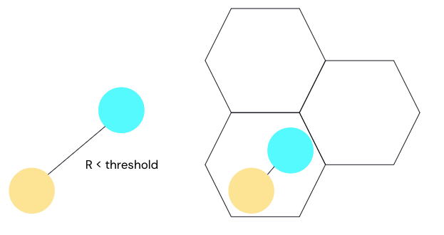
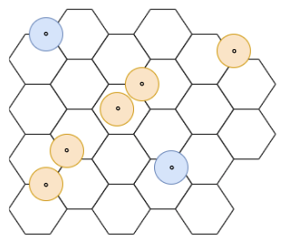
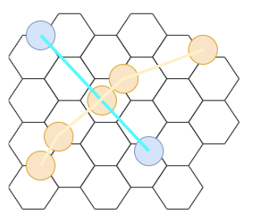

# Ship2Ship Transfer Detection

> Note: `ipynb` files can be previewed in GitHub and can also be imported into Databricks, more [here](https://docs.databricks.com/en/notebooks/notebook-export-import.html).

## Introduction
This is an algorithmic implementation to detect Ship to Ship transfers at scale using Databricks. It was initially presented at the [Data and AI Summit 2022](https://www.youtube.com/watch?v=XQNflqbgP7Q). 

This spatial sql + h3 example explores a novel, algorithmic approach to detecting Ship to Ship transfers at scale using AIS data. In particular it aims to surpass existing, naive implementations that are just based on a particular distance radius like the one shown below:

Although the naive approach can be optimized with indices to be quite performant, additional improvements can be made. This is quite apparent if we look at the following data points below:

According to our naive approach, where we buffer around our LAT/LONG points, the two vessels would not intersect. However, if we construct the actual path the vessels took, our algorithmic implementation would detect an overlap between the two paths, as shown below:

This model is expanded upon in the course of the attached notebooks. It shows how to ingest AIS data, how to process it at scale leveraging Mosaic in Databricks, and provides examples of how to extend the analysis to incorporate additional sources. 

## Requirements
This notebook series was run on Databricks using the 75+ spatial sql expressions available (currently private preview). To join the spatial sql private preview (required to execute this series), please reach out to your Databricks account team.  

*created by [@tiems90](https://github.com/tiems90) | maintained by [@mjohns-data](https://github.com/mjohns_data)* 