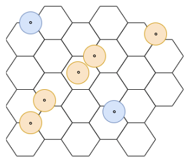
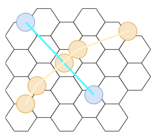

# STS-transfers
An algorithmic implementation to detect Ship to Ship transfers at scale using Databricks. 

This Mosaic example explores a novel, algorithmic approach to detecting Ship to Ship transfers at scale using AIS data. In particular it aims to surpass existing, naive implementations that are just based on a particular distance radius like the one shown below:

Although the naive approach can be optimised with indices to be quite performant, additional improvements can be made. This is quite apparent if we look at the following data points below:

According to our naive approach, where we buffer around our LAT/LONG points, the two vessels would not intersect. However, if we construct the actual path the vessels took, our algorithmic implementation would detect an overlap between the two paths, as shown below:

This model is expanded upon in the course of the attached notebooks. 