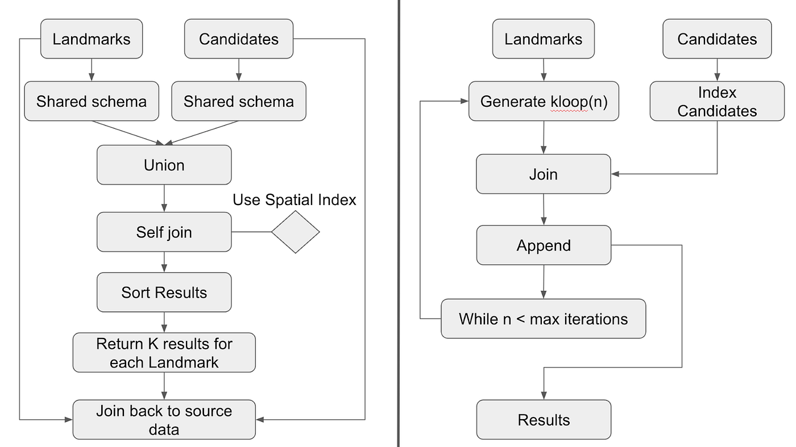
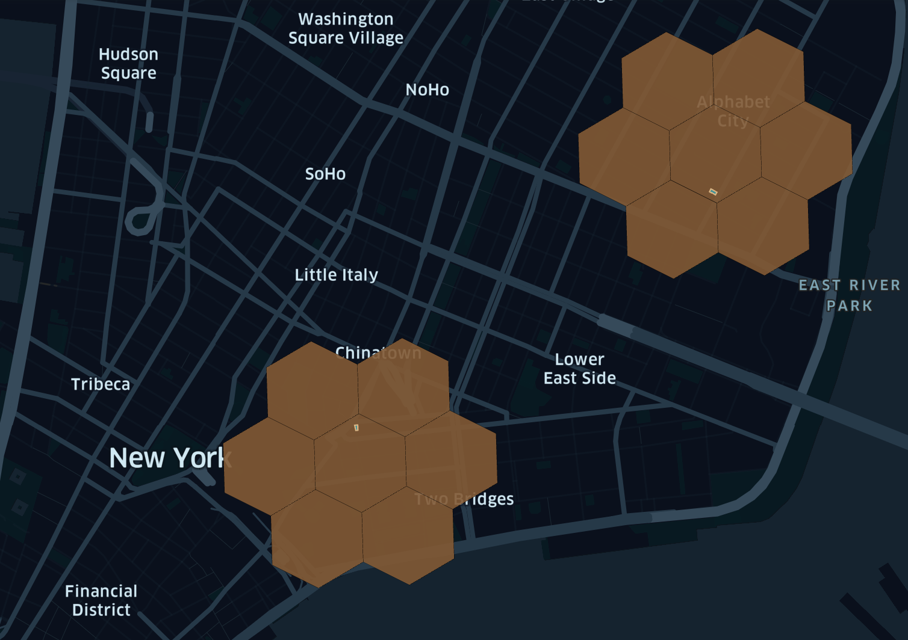
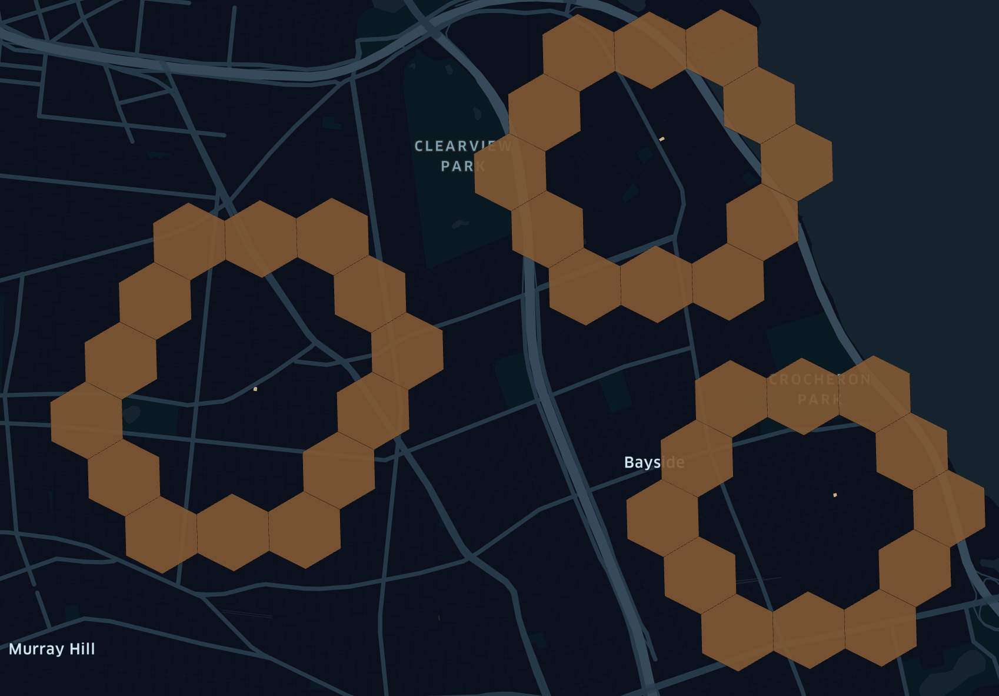
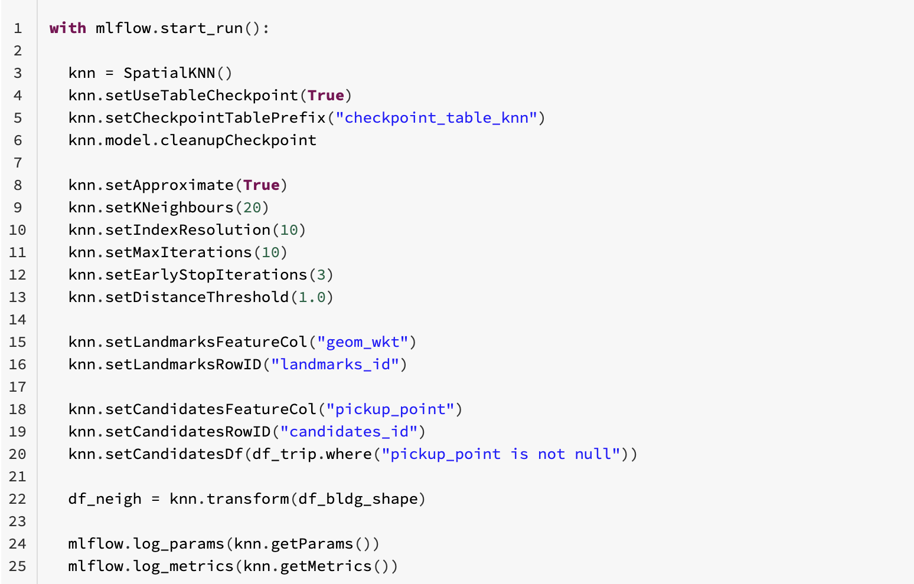
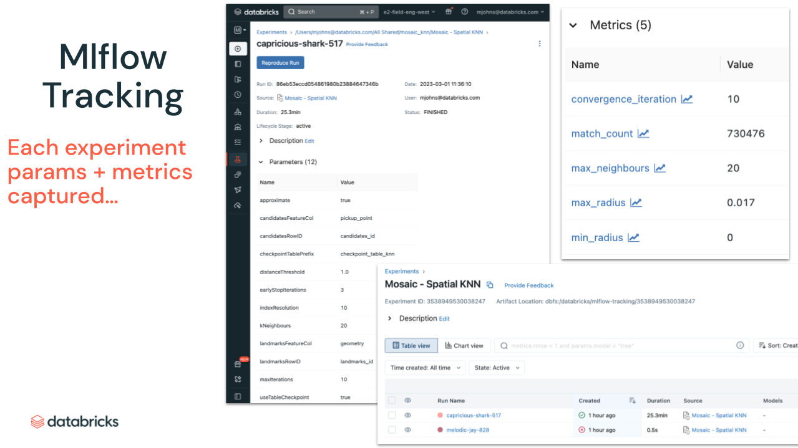

# Scalable KNN on Databricks with Mosaic

### This is a self-contained example for running Spatial K-Nearest Neighbors in Mosaic.

__Notebooks + Tables:__

* `01. Data Prep` - Generates Delta Lake Tables for 50K buildings and 1M taxi trips used:
  * `mosaic_spatial_knn.building_50k`
  * `mosaic_spatial_knn.trip_1m`
* `02. Spatial KNN` - Runs the SpatialKNN Transform and stores results:
  * `mosaic_spatial_knn.transform`

 _Also, see [Mosaic Spatial KNN Docs](https://databrickslabs.github.io/mosaic/models/spatial-knn.html) | [Scalable Spatial Nearest Neighbours Blog](https://medium.com/@milos.colic/scalable-spatial-nearest-neighbours-with-mosaic-336ce37edbae) | [SpatialKNN API](https://github.com/databrickslabs/mosaic/blob/main/python/mosaic/models/knn/spatial_knn.py)._

## Optimized Algorithm 

Usually when asserting the notion of nearest neighbors we fix that notion to the _K_ neighbors. if _K_ is left unbound the answers produced by the analysis are basically orderings of the whole data assets based on the proximity/distance and the computational costs to produce such outputs can be very prohibitive since they would result in comparing all features across all data assets. _Note: Optimized KNN algorithm is on the right in the image above._

| Step        | Description |
| ----------- | ----------- |
| 1. | For each geometry in set L generate a kloop (hollow ring) |
| 2. | Generate match candidates within |
| 3. | For each match candidate C calculate the distance to the landmark |
| 4. | For each L[i] count the matches; stop if count =  k |
| 5. | If count < k, increase the size of the kloop;  repeat (s1) |
| 6. | If count > k, remove matches furthest from the L[i]; stop |
| 7. | Optional: early stopping if no new match candidates are found in the kloop of any L geometry for N iterations |
| 8. | Continue with the next kloop up to max iterations |
| 9. | Return C geometries with smallest distance to each L[i] |

## Initial Render with Kepler

> In order to find out the nearest neighbors we can create a kring around each of our point of interests. This and the following expressions have their auto-explode versions that we are going to use here. It is much easier to join already exploded cell IDs between 2 datasets.

  

> But what do we do if we dont have enough neighbors in the krings we just ran? We need to keep iterating. Our second iteration and all iterations onward are kdisc / kloop based. This allows us to only compare candidates we absolutely need to compare. For that purpose mosaic comes with geometry conscious kring and kdisc / kloop (hexring) implementations. 

## Run the KNN Transform

> There are a lot of things to keep track of if one is to implemet a scalable KNN approach. Luckily Mosaic comes with an implemetation of a spark transformer that can do all of those steps for us. In this example we will compare ~50K building shapes (polygons) to 1M taxi trips (points). Since this approach is defined as an algorithm it can be easily chained. E.g. We could, as a follow-on, check using another instance of the knn model which streets are closest to the set of taxi trips that are idetified in the first run (not shown).

## Render Transform Results

> Finally we can render our knn sets in kepler and verify that results make sense.

## Requirements
This notebook series was run on Databricks with the [Mosaic](https://github.com/databrickslabs/mosaic/tree/main/python) library installed. For this example it is recommended to install it from [PyPi](https://pypi.org/project/databricks-mosaic/) on your Databricks cluster like [so](https://docs.databricks.com/libraries/cluster-libraries.html). __Make sure you run this on Databricks ML Runtime (initially implemented on 11.3 LTS).__

*notebook original author [@milos-colic](https://github.com/milos-colic) | submitted by [@mjohns-databricks](https://github.com/mjohns-databricks)* 
