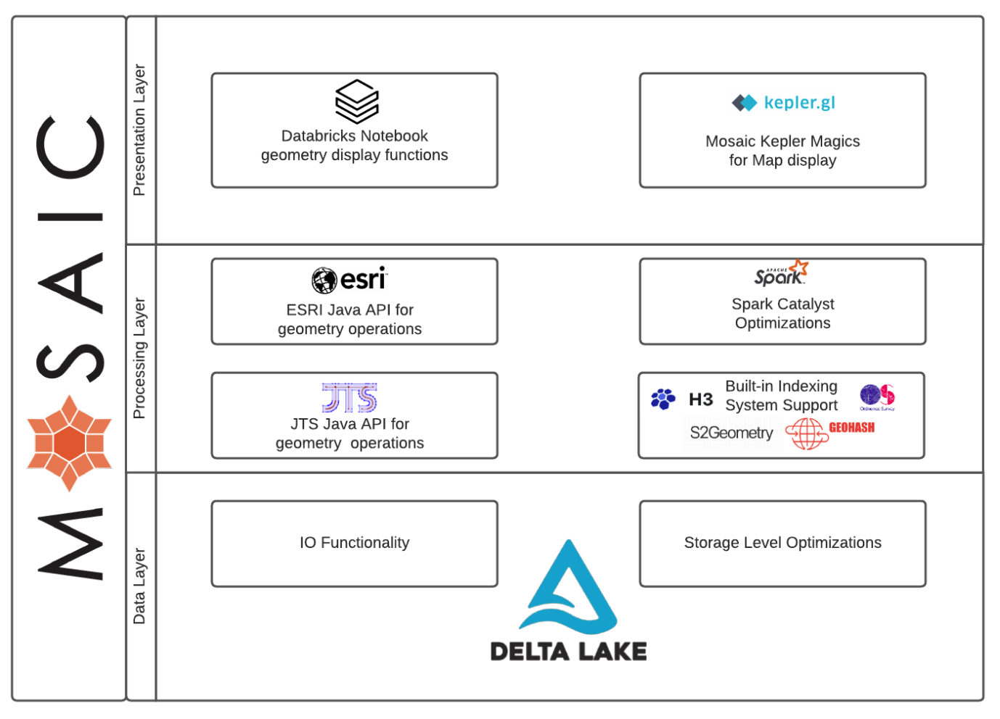
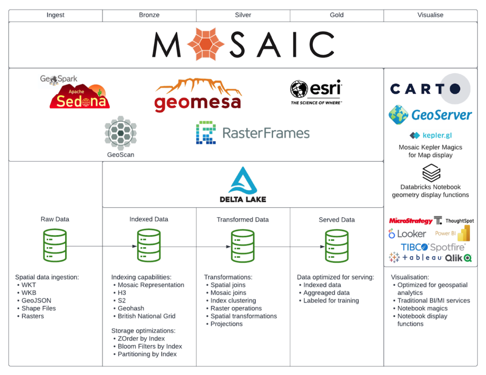

# Mosaic by Databricks Labs


An extension to the [Apache Spark](https://spark.apache.org/) framework that allows easy and fast processing of very large geospatial datasets.

[](https://badge.fury.io/py/databricks-mosaic)

[](https://codecov.io/gh/databrickslabs/mosaic)
[](https://github.com/databrickslabs/mosaic/actions/workflows/build.yml)
[](https://github.com/databrickslabs/mosaic/actions/workflows/docs.yml)
[](https://lgtm.com/projects/g/databrickslabs/mosaic/context:python)
[](https://github.com/psf/black)


Mosaic provides:
- easy conversion between common spatial data encodings (WKT, WKB and GeoJSON);
- constructors to easily generate new geometries from Spark native data types;
- many of the OGC SQL standard `ST_` functions implemented as Spark Expressions for transforming, aggregating and joining spatial datasets;
- high performance through implementation of Spark code generation within the core Mosaic functions;
- optimisations for performing point-in-polygon joins using an approach we co-developed with Ordnance Survey ([blog post](https://databricks.com/blog/2021/10/11/efficient-point-in-polygon-joins-via-pyspark-and-bng-geospatial-indexing.html)); and
- the choice of a Scala, SQL and Python API.



Image1: Mosaic logical design.

## Getting started

### Required compute environment
The only requirement to start using Mosaic is a Databricks cluster running Databricks Runtime 10.0 (or later).

### Package installation
#### Installation from PyPI
Python users can install the library directly from [PyPI](https://pypi.org/project/databricks-mosaic/)
using the instructions [here](https://docs.databricks.com/libraries/cluster-libraries.html)
or from within a Databricks notebook using the `%pip` magic command, e.g.
```shell
%pip install databricks-mosaic
```

#### Installation from release artifacts
Alternatively, you can access the latest release artifacts [here](https://github.com/databrickslabs/mosaic/releases)
and manually attach the appropriate library to your cluster.
Which artifact you choose to attach will depend on the language API you intend to use.
- For Python API users, choose the Python .whl file.
- For Scala users, take the Scala JAR (packaged with all necessary dependencies).
- For R users, download the Scala JAR and the R bindings library [see the sparkR readme](R/sparkR-mosaic/README.md).

Instructions for how to attach libraries to a Databricks cluster can be found [here](https://docs.databricks.com/libraries/cluster-libraries.html).

#### Automatic SQL registration
If you would like to use Mosaic's functions in pure SQL (in a SQL notebook, from a business intelligence tool,
or via a middleware layer such as Geoserver, perhaps) then you can configure
"Automatic SQL Registration" using the instructions [here](https://databrickslabs.github.io/mosaic/usage/automatic-sql-registration.html).

### Enabling the Mosaic functions

The mechanism for enabling the Mosaic functions varies by language:

#### Python
```python
from mosaic import enable_mosaic
enable_mosaic(spark, dbutils)
```

#### Scala
```scala
import com.databricks.labs.mosaic.functions.MosaicContext
import com.databricks.labs.mosaic.H3
import com.databricks.labs.mosaic.ESRI

val mosaicContext = MosaicContext.build(H3, ESRI)
import mosaicContext.functions._
```

#### R
```R
library(sparkrMosaic)
enableMosaic()
```

#### SQL
If you have not employed [automatic SQL registration](#Automatic-SQL-registration), you will need to
register the Mosaic SQL functions in your SparkSession from a Scala notebook cell:
```scala
%scala
import com.databricks.labs.mosaic.functions.MosaicContext
import com.databricks.labs.mosaic.H3
import com.databricks.labs.mosaic.ESRI

val mosaicContext = MosaicContext.build(H3, ESRI)
mosaicContext.register(spark)
```

### Ecosystem
Mosaic is intended to augment the existing system and unlock the potential by integrating spark, delta and 3rd party frameworks into the Lakehouse architecture.


Image2: Mosaic ecosystem - Lakehouse integration.

### Example notebooks
This repository contains several example notebooks in `notebooks/examples`. You can import them into your Databricks workspace using the instructions [here](https://docs.databricks.com/notebooks/notebooks-manage.html#import-a-notebook).

### Project Support
Please note that all projects in the `databrickslabs` github space are provided for your exploration only, and are not formally supported by Databricks with Service Level Agreements (SLAs). They are provided AS-IS and we do not make any guarantees of any kind. Please do not submit a support ticket relating to any issues arising from the use of these projects.

Any issues discovered through the use of this project should be filed as GitHub Issues on the Repo. They will be reviewed as time permits, but there are no formal SLAs for support.
